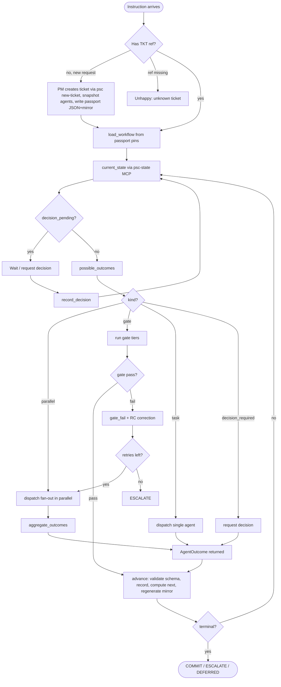
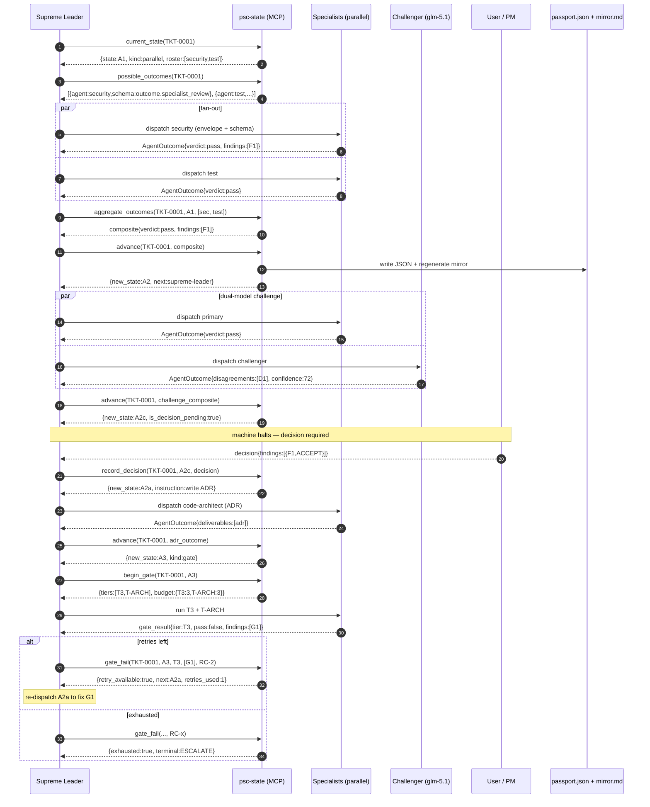

# PSC Workflow Engine — Design Document

> **Status:** DRAFT — tentative. All architecture decisions are marked **[TENTATIVE]** pending review.
> **Branch:** `feature/workflow-engine` (to be created as the first executable step — see §0).
> **Owner:** Supreme Leader (orchestrating); design synthesised from parallel agent exploration + critique.

---

## Purpose

Replace the loosely-defined markdown passport and prose-driven agent handoff with a **deterministic, semi-structured workflow engine**: JSON + JSON Schema for the workflow definition and passport, a Python library that answers state-machine questions, and an MCP surface the dispatch-only Supreme Leader can call without violating its permission block.

The agent never decides "what's next" for deterministic transitions — it calls a function and gets a response. The four genuine judgement points (A0 roster classification, A2c user disposition, C4 PM completion, gate-fail root-cause correction) are recorded as typed decision objects and routed by their declared fields.

---

## 0. Executable Steps (ordered)

These are the concrete first actions once this design is approved. Each is a shippable, testable unit.

| # | Step | Command / Action | Why first |
|---|------|-------------------|-----------|
| 0.1 | **Create the feature branch** | `git checkout -b feature/workflow-engine` | Isolates all workflow-engine work from `main`. **This is the very first executable step — nothing else proceeds until the branch exists.** |
| 0.2 | Commit this design doc to the repo | Move this file to `docs/design/workflow-engine.md` on the feature branch and commit with `docs(workflow-engine): add design document for deterministic workflow engine` | The design is version-controlled and reviewable before any code. |
| 0.3 | Review the six tentative decisions in §1 | User + Supreme Leader review and confirm or override each decision | Locks the architecture before implementation begins. |
| 0.4 | Begin Phase 1 of implementation (§9) | Schemas + library core | Once decisions are locked, Phase 1 is the foundation everything else depends on. |

---

## 1. Architecture Decisions [ALL TENTATIVE]

Each decision below is **tentative** — documented for review, not yet locked. Override any of them during review.

### 1.1 State-machine access boundary — MCP server `psc-state` [TENTATIVE]

**Decision:** The Supreme Leader reaches the state machine via an **MCP server** (`psc-state`), not a Python import, CLI, or subagent.

**Why:** The Supreme Leader has `permission: {edit: deny, bash: deny}` — it cannot call a shell or import a library. Options considered:
- *(a) Relax permissions* — violates the Agent Permission Validation Rule (dispatch-only → `bash: deny`). **Rejected.**
- *(b) State-keeper subagent* (the critique's recommendation) — preserves invariants but every state op becomes a full agent dispatch: slow, token-heavy, and introduces a bash-capable indirect-breach vector. **Rejected** as primary; valid fallback.
- *(c) MCP server* — exposes a constrained, schema-validated tool surface (`current_state`, `advance`, `record_decision`, `gate_fail`, …). The orchestrator calls a *tool*, never a shell. OpenCode treats MCP tools as a separate channel from `bash:`. The Supreme Leader's config whitelists only `psc-state.*`. **Selected.**

**Surface:** see §3 for the full tool list.

**Review note:** if you prefer (b), swap the boundary — the library/CLI implementation underneath is identical either way; only the wrapper changes.

---

### 1.2 Storage — JSON + advisory lock + derived Markdown mirror [TENTATIVE]

**Decision:** Each ticket stores its state as a **JSON file** (`passports/<TKT>.json`) guarded by an advisory `flock`. On every state transition, a **read-only Markdown mirror** (`passports/<TKT>.md`) is auto-generated and committed; drift between regenerated and committed copy is a CI failure.

**Why:** The current system is already **single-writer** — agents return outcomes as text; the Supreme Leader (via the MCP server) aggregates and writes. Parallel agents do not write the passport concurrently. Therefore:
- The locking/retry problem the original brief worries about is largely **theoretical** under the single-writer model. `flock` guards the rare re-entrant write.
- SQLite-WAL (the critique's recommendation) offers atomicity/queries that are wasted on single-writer-per-ticket, breaks per-ticket portability, and — critically — destroys the git-diff-reviewable property the audit model depends on.
- JSON preserves portability, version-pinning, and human reviewability at near-zero cost.

**Markdown mirror rationale:** humans review markdown diffs today; building JSON review tooling is unbudgeted. JSON is authoritative; the mirror is regenerated on every `advance()` and committed; a CI check diffs regenerated-vs-committed. A reviewer never has to learn JSON.

**Review note:** if you want stronger atomicity or cross-ticket analytics, swap to per-ticket SQLite-WAL + a derived mirror. The library interface stays the same; only the store adapter changes.

---

### 1.3 Non-deterministic decision points — `decision_required` states [TENTATIVE]

**Decision:** The four judgement points are **first-class `decision_required` states** in the workflow, not branches baked into the transition graph. The machine halts at a decision state; a typed decision object is supplied (by user or PM); the outbound transition is computed **deterministically from the decision object's fields** via routing rules declared in the workflow.

**The four judgement points:**
1. **A0 — task-domain classification** (Supreme Leader judges the specialist roster)
2. **A2c — user disposition** (human rules on each A2 finding: ACCEPT/REJECT/BACKLOG/DEFER/IMPLEMENT_NOW)
3. **C4 — PM completion decision** (6-way: complete/backlog_split/rework/escalate/defer/add_tests)
4. **Gate-fail root-cause correction** (agent classifies RC-1..RC-5 before retry; routing is deterministic by tier, but the RC classification is agent judgement)

**Why:** baking the 6-way C4 decision or per-finding A2 dispositions into the state machine couples the graph to specific decision dimensions that evolve independently. A decision state keeps the graph generic (it just knows "this state needs a decision of schema X; here are field→target rules") and makes human-in-the-loop explicit (the machine waits until a decision object exists).

**Rule:** the state machine never *computes* a judgement; it *records* it and routes off its declared fields.

---

### 1.4 Schema evolution — snapshot workflow + agents into the ticket at A0 [TENTATIVE]

**Decision:** At task creation (A0), the workflow definition JSON **and** the referenced agent definition files are **copied into the ticket directory** (`snapshots/<TKT>/workflow.json`, `snapshots/<TKT>/agents/`). The passport pins that snapshot. In-flight tickets run against their frozen snapshot for their entire lifetime.

**Why:** if the security specialist's role changes mid-flight, re-running C2 against the new definition can produce conclusions inconsistent with the B-phase assumptions — a silent correctness regression. Snapshots guarantee reproducibility.

**Versioning policy [TENTATIVE]:**
- Workflows are **SemVer** (`MAJOR.MINOR.PATCH`).
- PATCH (transition/schema bugfix, backward compatible) and MINOR (new optional states/fields, additive) auto-apply to **new** tickets only.
- MAJOR (breaking schema/transition change) creates a new workflow file; new tickets pin the new MAJOR, in-flight tickets keep theirs.
- **Max 2 concurrent MAJOR versions supported.** Shipping a third retires the oldest immediately (its grace window already elapsed).
- When a new MAJOR ships, the old enters `DEPRECATED` (rejects new tickets, serves in-flight). After a **90-day grace** window, any ticket still on the deprecated version is force-migrated (PM review + recorded decision) or closed.
- **No auto-migration of in-flight tickets.** A ticket that needs a new workflow version is closed and re-opened, or explicitly re-pinned by the PM with a recorded decision.

---

### 1.5 Human review trail — derived Markdown mirror, JSON authoritative [TENTATIVE]

**Decision:** JSON is authoritative; `passports/<TKT>.md` is regenerated on every `advance()` and committed, marked `<!-- AUTO-GENERATED from <TKT>.json; do not edit -->`. A `validate_passport` check regenerates the mirror and diffs it against the committed copy — drift is a CI failure.

**Why:** building JSON review tooling is a large investment for a payoff humans already get from `git diff` + a Markdown viewer. The mirror preserves the existing review workflow with zero new tooling. JSON tooling is built only for machines (the state service, CI, the `psc` CLI); humans get Markdown.

---

### 1.6 Adhoc tasks — separate workflow file `psc-adhoc` [TENTATIVE]

**Decision:** Adhoc/small tasks run a **separate workflow definition** `psc-adhoc` (version-pinned independently), not a branch inside `psc-main`.

**Why:** branching inside one workflow couples the two lifecycles and makes the state table unreadable; a distinct workflow file lets small-task rules evolve without touching the main pipeline, and a ticket pins whichever it uses.

**The `psc-adhoc` workflow** (full definition in §8):
- **Skipped/lightened:** A1 parallel fan-out → single reviewer; A2 dual-model challenge → dropped; A2c user-disposition → PM decides inline; T2/T3 deep tiers → T1 only (findings still collected opportunistically but not gating); retry budgets halved (2 not 3); review rounds 3 not 5.
- **Mandatory, never skippable:**
  1. A0L task definition (an ambiguous adhoc task is more dangerous than a structured one)
  2. T1 mechanical gate (build/docs/grep) at B2a, B3a, C3L — a non-building change is always wrong regardless of task size
  3. B build + B3a gate — no change ships unvalidated
  4. CR code review — even small changes get a reviewer pass (reduced rounds, not optional)

**Selection:** the Supreme Leader chooses the workflow at ticket creation (`psc new-ticket --workflow=psc-adhoc`) based on the A0 classification's `is_adhoc` heuristic (single-concern, single-file-class, no architecture impact). The choice is recorded and not re-evaluated mid-flight (would break the version-pin invariant). If an adhoc task grows scope, the PM closes it and opens a `psc-main` ticket.

---

## 2. Data Model

Schemas are JSON Schema 2020-12. Shapes shown below; a schema author can transcribe directly.

### 2.1 Workflow Definition — `workflows/<id>/<version>.json`

```jsonc
{
  "workflow_id": "psc-main",
  "version": "2.0.0",                      // SemVer
  "name": "PSC Main Pipeline",
  "description": "Full A→B→C→CR pipeline for production tasks.",
  "phases": [
    {"id":"A","name":"Requirements & Design","states":["A0","A1","A2","A2a","A2b","A2c","A3"]},
    {"id":"B","name":"Build / PAU loop","states":["B1","B2","B2a","B3","B3a"]},
    {"id":"C","name":"Multi-Agent Verify","states":["C0","C1","C2","C3","C4"]},
    {"id":"CR","name":"Code Review","states":["CR1","CR2","CR3"]}
  ],
  "states": {
    "A0": {"id":"A0","phase":"A","kind":"task","agent":"supreme-leader",
           "outcome_schema":"outcome.task_definition",
           "transitions":{"classified":{"target":"A1"},
                          "needs_clarification":{"target":"A0","agent":"pm"}}},
    "A1": {"id":"A1","phase":"A","kind":"parallel","fan_out":"$roster","join":"all",
           "agent":"supreme-leader","outcome_schema":"outcome.specialist_composite",
           "transitions":{"reviews_complete":{"target":"A2"}}},
    "A2": {"id":"A2","kind":"parallel","fan_out":["primary","challenger"],"join":"all",
           "agent":"supreme-leader","outcome_schema":"outcome.challenge_composite",
           "transitions":{"challenge_complete":{"target":"A2b"}}},
    "A2b":{"id":"A2b","kind":"task","agent":"pm","outcome_schema":"outcome.synthesis",
           "transitions":{"synthesized":{"target":"A2c"}}},
    "A2c":{"id":"A2c","kind":"decision_required","decision_schema":"decision.user_disposition",
           "agent":"user","routing_rule":"route.user_disposition","transitions":{}},
    "A2a":{"id":"A2a","kind":"task","agent":"code-architect","outcome_schema":"outcome.adr",
           "transitions":{"adr_written":{"target":"A3"}}},
    "A3": {"id":"A3","kind":"gate","gate_config":"gate.A3",
           "transitions":{"pass":{"target":"B1"},"fail":{"target":"A2a","loop":true},
                          "exhausted":{"target":"ESCALATE"}}},
    "B1": {"id":"B1","kind":"task","agent":"code-architect","outcome_schema":"outcome.plan",
           "transitions":{"planned":{"target":"B2"}}},
    "B2": {"id":"B2","kind":"task","agent":"code-architect","outcome_schema":"outcome.unit_apply",
           "transitions":{"unit_applied":{"target":"B2a"},"units_complete":{"target":"B3"}}},
    "B2a":{"id":"B2a","kind":"gate","gate_config":"gate.B2a",
           "transitions":{"pass":{"target":"B2"},"fail":{"target":"B2","loop":true},
                          "exhausted":{"target":"ESCALATE"}}},
    "B3": {"id":"B3","kind":"task","agent":"code-architect","outcome_schema":"outcome.validate",
           "transitions":{"validated":{"target":"B3a"}}},
    "B3a":{"id":"B3a","kind":"gate","gate_config":"gate.B3a",
           "transitions":{"pass":{"target":"C0"},"fail":{"target":"B1","loop":true},
                          "exhausted":{"target":"ESCALATE"}}},
    "C0": {"id":"C0","kind":"task","agent":"supreme-leader","outcome_schema":"outcome.t1_rerun",
           "transitions":{"done":{"target":"C1"}}},
    "C1": {"id":"C1","kind":"parallel","fan_out":["primary","challenger"],"join":"all",
           "agent":"supreme-leader","outcome_schema":"outcome.challenge_composite",
           "transitions":{"challenge_complete":{"target":"C2"}}},
    "C2": {"id":"C2","kind":"parallel","fan_out":"$roster","join":"all",
           "agent":"supreme-leader","outcome_schema":"outcome.approval_composite",
           "transitions":{"all_approved":{"target":"C3"},"any_rejected":{"target":"CR1"}}},
    "C3": {"id":"C3","kind":"gate","gate_config":"gate.C3",
           "transitions":{"pass":{"target":"C4"},"fail":{"target":"B1","loop":true},
                          "exhausted":{"target":"ESCALATE"}}},
    "C4": {"id":"C4","kind":"decision_required","decision_schema":"decision.c4_completion",
           "agent":"pm","routing_rule":"route.c4","transitions":{}},
    "CR1":{"id":"CR1","kind":"task","agent":"code-reviewer","outcome_schema":"outcome.review",
           "transitions":{"reviewed":{"target":"CR2"}}},
    "CR2":{"id":"CR2","kind":"gate","gate_config":"gate.CR2",
           "transitions":{"accept":{"target":"CR3"},"request_changes":{"target":"B2","loop":true},
                          "exhausted":{"target":"ESCALATE"}}},
    "CR3":{"id":"CR3","kind":"task","agent":"code-reviewer","outcome_schema":"outcome.acceptance",
           "transitions":{"accepted":{"target":"COMMIT"}}},
    "COMMIT":{"id":"COMMIT","kind":"terminal"},
    "ESCALATE":{"id":"ESCALATE","kind":"terminal"}
  },
  "gate_configs": {
    "gate.A3":  {"tiers":["T3","T-ARCH"],"retry_budget":{"T3":3,"T-ARCH":3}},
    "gate.B2a": {"tiers":["T1","T-ARCH"],"retry_budget":{"T1":3,"T-ARCH":3}},
    "gate.B3a": {"tiers":["T1","T2","T-ARCH"],"retry_budget":{"T1":3,"T2":3,"T-ARCH":3}},
    "gate.C3":  {"tiers":["T1","T3","T-ARCH"],"retry_budget":{"T1":3,"T3":3,"T-ARCH":3}},
    "gate.CR2": {"tiers":["T3"],"retry_budget":{"T3":5},"round_budget":5}
  },
  "decision_schemas": {
    "decision.user_disposition": {"type":"object","properties":{
      "findings":{"type":"array","items":{"type":"object","properties":{
        "finding_id":{"type":"string"},
        "disposition":{"type":"string","enum":["ACCEPT","REJECT","BACKLOG","DEFER","IMPLEMENT_NOW"]}}}}}},
    "decision.c4_completion": {"type":"object","properties":{
      "decision":{"type":"string","enum":["complete","backlog_split","rework","escalate","defer","add_tests"]},
      "rationale":{"type":"string"},
      "backlog_refs":{"type":"array","items":{"type":"string"}}}}
  },
  "routing_rules": {
    "route.user_disposition": {
      "match":"any finding.disposition == IMPLEMENT_NOW || ACCEPT",
      "on_match":{"target":"A2a"},
      "on_no_match":{"target":"A3","skip":["A2a"]}},
    "route.c4": {
      "complete":{"target":"CR1"},
      "backlog_split":{"target":"CR1"},
      "rework":{"target":"B1","loop":true},
      "escalate":{"target":"ESCALATE"},
      "defer":{"target":"DEFERRED"},
      "add_tests":{"target":"B1","loop":true,"scope":"tests"}}
  },
  "retry_policy": {"max_per_tier":3,"on_exhaust":"ESCALATE"},
  "max_review_rounds": 5
}
```

### 2.2 Passport — `passports/<TKT>.json`

```jsonc
{
  "ticket_id": "TKT-0001",
  "title": "Add BLE scan filter",
  "request": "<original instruction>",
  "requester": "user",
  "created_at": "2026-06-29T10:00:00Z",
  "updated_at": "2026-06-29T11:30:00Z",
  "workflow_id": "psc-main",
  "workflow_version": "2.0.0",
  "agent_snapshot": {"ref":"snapshots/TKT-0001/agents/","taken_at":"2026-06-29T10:00:00Z"},
  "is_adhoc": false,

  "domain_classification": {
    "primary":"security","secondary":["test"],"roster":["security","test","design"]},

  "state": {"current":"A2c","phase":"A","entered_at":"2026-06-29T11:00:00Z",
            "is_decision_pending":true,"pending_decision_schema":"decision.user_disposition"},

  "retries": {
    "A3":  {"T3":0,"T-ARCH":0},
    "B2a": {"T1":0,"T-ARCH":0},
    "B3a": {"T1":0,"T2":0,"T-ARCH":0},
    "C3":  {"T1":0,"T3":0,"T-ARCH":0},
    "CR2": {"T3":0}
  },
  "review_round": 0,
  "max_review_rounds": 5,

  "step_log": [
    {"step":"A0","agent":"supreme-leader","model":"glm-5.2",
     "started_at":"...","completed_at":"...","stamp":"STMP-0001","status":"complete"}
  ],
  "outcomes": {"A0": {}},
  "gate_results": [],
  "decisions": [],
  "loop_history": [],
  "corrections": [],
  "reviews": {"current_round":0,"rounds":[]},
  "skips": [],
  "parallel_progress": {
    "A1": {"expected":["security","test","design"],"returned":["security"],
           "pending":["test","design"],"join":"all"}
  },
  "version_pins": {"workflow":"2.0.0","agent_snapshot":"snapshots/TKT-0001"}
}
```

### 2.3 Agent Outcome — returned by every agent at every step

```jsonc
{
  "step": "A1#security",
  "agent": "security-specialist",
  "model": "glm-5.1",
  "role": "specialist",                      // specialist|challenger|reviewer|architect|pm|supreme-leader
  "verdict": "pass",                         // pass|fail|needs_decision|needs_info|request_changes|approved
  "confidence": 87,                          // 0-100
  "findings": [
    {"id":"F1","severity":"blocker",         // blocker|major|minor|nit
     "category":"security",
     "message":"unbounded memcpy in scan parser",
     "reference":"https://owasp.org/..."}    // authoritative citation (mandatory per project rules)
  ],
  "agreements": [],                          // challenger-only
  "disagreements": [],                       // challenger-only
  "missing_considerations": [],              // challenger-only
  "recommendations": [],                    // challenger-only
  "deliverables": [
    {"type":"file","ref":"src/scan.c","sha":"abc123"},
    {"type":"adr","ref":"docs/adr/0007.md"}
  ],
  "flags": [
    {"type":"assumption","severity":"high","detail":"assumed buffer ≤ MTU without check"}
  ],
  "decision": null,                           // populated only at decision_required states
  "gate_result": null,                       // populated only at gate states
  "root_cause": null,                         // populated only on correction: RC-1..RC-5
  "timestamp": "2026-06-29T10:05:00Z"
}
```

Composite outcomes (`outcome.specialist_composite`, `outcome.challenge_composite`, `outcome.approval_composite`) wrap a list of per-agent outcomes plus a synthesised verdict — see §6 (Parallel Flows).

---

## 3. The Python Library / CLI / MCP

| Boundary | Name | Used by | Purpose |
|----------|------|---------|---------|
| Library | `psc_engine` | the CLI and MCP server (never imported by agents) | Pure logic: state machine, validation, routing, aggregation. No I/O except via injected store. |
| CLI | `psc` | humans / PM / CI (never the Supreme Leader) | `psc workflow list\|show\|validate`, `psc passport show\|validate\|history\|mirror`, `psc migrate`, `psc snapshot agents`, `psc new-ticket`. |
| MCP server | `psc-state` | the Supreme Leader (whitelisted `psc-state.*` tools) | The surface the orchestrator calls. Wraps `psc_engine` + a JSON-file store. |

### MCP tool surface (`psc-state.*`) — every tool the Supreme Leader calls

| Tool | Inputs | Returns | Deterministic computation |
|------|--------|---------|----------------------------|
| `load_workflow` | `workflow_id`, `version` | workflow object | Reads `workflows/<id>/<version>.json`. Pure load. |
| `current_state` | `ticket_id` | `{state, phase, kind, is_decision_pending, pending_decision_schema, is_gate, retry_counts, review_round, parallel_progress}` | Reads passport; derives from `state.current` + workflow state def + `retries`/`parallel_progress`. |
| `possible_outcomes` | `ticket_id` | list of `{outcome_key, schema_ref, agent, instruction, expected_outcomes}` | Looks up current state's `transitions`; for `parallel` resolves `$roster` from passport; for `decision_required` returns the decision schema + routing preview. |
| `advance` | `ticket_id`, `outcome` (AgentOutcome) | `{new_state, next_agent, instruction, expected_outcomes, terminal, mirror_updated}` | (1) validate outcome against current state's `outcome_schema`; (2) if parallel, merge into `parallel_progress`, advance only when join satisfied; (3) compute target via `transitions[outcome.verdict]` or routing_rule for decision states; (4) update `step_log`/`outcomes`/`retries`/`loop_history`; (5) regenerate Markdown mirror; (6) return next dispatch info. Rejects if schema invalid or precondition unmet (returns error list, no mutation). |
| `route_for_outcome` | `ticket_id`, `outcome` | `{target, agent, instruction, expected_outcomes, loop?, skip[]?}` | Pure routing: same computation as advance step 3, **without mutating**. Used to preview before committing. |
| `validate_passport` | `ticket_id` | `{valid: bool, errors: [...]}` | Invariants: every step in `step_log` has a stamp; every skip has justification; no `parallel_progress` pending when advancing; no missing-previous-step; retry budget not exceeded; mirror matches JSON. |
| `record_decision` | `ticket_id`, `state`, `decision_object` | `{new_state, ...}` | Validates decision against `decision_schemas[state]`, appends to `decisions`, computes target via `routing_rules[state]` from decision fields, advances. |
| `begin_gate` | `ticket_id`, `gate_state` | `{gate_id, tiers, retry_budget}` | Initialises retry tracking for that gate instance (idempotent). |
| `gate_fail` | `ticket_id`, `gate_state`, `tier`, `findings`, `root_cause` | `{retry_available: bool, next_state, retries_used, exhausted: bool}` | Increments `retries[gate][tier]`; if `>= budget` → `ESCALATE`; else → loop-back target + requires `root_cause` in RC-1..RC-5. |
| `aggregate_outcomes` | `ticket_id`, `state`, `outcomes[]` | composite outcome | Merges parallel outcomes per join rule (see §6). Does not advance. |
| `query` | `ticket_id`, `what` | result set | Read-only filters over passport (`step_log`, `gate_history`, `decision_log`, `pending`). |
| `migrate` | `ticket_id`, `target_version` | `{migrated: bool, incompatibilities[]}` | Only if compatible (same MAJOR or documented migration). In-flight migration is **not** auto; returns incompatibility list if breaking. |

---

## 4. Process Flow

### 4.1 Numbered list (instruction arrives at the Supreme Leader)

1. Supreme Leader receives an instruction (user message or subagent return).
2. **Has task?** Parse for a `TKT-####` reference.
   - None + new request → dispatch PM to create ticket (`psc new-ticket`); PM snapshots agents + workflow, writes `passports/<TKT>.json` (state=A0) + mirror.
   - References a missing ticket → unhappy path (§4.4 E2).
3. `load_workflow(workflow_id, workflow_version)` from the passport's version pins.
4. `current_state(ticket_id)` → current state, kind, pending flags, retry counts, parallel progress.
5. **Decision pending?** If `is_decision_pending` → do not dispatch; the decision must be supplied (by user or PM). Wait / request decision.
6. `possible_outcomes(ticket_id)` → list of outcome keys + schemas + agent + instruction + expected_outcomes.
7. **Parallel?** If `kind=parallel` → dispatch each specialist subagent in parallel with a dispatch envelope containing the outcome schema.
8. **Gate?** If `kind=gate` → run the gate tiers per `gate_config`; collect `gate_result` into an outcome; call `advance` or `gate_fail`.
9. **Task?** Dispatch the single bound agent with instruction + outcome schema; await outcome JSON.
10. Agent returns AgentOutcome. Supreme Leader calls `advance(ticket_id, outcome)`.
11. `advance` validates against schema, records, computes next state, regenerates mirror, returns `{new_state, next_agent, instruction, expected_outcomes, terminal}`.
12. If `terminal` (COMMIT/ESCALATE/DEFERRED) → stop, report to user. Else loop to step 4.

### 4.2 Mermaid flowchart



### 4.3 Happy path — clean new feature

1. User issues request → Supreme Leader sees no `TKT-####` → dispatches PM to create ticket; PM runs `psc new-ticket --workflow=psc-main`, snapshots agents + workflow into the ticket dir, writes `passports/TKT-0001.json` (state=A0) + mirror.
2. `current_state` → A0 (task, agent=supreme-leader). Supreme Leader classifies domain → outcome `verdict:classified`, `decision.roster=[security,test,design]`.
3. `advance` → A1 (parallel, fan_out=`$roster`). Dispatches 3 specialists in parallel, each with the outcome schema.
4. Each specialist returns an AgentOutcome; `advance` marks it returned in `parallel_progress`; when `pending==[]`, `aggregate_outcomes` builds the composite; `advance` → A2.
5. A2 dual-model (primary + challenger on glm-5.1) → A2b (PM synthesis) → A2c (decision_required, machine halts).
6. User dispositions findings → `record_decision` → routing rule picks A2a (ADR) or skips to A3.
7. A3 gate (T3+T-ARCH) → B1 → B2/B2a per unit (loops with RC corrections) → B3a → C0 → C1 → C2 → C3 → C4 (decision_required) → PM picks `complete` → CR1 → CR2 → CR3 → COMMIT.
8. `advance` returns `terminal=COMMIT`. Supreme Leader reports completion. Mirror committed.

### 4.4 Unhappy paths (entry)

| Case | Trigger | State machine returns | Supreme Leader action |
|------|---------|-----------------------|-----------------------|
| **E2 Unknown ticket** | Instruction cites `TKT-0099` that doesn't exist | `{error:"ticket_not_found"}` | Halt; ask user to confirm new vs typo; PM creates if new |
| **E3 Ambiguous instruction** | No TKT ref + request unclear | A0 stays; outcome `verdict:needs_clarification` → next_agent=pm | PM asks user; loops at A0 until clarified |
| **E4 Passport missing** | TKT exists, JSON absent | `{error:"passport_missing"}` | Halt; PM restores from git/mirror or recreates (recorded decision); no work proceeds |
| **E5 Prior step unstamped** | `validate_passport` finds a missing stamp or non-empty `pending` at advance time | `advance` returns `{valid:false, errors:["step_unstamped:A1","parallel_pending:test"]}` — **no mutation** | Re-dispatch the missing specialist or stamp; state unchanged |
| **E6 Gate exhausted** | `gate_fail` with `retries >= budget` | `{exhausted:true, next_state:ESCALATE, terminal:true}` | Report to user with gate history + RC corrections log |
| **E7 Decision never arrives** | `is_decision_pending` and no response | State unchanged; only the decision schema is returned | Re-request; after timeout PM may route to `DEFERRED` terminal via a recorded decision |

---

## 5. Sequence Diagram — one full stage transition



---

## 6. Parallel Flows & Aggregation

A `parallel` state declares `fan_out` (static list or `$roster` resolved from a prior outcome) and a `join` rule (`all` or `quorum:N`). On entering a parallel state, `advance` writes:

```jsonc
"parallel_progress": {
  "expected": ["security","test","design"],
  "returned": [],
  "pending":  ["security","test","design"],
  "join": "all"
}
```

Each specialist is dispatched with a **per-specialist step ID** (e.g. `A1#security`) and the outcome schema. When an agent returns, `advance` marks it returned, moves it from `pending` to `returned`, and stores the outcome keyed by `step+agent`. **The state does not advance until `join` is satisfied.**

- For `join:all`, advance when `pending == []`.
- For `join:quorum:N`, advance when `len(returned) >= N`.

A crashed specialist leaves a `pending` entry; the Supreme Leader re-dispatches that specific step ID, not the whole fan-out. `advance` refuses to accept an outcome for a specialist not in `expected`, and refuses to advance while `pending` is non-empty.

### Aggregation rule (when join satisfied, Supreme Leader calls `aggregate_outcomes`)

- **verdict**:
  - A1/specialist review: `pass` if all returned `pass`; `fail` if any `fail`; `needs_decision` if any `needs_info`.
  - C2/approval: `all_approved` if every specialist `verdict==approved`; `any_rejected` if any `verdict==request_changes` or `fail`.
  - A2/C1 challenge: `pass` if primary pass AND challenger has no `blocker`-severity disagreements; `needs_decision` if disagreements exist (routes to A2b synthesis).
- **findings**: union of all `findings`, deduplicated by `(category, message)` hash, retaining the highest severity.
- **agreements/disagreements/missing_considerations/recommendations**: merged from challenger outcomes only.
- **confidence**: min across returned outcomes (the weakest link governs).
- **flags**: union.
- **deliverables**: union.

The composite is stored as `outcomes[state]` and the state advances on the composite's `verdict`. **The orchestrator never writes the passport directly** — it always hands outcomes to `advance`, which writes. The aggregation is the only place synthesis logic lives; it is library code, not agent prose.

---

## 7. Deterministic vs Judgement — exhaustive transition table

| # | Transition | Class | Routed by |
|---|-----------|-------|-----------|
| 1 | A0 → A1 (classified) | DETERMINISTIC (transition) / JUDGEMENT (roster field) | outcome.verdict + decision.roster |
| 2 | A0 → A0 (needs_clarification) | DETERMINISTIC | outcome.verdict=needs_info |
| 3 | A1 → A2 (reviews_complete) | DETERMINISTIC | join:all satisfied → composite verdict |
| 4 | A2 → A2b (challenge_complete) | DETERMINISTIC | join:all on primary+challenger |
| 5 | A2b → A2c (synthesized) | DETERMINISTIC | PM synthesis outcome.verdict |
| 6 | A2c → A2a / skip→A3 | **JUDGEMENT** | decision.user_disposition findings[].disposition |
| 7 | A2a → A3 (adr_written) | DETERMINISTIC | outcome.verdict |
| 8 | A3 → B1 (pass) | DETERMINISTIC | gate all tiers pass |
| 9 | A3 → A2a (fail, loop) | DETERMINISTIC (routing) / **JUDGEMENT** (RC correction) | tier fail + RC classification |
| 10 | A3 → ESCALATE (exhausted) | DETERMINISTIC | retries ≥ budget |
| 11 | B1 → B2 (planned) | DETERMINISTIC | outcome.verdict |
| 12 | B2 → B2a (unit_applied) | DETERMINISTIC | outcome.verdict |
| 13 | B2 → B3 (units_complete) | DETERMINISTIC | plan units exhausted |
| 14 | B2a → B2 (pass, next unit) | DETERMINISTIC | gate pass |
| 15 | B2a → B2 (fail, rework) | DETERMINISTIC / **JUDGEMENT** (RC) | tier fail |
| 16 | B2a → ESCALATE (exhausted) | DETERMINISTIC | retries ≥ budget |
| 17 | B3 → B3a (validated) | DETERMINISTIC | outcome.verdict |
| 18 | B3a → C0 (pass) | DETERMINISTIC | gate pass |
| 19 | B3a → B1 (fail, loop) | DETERMINISTIC / **JUDGEMENT** (RC) | tier fail |
| 20 | B3a → ESCALATE (exhausted) | DETERMINISTIC | retries ≥ budget |
| 21 | C0 → C1 (done) | DETERMINISTIC | T1 re-run outcome |
| 22 | C1 → C2 (challenge_complete) | DETERMINISTIC | join:all |
| 23 | C2 → C3 (all_approved) | DETERMINISTIC | composite verdict |
| 24 | C2 → CR1 (any_rejected) | DETERMINISTIC | composite verdict |
| 25 | C3 → C4 (pass) | DETERMINISTIC | gate pass |
| 26 | C3 → B1 (fail, loop) | DETERMINISTIC / **JUDGEMENT** (RC) | tier fail |
| 27 | C3 → ESCALATE (exhausted) | DETERMINISTIC | retries ≥ budget |
| 28 | C4 → CR1 / B1 / ESCALATE / DEFERRED | **JUDGEMENT** | decision.c4_completion.decision field |
| 29 | CR1 → CR2 (reviewed) | DETERMINISTIC | outcome.verdict |
| 30 | CR2 → CR3 (accept) | DETERMINISTIC | gate accept |
| 31 | CR2 → B2 (request_changes, loop) | DETERMINISTIC / **JUDGEMENT** (RC) | round++ + reviewer findings |
| 32 | CR2 → ESCALATE (rounds exhausted) | DETERMINISTIC | review_round ≥ max_review_rounds |
| 33 | CR3 → COMMIT (accepted) | DETERMINISTIC | outcome.verdict |
| 34 | COMMIT / ESCALATE / DEFERRED | terminal | — |

**Summary:** four genuine judgement points — A0 roster classification, A2c user disposition, C4 PM completion decision, and gate-fail root-cause correction (RC-1..RC-5). Everything else the library computes from outcomes/decisions/counters. The judgement points are all recorded as structured objects, so the *routing* that follows them is still deterministic.

---

## 8. Adhoc Workflow Variant — `psc-adhoc`

A **separate workflow definition** (version-pinned independently). Not a branch inside `psc-main`.

```jsonc
{
  "workflow_id": "psc-adhoc",
  "version": "1.0.0",
  "name": "PSC Adhoc / Small Task Pipeline",
  "phases": [
    {"id":"A","name":"Lightweight Design","states":["A0L","A1L","A2L"]},
    {"id":"B","name":"Build","states":["B1","B2","B2a","B3","B3a"]},
    {"id":"C","name":"Lightweight Verify","states":["C0","C1L","C2L","C3L"]},
    {"id":"CR","name":"Code Review","states":["CR1","CR2","CR3"]}
  ],
  "states": {
    "A0L":{"id":"A0L","kind":"task","agent":"supreme-leader",
           "outcome_schema":"outcome.task_definition",
           "transitions":{"classified":{"target":"A1L"},
                          "needs_clarification":{"target":"A0L"}}},
    "A1L":{"id":"A1L","kind":"task","agent":"supreme-leader",
           "outcome_schema":"outcome.single_review",
           "transitions":{"reviewed":{"target":"A2L"}}},
    "A2L":{"id":"A2L","kind":"gate","gate_config":"gate.A2L",
           "transitions":{"pass":{"target":"B1"},"fail":{"target":"A1L","loop":true},
                          "exhausted":{"target":"ESCALATE"}}},
    "B1":{"id":"B1","kind":"task","agent":"code-architect",
          "transitions":{"planned":{"target":"B2"}}},
    "B2":{"id":"B2","kind":"task","agent":"code-architect",
          "transitions":{"unit_applied":{"target":"B2a"},"units_complete":{"target":"B3"}}},
    "B2a":{"id":"B2a","kind":"gate","gate_config":"gate.B2aL",
           "transitions":{"pass":{"target":"B2"},"fail":{"target":"B2","loop":true},
                          "exhausted":{"target":"ESCALATE"}}},
    "B3":{"id":"B3","kind":"task","agent":"code-architect",
          "transitions":{"validated":{"target":"B3a"}}},
    "B3a":{"id":"B3a","kind":"gate","gate_config":"gate.B3aL",
           "transitions":{"pass":{"target":"C0"},"fail":{"target":"B1","loop":true},
                          "exhausted":{"target":"ESCALATE"}}},
    "C0":{"id":"C0","kind":"task","agent":"supreme-leader",
          "transitions":{"done":{"target":"C1L"}}},
    "C1L":{"id":"C1L","kind":"task","agent":"supreme-leader",
           "outcome_schema":"outcome.single_review",
           "transitions":{"reviewed":{"target":"C2L"}}},
    "C2L":{"id":"C2L","kind":"task","agent":"supreme-leader",
           "outcome_schema":"outcome.approval_single",
           "transitions":{"approved":{"target":"C3L"},"rejected":{"target":"CR1"}}},
    "C3L":{"id":"C3L","kind":"gate","gate_config":"gate.C3L",
           "transitions":{"pass":{"target":"CR1"},"fail":{"target":"B1","loop":true},
                          "exhausted":{"target":"ESCALATE"}}},
    "CR1":{"id":"CR1","kind":"task","agent":"code-reviewer",
           "transitions":{"reviewed":{"target":"CR2"}}},
    "CR2":{"id":"CR2","kind":"gate","gate_config":"gate.CR2",
           "transitions":{"accept":{"target":"CR3"},"request_changes":{"target":"B2","loop":true},
                          "exhausted":{"target":"ESCALATE"}}},
    "CR3":{"id":"CR3","kind":"task","agent":"code-reviewer",
           "transitions":{"accepted":{"target":"COMMIT"}}},
    "COMMIT":{"id":"COMMIT","kind":"terminal"},
    "ESCALATE":{"id":"ESCALATE","kind":"terminal"}
  },
  "gate_configs": {
    "gate.A2L":  {"tiers":["T-ARCH"],"retry_budget":{"T-ARCH":2}},
    "gate.B2aL": {"tiers":["T1"],"retry_budget":{"T1":2}},
    "gate.B3aL": {"tiers":["T1"],"retry_budget":{"T1":2}},
    "gate.C3L":  {"tiers":["T1"],"retry_budget":{"T1":2}},
    "gate.CR2":  {"tiers":["T3"],"retry_budget":{"T3":3},"round_budget":3}
  },
  "retry_policy": {"max_per_tier":2,"on_exhaust":"ESCALATE"},
  "max_review_rounds": 3
}
```

### What is skipped vs kept

- **Skipped/lightened:** A1 parallel fan-out → single reviewer; A2 dual-model challenge → dropped; A2c user-disposition gate → PM/supreme-leader decides inline; T2/T3 deep tiers → T1 only (findings still collected opportunistically but not gating); retry budgets halved (2 not 3); review rounds 3 not 5.
- **Mandatory, never skippable:**
  1. **A0L task definition** — an ambiguous adhoc task is more dangerous than a structured one because there's less downstream scrutiny.
  2. **T1 mechanical gate** at B2a, B3a, C3L — a non-building change is always wrong regardless of task size. T1 is the cheapest, highest-signal check.
  3. **B build + B3a gate** — no change ships unvalidated.
  4. **CR code review** — even small changes get a reviewer pass (reduced rounds, not optional).

**Justification:** adhoc tasks are bounded in scope (one unit, one concern). The cost of dual-model challenge + full T2/T3 + 6-way C4 + 5 review rounds is not justified; the risk of skipping T1/build/review is. The adhoc workflow is a *reduced-confidence* path, not a *no-confidence* path — it accepts higher residual risk in exchange for velocity, but never zero confidence.

---

## 9. Implementation Phasing

| Phase | Build | Shippable test | Depends on |
|-------|-------|----------------|------------|
| **1 — Schemas + library core** | JSON Schemas (workflow, passport, AgentOutcome, decisions). `psc_engine`: `load_workflow`, `current_state`, `possible_outcomes`, `validate_passport`. `psc` CLI for `validate`. | Schema validation + invariants green on fixtures | — |
| **2 — State machine + gates + decisions** (riskiest) | `advance`, `route_for_outcome`, `begin_gate`, `gate_fail`, `record_decision` + routing rules, `aggregate_outcomes` + join, `migrate`. | Exhaustive transition-table tests (every row of §7) + property tests (retries never exceed budget; parallel never advances with pending; decision state never auto-advances; mirror matches JSON) | Phase 1 |
| **3 — MCP server + snapshots + mirror** | `psc-state` MCP server; agent/workflow snapshotting at A0; Markdown mirror + drift CI. Wire Supreme Leader MCP whitelist. | Manual A0→A1 dispatch round-trip through MCP | Phase 2 |
| **4 — Parallel aggregation wiring** | Real A1/C1/C2 fan-out; dispatch envelope generator; `parallel_progress` recovery (re-dispatch a single crashed specialist by step ID) | 3-specialist fan-out where one fails completes only after re-dispatch | Phase 3 |
| **5 — Adhoc workflow + lifecycle** | `psc-adhoc` workflow definition + tests; `migrate` compatibility; DEPRECATED lifecycle (max 2 MAJOR, 90-day grace) | `psc-main` ticket cannot migrate across MAJOR without incompatibility report; `psc-adhoc` runs end-to-end | Phases 1–4 |

**Risk ranking:** Phase 2 (state correctness) ≫ Phase 3 (mirror/MCP boundary) > Phase 4 (parallel recovery) > Phase 5 (lifecycle) > Phase 1 (schemas). Phase 2 is where a subtle off-by-one in retry accounting or a missed join condition silently corrupts tickets — it gets the most test investment.

---

## 10. Risks and Opportunities

### Three biggest risks

1. **The Supreme Leader's permission block forbids the call path the original brief assumes.** Resolved by MCP — the orchestrator calls a tool, not a shell, preserving `bash:deny`. If you'd prefer a state-keeper subagent, the library/CLI underneath is identical; only the wrapper changes.
2. **Per-ticket versioning without a deprecation policy is a slow-burning liability.** Resolved by SemVer + max 2 concurrent MAJOR + 90-day grace + force-migrate-or-close + agent/workflow snapshots per ticket.
3. **Markdown→JSON migration destroys the human-review audit trail.** Resolved by JSON authoritative + auto-generated Markdown mirror + CI drift check.

### Three biggest opportunities

1. **Deterministic, unit-testable routing.** Today routing correctness lives in 2,000+ lines of prose an LLM must obey. The JSON workflow + `advance` makes routing a compile-time artefact, not a prompt-time hope.
2. **Cross-ticket analytics.** Structured per-ticket state answers "which tier fails most?", "which specialist issues the most REJECTEDs?", "median retry count at B-UNIT-GATE?" — impossible today without grepping hundreds of markdown files.
3. **Adhoc routing without bypass.** A defined `psc-adhoc` workflow enforces the No-Hotfix-Bypass rule structurally rather than rhetorically.

---

## 11. Open Questions for Review

These are the loose ends to resolve before locking the design:

1. **MCP vs state-keeper subagent** — confirm MCP is the boundary, or swap to a subagent if the MCP infrastructure is too heavy for the runtime.
2. **JSON vs SQLite** — confirm JSON+lock+mirror is sufficient, or upgrade to per-ticket SQLite-WAL if cross-ticket analytics become a first-class requirement.
3. **Adhoc heuristic** — what's the precise rule the Supreme Leader uses to pick `psc-adhoc` vs `psc-main` at A0? (Single-concern? Single-file-class? No architecture impact? All three?) Needs a concrete decision procedure, not a vague heuristic.
4. **Decision timeout policy** — when a `decision_required` state never receives a decision (E7), after how long does the PM route to `DEFERRED`? Is it a wall-clock timeout or an explicit user/PM action?
5. **Agent snapshot granularity** — snapshot *all* agent files, or only the ones the workflow references (the specialist roster)? Snapshotting all is simpler; snapshotting only referenced ones is leaner.
6. **Mirror commit cadence** — is the Markdown mirror committed on every `advance()`, or only at phase boundaries / gate passes? Committing every advance is noisy but accurate; committing at boundaries is cleaner but can drift from JSON mid-phase.

---

_End of design document. All decisions marked [TENTATIVE] pending review._