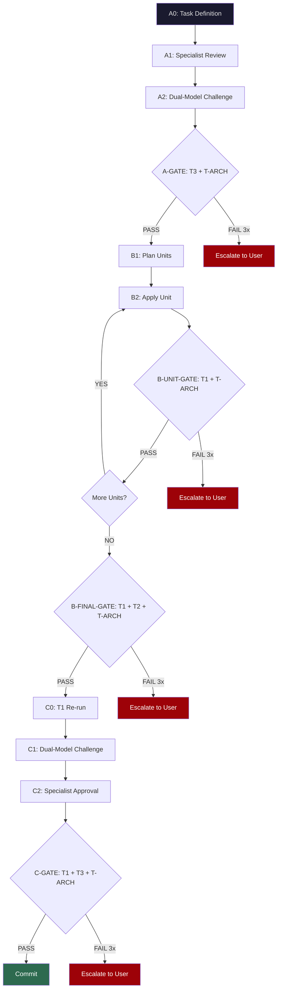

# PSC — Politburo Standing Committee

> *The speed of a standing committee. The discipline of a politburo. Ship code that works.*

## Why PSC?

China built 40,000 km of high-speed rail in 15 years. The UK spent 20 years *planning* HS2 and hasn't laid a single mile of track. Shanghai's Metro grew from 0 to 800 km in under three decades; London's Crossrail took 13 years for a single line.

The difference isn't resources — it's execution discipline. The Politburo Standing Committee (PSC) makes decisions fast, assigns clear ownership, enforces quality without scope creep, and moves on. No endless review cycles. No democracy-of-one-thousand-opinions. Design, validate, build, verify, commit.

PSC brings that execution philosophy to multi-agent AI development:

- **Unambiguous ownership** — every task has exactly one responsible agent
- **Quality gates, not review theaters** — mechanical checks pass or fail; no subjective "looks good to me"
- **Dual-Model Challenge** — adversarial review by a second model, not rubber stamps
- **Three-phase pipeline** — Design → Build → Verify, with no skipping phases
- **Tiered compliance** — T1 (mechanical), T2 (architectural), T3 (semantic), each with independent retry budgets

## Pipeline at a Glance



### The Three Phases

| Phase | Purpose | Key Mechanism |
|-------|---------|---------------|
| **A — Requirements & Design** | Define what and how before writing code | Parallel specialist review + adversarial challenge |
| **B — Build** | Implement incrementally with self-validation | PAU loop (Plan → Apply → Validate) per unit + tiered gates |
| **C — Multi-Agent Verify** | Final check before commit | Dual-Model Challenge + 6 specialist approvals |

### The Four Compliance Tiers

| Tier | Type | Who Runs | What It Checks |
|------|------|----------|---------------|
| **T1** | Mechanical | Automated | Build passes, Doxygen, no banned patterns, no raw integers in public API |
| **T2** | Architectural | Software Engineer | Platform boundary, namespace hygiene, API surface, no mutable globals |
| **T3** | Semantic | All 6 specialists | Datasheet fidelity, protocol correctness, security, test coverage, docs |
| **T-ARCH** | Principles | Software Engineer | Logical consistency, structural soundness, principle alignment |

Each tier has an **independent 3-retry budget**. After 3 failures at any tier, escalation to the user — no infinite loops.

### The Supreme Leader

The **Supreme Leader** (the orchestrator agent) follows a strict **DISPATCH-ONLY** rule: it never analyses, designs, writes, or decides anything itself. It classifies intent, dispatches to specialists, presents output, and manages the pipeline flow. Every decision is made by the specialist closest to the problem.

## Quick Start

```bash
# Clone the repository
git clone https://github.com/jeanboutros/psc.git

# Install into your project (interactive — selects domain skills)
cd /path/to/your/project
/path/to/psc/install.sh

# Or install into a specific directory
/path/to/psc/install.sh /path/to/project

# Non-interactive: install everything
/path/to/psc/install.sh --non-interactive /path/to/project

# Core-only: skip domain skill selection
/path/to/psc/install.sh --core-only /path/to/project
```

After installation, your project will have:

```
your-project/
  .opencode/
    agents/                    # 10 agent definitions
    skills/                    # Core + selected domain skills
    merge/                     # Merge prompts for conflicts (if any)
  docs/
    pipeline/
      scripts/
        t1-check.sh           # T1 mechanical compliance check
    project-management/
      next-id.mjs              # Ticket/epic/ADR ID generator
      counters.json            # ID counters
      open/                    # Open tickets
      backlog/                 # Backlog tickets
      closed/                  # Closed tickets
      epics/                   # Epic definitions
      clarifications/          # Clarification requests
      advisories/              # Advisory flags
      adr/                     # Architecture decision records
      designs/                 # Design documents
      chores/                  # Chores
      reviews/                 # Review records
```

## Deep Dive

For the complete pipeline specification, agent routing, dispatch envelope format, gate retry logic, and the Dual-Model Challenge protocol, see **[docs/pipeline.md](docs/pipeline.md)**.

## The Agents

| Agent | Role | Mode |
|-------|------|------|
| `supreme-leader` | Orchestrator — dispatches tasks to specialists, enforces pipeline | primary |
| `software-engineer` | Architecture, API design, HAL interfaces, T2 & T-ARCH review | subagent |
| `hardware-engineer` | Datasheet verification, register models, timing constraints | subagent |
| `wireless-expert` | RF protocol compliance, channel mapping, modulation | subagent |
| `security-reviewer` | Buffer safety, stack depth, secrets handling, attack surfaces | subagent |
| `test-engineer` | Test strategy, static_assert, edge cases, coverage | subagent |
| `docs-writer` | Doxygen, learning docs, reference verification | subagent |
| `code-architect` | Primary implementation agent (PAU loop, incremental build) | subagent |
| `memory-safety` | C++ memory safety, RAII, heap analysis, ASAN | subagent |
| `pm` | Task master — sole authority for creating tasks and tickets | subagent |

## Skills

Skills are the domain knowledge layer — agents are generic roles, and all project-specific expertise lives in skills loaded at dispatch time.

### Skill Loading Order

1. **`assumption-trap`** — FIRST, always. Halts on ambiguity.
2. **Core skills** — `compliance-gate`, `pipeline`, `pau-loop`, `verification-before-completion`, etc.
3. **Domain skills** — loaded based on the tech stack in `AGENTS.md`
4. **Phase skills** — `brainstorming` (Phase A), `incremental-execution` (Phase B), `grill-me` (Phase C)

### Skill Categories

| Category | Skills | Always Installed? |
|----------|--------|-------------------|
| **Core** | assumption-trap, pau-loop, incremental-execution, compliance-gate, pipeline, review-confidence, flag-protocol, self-audit-checklist | Yes |
| **Process** | brainstorming, grill-me, datasheet-verification, systematic-debugging, test-driven-development, verification-before-completion, memory-safety, type-design-review, silent-failure | Yes |
| **Domain** | nrf24l01plus, esp-idf, cpp-embedded, ble-protocol, ubertooth, nrf52840-sniffer | Optional |

## Project Management

### Ticket IDs

```bash
node docs/project-management/next-id.mjs ticket         # next ticket id
node docs/project-management/next-id.mjs ticket 5       # next 5 ticket ids
node docs/project-management/next-id.mjs epic            # next epic id
node docs/project-management/next-id.mjs clarification   # next clarification id
node docs/project-management/next-id.mjs adr             # next ADR id
node docs/project-management/next-id.mjs ticket --dry-run  # preview only
```

The ID prefix defaults to the project directory name but can be configured via `ID_PREFIX`.

### Flag Protocol

Non-PM agents raise **flags** (structured requests) — only the PM creates actual tasks:

```markdown
## Flag: [type] — [short title]

| Field | Value |
|-------|-------|
| Type | task / clarification / decision / advisory |
| Priority | critical / high / medium / low |
| Raised by | Agent role |
| Blocking | yes / no |

## Description
What was found and why it needs attention.

## Evidence
Code snippets, datasheet references, or PoC.

## Suggested action
What the flagging agent recommends.
```

### Directory Structure

| Directory | Purpose |
|-----------|---------|
| `open/` | Active tickets |
| `backlog/` | Tickets waiting to be started |
| `closed/` | Completed tickets |
| `epics/` | Large feature definitions |
| `clarifications/` | Questions needing answers |
| `advisories/` | Non-blocking flags |
| `adr/` | Architecture Decision Records |
| `designs/` | Design documents |
| `chores/` | Small tasks |
| `reviews/` | Review records |

## How to Add Your Own Domain Skills

1. Create `.opencode/skills/your-skill-name/SKILL.md` with YAML frontmatter:

```yaml
---
name: your-skill-name
description: "One-line description of when to trigger this skill (1-1024 characters)."
---

# Your Skill Title

## Purpose
What this skill provides and when to use it.

## When to Trigger
Conditions that should cause OpenCode to load this skill.

## Content
Your skill content here — rules, checklists, patterns, gotchas.

## Self-Reflection Clause
After fixing any bug, ask:
1. Why was this bug missed?
2. What procedural safeguard would have caught it?
3. Update this skill or the learning docs.
```

2. Reference it in `AGENTS.md` under the Skill Registry.

## Self-Reflection Clause

Every agent and skill includes a self-reflection clause. After fixing any bug or resolving an issue:

1. **Why was this bug missed?** — What review, test, or protocol gap allowed it through?
2. **What procedural safeguard would have caught it?** — What specific check would have prevented it?
3. **Update the knowledge base** — Add the lesson to the relevant skill or learning doc.

Every failure becomes a permanent improvement to the workflow.

## License

MIT License — see [LICENSE](LICENSE) for details.