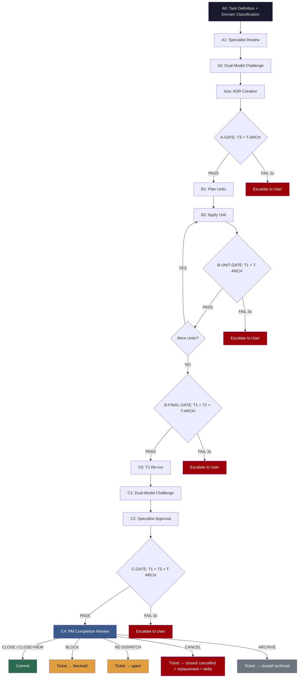

# PSC - Politburo Standing Committee

> *The speed of a standing committee. The discipline of a politburo. Ship code that works.*

## Why PSC?

China built 40,000 km of high-speed rail in 15 years. The UK spent 20 years *planning* HS2 and hasn't laid a single mile of track. Shanghai's Metro grew from 0 to 800 km in under three decades; London's Crossrail took 13 years for a single line.

The difference isn't resources, it's execution discipline. The Politburo Standing Committee (PSC) makes decisions fast, assigns clear ownership, enforces quality without scope creep, and moves on. No endless review cycles. No democracy-of-one-thousand-opinions. Design, validate, build, verify, commit.

PSC brings that execution philosophy to multi-agent AI development:

- **Unambiguous ownership** — every task has exactly one responsible agent
- **Quality gates, not review theaters** — mechanical checks pass or fail; no subjective "looks good to me"
- **Dual-Model Challenge** — adversarial review by a second model, not rubber stamps
- **Three-phase pipeline** — Design → Build → Verify, with no skipping phases
- **Tiered compliance** — T1 (mechanical), T2 (architectural), T3 (semantic), T-ARCH (principles), each with independent retry budgets

## Pipeline at a Glance



### The Three Phases + Completion Review

| Phase | Purpose | Key Mechanism |
|-------|---------|---------------|
| **A — Requirements & Design** | Define what and how before writing code | Task domain classification + parallel specialist review + adversarial challenge + ADR creation |
| **B — Build** | Implement incrementally with self-validation | PAU loop (Plan → Apply → Validate) per unit + tiered gates |
| **C — Multi-Agent Verify** | Final check before commit | Dual-Model Challenge + specialist approvals (cross-document consistency) |
| **C4 — PM Completion Review** | Post-gate decision point | PM reviews all verdicts, synthesis, corrections, gaps. Decides: CLOSE / CLOSE+NEW / BLOCK / RE-DISPATCH / CANCEL / ARCHIVE |

### The Four Compliance Tiers

| Tier | Type | Who Runs | What It Checks |
|------|------|----------|---------------|
| **T1** | Mechanical | Automated | Build passes, doc-standard comments, no banned patterns, no raw integers in public API |
| **T2** | Architectural | Software Engineer | Platform boundary, namespace hygiene, API surface, no mutable globals |
| **T3** | Semantic | All dispatched specialists | Datasheet fidelity, protocol correctness, security, test coverage, docs (including cross-document consistency) |
| **T-ARCH** | Principles | Software Engineer | Logical consistency, structural soundness, principle alignment |

Each tier has an **independent 3-retry budget**. After 3 failures at any tier, escalation to the user — no infinite loops.

### The Supreme Leader

The **Supreme Leader** (the orchestrator agent) follows a strict **DISPATCH-ONLY** rule: it never analyses, designs, writes, or decides anything itself. It classifies intent, dispatches to specialists, presents output, and manages the pipeline flow. Every decision is made by the specialist closest to the problem.

## Quick Start

```bash
# Clone the repository
git clone https://github.com/jeanboutros/psc.git

# Install into your project (interactive — selects domain skills)
cd /path/to/your/project
/path/to/psc/install.sh

# Or install into a specific directory
/path/to/psc/install.sh /path/to/project

# Non-interactive: install everything
/path/to/psc/install.sh --non-interactive /path/to/project

# Core-only: skip domain skill selection
/path/to/psc/install.sh --core-only /path/to/project
```

After installation, your project will have:

```
your-project/
  .opencode/
    agents/                    # Agent definitions
    skills/                    # Core + selected domain skills
    merge/                     # Merge prompts for conflicts (if any)
  docs/
    project-management/
      next-id.mjs              # Atomic ID generator (9 kinds: ticket, epic, adhoc, clarification, decision, advisory, mistake, adr, conversation)
      counters.json            # ID counters (must exist, never recreated)
      passports/               # Pipeline passports
      tickets/                 # Ticket files (universal unit of work)
        open/                  # Ready for dispatch
        active/                # Currently in pipeline
        closed/                # Completed (completed / cancelled / archived)
        blocked/               # Waiting for clarification/dependency
      epics/                   # Epic definitions
      adhoc/                   # Adhoc request tickets
      clarifications/          # Clarification requests and resolutions
      advisories/              # Advisory flags
      decisions/               # Decision records
      logs/                    # Universal log directory
        tickets/               # Per-ticket execution logs (one directory per ticket)
        conversations/         # Auto-logged session conversations
        index.md               # Cross-reference index of all logs
      INDEX.md                 # Project management directory index
    adr/                       # Architecture decision records
    pipeline/
```

## Deep Dive

For the complete pipeline specification, agent routing, dispatch envelope format, gate retry logic, and the Dual-Model Challenge protocol, see **[docs/pipeline.md](docs/pipeline.md)**.

## The Agents

| Agent | Role | Mode | Model |
|-------|------|------|-------|
| `supreme-leader` | Orchestrator — dispatches tasks to specialists, enforces pipeline, manages passports | primary | `deepseek-v4-pro` |
| `pm` | Task master — sole authority for creating tasks and tickets | subagent | `nemotron-3-ultra` |
| `software-engineer` | Architecture, API design, HAL interfaces, T2 & T-ARCH review | subagent | `deepseek-v4-pro` |
| `hardware-engineer` | Datasheet verification, register models, timing constraints | subagent | `deepseek-v4-pro` |
| `wireless-expert` | RF protocol compliance, channel mapping, modulation | subagent | `deepseek-v4-pro` |
| `security-reviewer` | Buffer safety, stack depth, secrets handling, attack surfaces | subagent | `deepseek-v4-pro` |
| `test-engineer` | Test strategy, static_assert, edge cases, coverage | subagent | `deepseek-v4-pro` |
| `docs-writer` | Documentation quality (language-agnostic — loads doc-standard skill per language), learning docs, reference verification | subagent | `deepseek-v4-pro` |
| `code-architect` | Primary implementation agent (PAU loop, incremental build) | subagent | `deepseek-v4-pro` |
| `memory-safety` | C++ memory safety, RAII, heap analysis, ASAN | subagent | `deepseek-v4-pro` |
| `code-reviewer` | Structured multi-round code review in Phase CR (confidence-scored findings) | subagent | `minimax-m3` |
| `skill-recruiter` | Online skill search, safety scanning, skill gap detection, conversation synthesis | subagent | `deepseek-v4-pro` |
| `product-designer` | Vision extraction, requirements discovery — helps users articulate what they want | subagent | `deepseek-v4-pro` |
| `ux-engineer` | Usability, state completeness, accessibility, interaction design | subagent | `deepseek-v4-pro` |
| `ui-engineer` | Frontend implementation — builds production-grade UI using specified stack | subagent | `deepseek-v4-pro` |

### Challenger Agents (Dual-Model Challenge)

Each specialist has a challenger variant powered by `glm-5.1` for independent critique during A2 and C1:

| Challenger | Primary | Model |
|-----------|---------|-------|
| `code-architect-challenger` | `code-architect` | `glm-5.1` |
| `software-engineer-challenger` | `software-engineer` | `glm-5.1` |
| `test-engineer-challenger` | `test-engineer` | `glm-5.1` |
| `docs-writer-challenger` | `docs-writer` | `glm-5.1` |
| `hardware-engineer-challenger` | `hardware-engineer` | `glm-5.1` |
| `memory-safety-challenger` | `memory-safety` | `glm-5.1` |
| `security-reviewer-challenger` | `security-reviewer` | `glm-5.1` |
| `wireless-expert-challenger` | `wireless-expert` | `glm-5.1` |
| `product-designer-challenger` | `product-designer` | `glm-5.1` |
| `ux-engineer-challenger` | `ux-engineer` | `glm-5.1` |
| `ui-engineer-challenger` | `ui-engineer` | `glm-5.1` |

### General Validation Agents (Multi-Model Validation)

Read-only agents for cross-validation, fact-checking, and requirement refinement. Dispatched by supreme-leader and PM only:

| Agent | Model | Priority |
|-------|-------|----------|
| `general-kimi` | `kimi-k2.7-code` | 1 (highest) |
| `general-nemotron` | `nemotron-3-ultra` | 2 |
| `general-minimax` | `minimax-m3` | 3 |
| `general-glm` | `glm-5.1` | 4 |
| `general-deepseek` | `deepseek-v4-pro` | 5 (lowest) |

## Skills

Skills are the domain knowledge layer — agents are generic roles, and all project-specific expertise lives in skills loaded at dispatch time.

### Skill Loading Order

1. **`assumption-trap`** — FIRST, always. Halts on ambiguity.
2. **Core skills** — `compliance-gate`, `pipeline`, `pau-loop`, `verification-before-completion`, etc.
3. **Domain skills** — loaded based on the tech stack in `AGENTS.md`
4. **Phase skills** — `brainstorming` (Phase A), `incremental-execution` (Phase B), `grill-me` (Phase C)

### Skill Categories

| Category | Skills | Always Installed? |
|----------|--------|-------------------|
| **Core** | assumption-trap, pau-loop, incremental-execution, compliance-gate, pipeline, review-confidence, flag-protocol, self-audit-checklist, multi-model-validation | Yes |
| **Process** | assumption-trap, pau-loop, incremental-execution, compliance-gate, pipeline, review-confidence, flag-protocol, self-audit-checklist, multi-model-validation | Yes |
| **Testing** | test-driven-development (generic), tdd-cpp (C++ projects), datasheet-verification, systematic-debugging, verification-before-completion, memory-safety, type-design-review, silent-failure | Yes |
| **UI/Design** | design-taste, ux-patterns | Optional (for projects with UI) |
| **Domain** | *(your project-specific skills — see "How to Add Your Own Domain Skills" below)* | Optional |

## Project Management

### Universal Ticket System

Every unit of work is a ticket. Nine ticket types, each with a type-appropriate pipeline path:

| Type | ID Prefix | Pipeline Path | Example |
|------|-----------|---------------|---------|
| `feature` | `psc` | Full A→B→C→C4→COMMIT | New BLE protocol |
| `bugfix` | `psc` | Full A→B→C→C4→COMMIT | Fix register bit |
| `adhoc` | `psc-adhoc` | Full A→B→C→C4→COMMIT | Update README |
| `clarification` | `psc-clar` | A-only: A0→A1→A3→C4 | User asks about pipeline |
| `decision` | `psc-dec` | A-only: A0→A1→(A2)→(A2a)→A3→C4 | Choose architecture option |
| `advisory` | `psc-adv` | Log-only: A0→C4 | Non-blocking finding |
| `mistake` | `psc-mistake` | Log-only: A0→C4 | Bug outside active ticket |
| `epic` | `psc-epic` | No pipeline — planning only | Large feature broken into tickets |
| `conversation` | `psc-conv` | No ticket, no PM — auto-logged by Supreme Leader | Session discussion |

### Ticket Lifecycle

```
FLAG → PM creates ticket in tickets/open/
              │
              ▼
      Supreme Leader dispatches
      Ticket → tickets/active/
              │
 ┌────────────┼────────────┐
 ▼            ▼            ▼
UNDERSTANDING C-GATE PASS C-GATE FAIL
ERROR FOUND  → C4: PM     → open/
→ closed/     reviews      (rework/new)
(cancelled)       │
+ replacement  ┌──┼──┐
+ delta        ▼  ▼  ▼
analysis    CLOSE CLOSE+NEW RE-DISPATCH
            →closed/ →closed/ →open/
            (completed)(completed)(new)
                        + new tickets

ARCHIVE → closed/ (archived)
```

### Ticket IDs

```bash
node docs/project-management/next-id.mjs ticket         # next ticket id
node docs/project-management/next-id.mjs ticket 5       # next 5 ticket ids
node docs/project-management/next-id.mjs epic            # next epic id
node docs/project-management/next-id.mjs adhoc           # next adhoc id
node docs/project-management/next-id.mjs clarification   # next clarification id
node docs/project-management/next-id.mjs decision        # next decision id
node docs/project-management/next-id.mjs advisory        # next advisory id
node docs/project-management/next-id.mjs mistake         # next mistake id
node docs/project-management/next-id.mjs adr             # next ADR id
node docs/project-management/next-id.mjs conversation    # next conversation id
node docs/project-management/next-id.mjs ticket --dry-run  # preview only
```

The counter file at `docs/project-management/counters.json` must exist. If deleted, the script fails — numbers are never reused.

### Universal Logging

Every agent outcome, decision, discussion, root cause, mistake, and bug is logged:

| Log Type | Location | Format |
|----------|----------|--------|
| Per-step agent outcomes | `docs/project-management/logs/tickets/<ticket-id>/<step>.md` | One file per agent per step — no race conditions |
| Session conversations | `docs/project-management/logs/conversations/<conv-id>.md` | Auto-logged by Supreme Leader at session end |
| Log index | `docs/project-management/logs/index.md` | Cross-reference of all logs |

### Flag Protocol

Non-PM agents raise **flags** (structured requests) — only the PM creates actual tasks:

```markdown
## Flag: [type] — [short title]

| Field | Value |
|-------|-------|
| Type | task / clarification / decision / advisory |
| Priority | critical / high / medium / low |
| Raised by | Agent role |
| Blocking | yes / no |

## Description
What was found and why it needs attention.

## Evidence
Code snippets, datasheet references, or PoC.

## Suggested action
What the flagging agent recommends.
```

### Directory Structure

| Directory | Purpose |
|-----------|---------|
| `open/` | Active tickets |
| `backlog/` | Tickets waiting to be started |
| `closed/` | Completed tickets |
| `epics/` | Large feature definitions |
| `clarifications/` | Questions needing answers |
| `advisories/` | Non-blocking flags |
| `adr/` | Architecture Decision Records |
| `designs/` | Design documents |
| `chores/` | Small tasks |
| `reviews/` | Review records |
| `passports/` | Pipeline passports tracking completed steps |

### Pipeline Passport

Every task carries a **passport** that tracks which pipeline steps have been completed. No step may be skipped without written justification.

**Key rules:**

1. **No step without a stamp** — every step must be checked off before the next step begins
2. **No skip without justification** — a written justification and Supreme Leader authorisation are required
3. **Loops are tracked** — every A→B→A loop is recorded in the passport's Loop History section
4. **Passport travels with dispatch** — the passport file path is included in every dispatch envelope

Passports are stored in `docs/project-management/passports/<ticket-id>-passport.md` and are created by the PM when a ticket is opened. For the full passport format and rules, see `.opencode/skills/pipeline-passport/SKILL.md`.

## How to Add Your Own Domain Skills

1. Create `.opencode/skills/your-skill-name/SKILL.md` with YAML frontmatter:

```yaml
---
name: your-skill-name
description: "One-line description of when to trigger this skill (1-1024 characters)."
---

# Your Skill Title

## Purpose
What this skill provides and when to use it.

## When to Trigger
Conditions that should cause OpenCode to load this skill.

## Content
Your skill content here — rules, checklists, patterns, gotchas.

## Self-Reflection Clause
After fixing any bug, ask:
1. Why was this bug missed?
2. What procedural safeguard would have caught it?
3. Update this skill or the learning docs.
```

2. Reference it in `AGENTS.md` under the Skill Registry.

## Self-Reflection Clause

Every agent and skill includes a self-reflection clause. After fixing any bug or resolving an issue:

1. **Why was this bug missed?** — What review, test, or protocol gap allowed it through?
2. **What procedural safeguard would have caught it?** — What specific check would have prevented it?
3. **Update the knowledge base** — Add the lesson to the relevant skill or learning doc.

Every failure becomes a permanent improvement to the workflow.

## Review & Test Status

Human review and testing status for every file in this project.

### Agents

| File | Reviewed | Tested |
|------|----------|--------|
| `agents/code-architect.md` | [ ] | [ ] |
| `agents/code-architect-challenger.md` | [ ] | [ ] |
| `agents/code-reviewer.md` | [ ] | [ ] |
| `agents/docs-writer.md` | [ ] | [ ] |
| `agents/docs-writer-challenger.md` | [ ] | [ ] |
| `agents/general-deepseek.md` | [ ] | [ ] |
| `agents/general-glm.md` | [ ] | [ ] |
| `agents/general-kimi.md` | [ ] | [ ] |
| `agents/general-minimax.md` | [ ] | [ ] |
| `agents/general-nemotron.md` | [ ] | [ ] |
| `agents/hardware-engineer.md` | [ ] | [ ] |
| `agents/hardware-engineer-challenger.md` | [ ] | [ ] |
| `agents/memory-safety.md` | [ ] | [ ] |
| `agents/memory-safety-challenger.md` | [ ] | [ ] |
| `agents/pm.md` | [ ] | [ ] |
| `agents/product-designer.md` | [ ] | [ ] |
| `agents/product-designer-challenger.md` | [ ] | [ ] |
| `agents/security-reviewer.md` | [ ] | [ ] |
| `agents/security-reviewer-challenger.md` | [ ] | [ ] |
| `agents/skill-recruiter.md` | [ ] | [ ] |
| `agents/software-engineer.md` | [ ] | [ ] |
| `agents/software-engineer-challenger.md` | [ ] | [ ] |
| `agents/supreme-leader.md` | [ ] | [ ] |
| `agents/test-engineer.md` | [ ] | [ ] |
| `agents/test-engineer-challenger.md` | [ ] | [ ] |
| `agents/ui-engineer.md` | [ ] | [ ] |
| `agents/ui-engineer-challenger.md` | [ ] | [ ] |
| `agents/ux-engineer.md` | [ ] | [ ] |
| `agents/ux-engineer-challenger.md` | [ ] | [ ] |
| `agents/wireless-expert.md` | [ ] | [ ] |
| `agents/wireless-expert-challenger.md` | [ ] | [ ] |

### Core Skills

| File | Reviewed | Tested |
|------|----------|--------|
| `skills/core/assumption-trap/SKILL.md` | [ ] | [ ] |
| `skills/core/brainstorming/SKILL.md` | [ ] | [ ] |
| `skills/core/compliance-gate/SKILL.md` | [ ] | [ ] |
| `skills/core/context7-docs/SKILL.md` | [ ] | [ ] |
| `skills/core/cross-document-consistency/SKILL.md` | [ ] | [ ] |
| `skills/core/datasheet-verification/SKILL.md` | [ ] | [ ] |
| `skills/core/doxygen-cpp/SKILL.md` | [ ] | [ ] |
| `skills/core/flag-protocol/SKILL.md` | [ ] | [ ] |
| `skills/core/github/SKILL.md` | [ ] | [ ] |
| `skills/core/grill-me/SKILL.md` | [ ] | [ ] |
| `skills/core/incremental-execution/SKILL.md` | [ ] | [ ] |
| `skills/core/memory-safety/SKILL.md` | [ ] | [ ] |
| `skills/core/multi-model-validation/SKILL.md` | [ ] | [ ] |
| `skills/core/pau-loop/SKILL.md` | [ ] | [ ] |
| `skills/core/pipeline/SKILL.md` | [ ] | [ ] |
| `skills/core/pipeline-passport/SKILL.md` | [ ] | [ ] |
| `skills/core/post-rejection-correction/SKILL.md` | [ ] | [ ] |
| `skills/core/review-confidence/SKILL.md` | [ ] | [ ] |
| `skills/core/self-audit-checklist/SKILL.md` | [ ] | [ ] |
| `skills/core/silent-failure/SKILL.md` | [ ] | [ ] |
| `skills/core/skill-recruiter/SKILL.md` | [ ] | [ ] |
| `skills/core/software-engineering-principles/SKILL.md` | [ ] | [ ] |
| `skills/core/systematic-debugging/SKILL.md` | [ ] | [ ] |
| `skills/core/tdd-cpp/SKILL.md` | [ ] | [ ] |
| `skills/core/test-driven-development/SKILL.md` | [ ] | [ ] |
| `skills/core/type-design-review/SKILL.md` | [ ] | [ ] |
| `skills/core/verification-before-completion/SKILL.md` | [ ] | [ ] |

### Domain Skills

| File | Reviewed | Tested |
|------|----------|--------|
| `skills/domain/ble-protocol/SKILL.md` | [ ] | [ ] |
| `skills/domain/cpp-embedded/SKILL.md` | [ ] | [ ] |
| `skills/domain/design-taste/SKILL.md` | [ ] | [ ] |
| `skills/domain/esp-idf/SKILL.md` | [ ] | [ ] |
| `skills/domain/nrf24l01plus/SKILL.md` | [ ] | [ ] |
| `skills/domain/nrf52840-sniffer/SKILL.md` | [ ] | [ ] |
| `skills/domain/ubertooth/SKILL.md` | [ ] | [ ] |
| `skills/domain/ux-patterns/SKILL.md` | [ ] | [ ] |

### Scripts

| File | Reviewed | Tested |
|------|----------|--------|
| `scripts/next-id.mjs` | [x] | [ ] |
| `scripts/counters.json` | [ ] | [ ] |

### Docs

| File | Reviewed | Tested |
|------|----------|--------|
| `docs/pipeline.md` | [ ] | [ ] |
| `README.md` | [ ] | [ ] |
| `AGENTS.md` | [ ] | [ ] |
| `LICENSE` | [ ] | [ ] |
| `install.sh` | [ ] | [ ] |

## License

MIT License — see [LICENSE](LICENSE) for details.