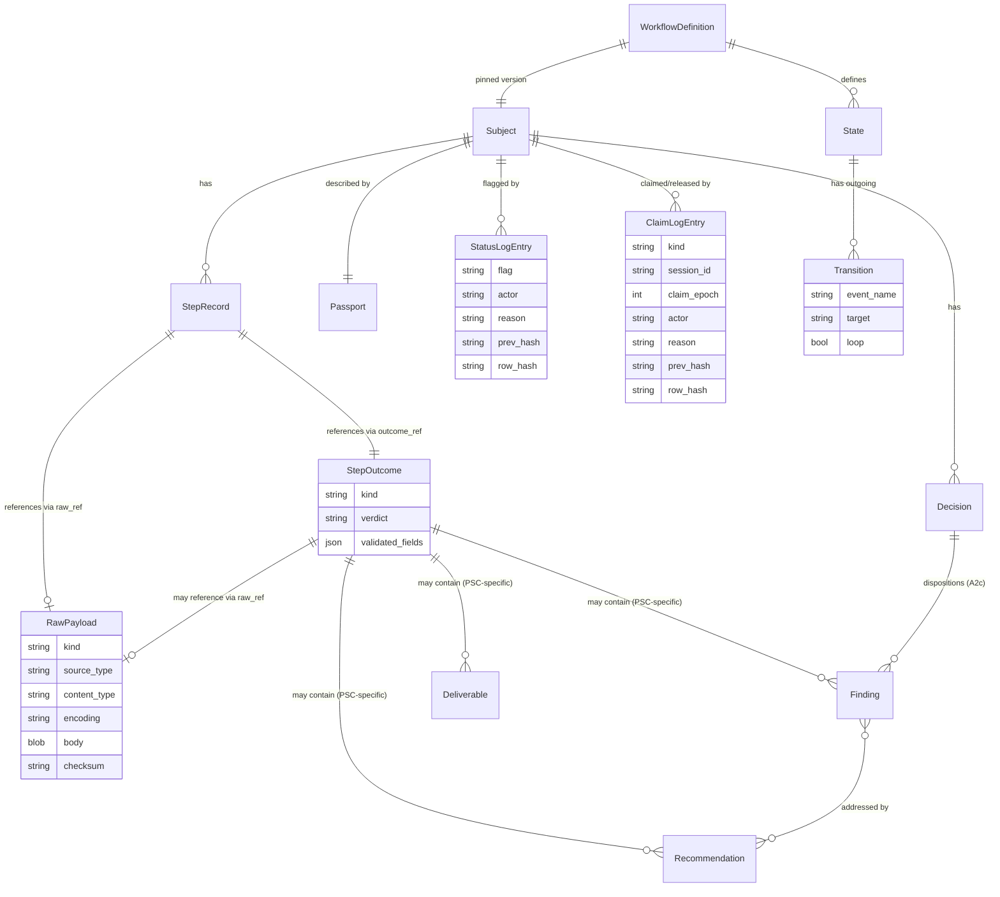

# 02 — High-Level Design: Semantics, Ontology, and Architecture Decisions

> **Status:** DRAFT. Decisions marked **[LOCKED]** or **[TENTATIVE]**.

---

## Workflow Semantics — BPMN 2.0.2 + ASL Vocabulary + LTS Graph [LOCKED]

Grounded in authoritative research (see [06-references.md](06-references.md)).
Our terms map to industry standards as follows:

| Our term | Standard term | Authority |
|----------|--------------|-----------|
| Phase | (no BPMN equivalent; grouping/ordinal) | Metadata field, not a graph element |
| Step / State | **Task** (BPMN) / **State** (ASL) | A node in the graph |
| Gate | **Gateway** (BPMN) / **Choice state** (ASL) | A routing node with conditions |
| Decision | **User Task** (BPMN) | Blocks until a human/PM supplies a form; output becomes variables; a downstream Choice routes on them |
| Outcome | **Task output / event payload** (ASL) | The JSON that flows along the edge to the next state |
| Verdict | **Choice Rule condition** (ASL) / **Gateway condition** (BPMN) | The evaluated predicate that selects which outgoing edge to take. `NewType[str]` — engine knows `pass`/`fail`; projects extend via transition keys |
| Kind | **State type** (ASL: Task, Choice, Parallel, Wait, Succeed, Fail) | The category of a node |
| Tier | (no standard; project-specific) | Metadata on a gate |
| Re-entry budget | **Retry** block (ASL: `max_attempts`) | Gate re-entry budget — how many times a gate can be re-entered after a loop-back. Default 3, per-gate override |
| Dispatch retry | **Retry** block (ASL: `max_attempts`, `interval`, `backoff`) | Re-execute the *same* state on transient dispatch failure, with exponential backoff. Global default, per-state override |
| Loop-back | **Explicit `Next` edge to an earlier state** (ASL) / **Boundary error event** (BPMN) | Transition to an *earlier* state on substantive gate failure — a cycle in the graph |
| Subject | (no standard; our generalisation) | The entity a workflow tracks — may be a ticket, survey, process, or review |
| Transition | **Sequence flow** (BPMN) / **Next** (ASL) | A labelled edge with a mandatory `event_name` |
| Lifecycle event | **Execution event** (all engines) | Engine-level event fired on every state entry/exit, gate, decision |
| Domain event | **event_name** on the transition | Project-specific event for event bus dispatch (Kafka topic) |
| Status flag | (no standard) | Metadata on a subject: `cancelled`, `deferred`, `archived`. NOT a state — the history stays loyal to what actually happened |
| StepOutcome | (no standard) | Validated, schema-conformant record produced by a step. Engine routes on its `verdict` |
| RawPayload | (no standard) | Unprocessed bytes from the dispatch handler — forensic evidence, never read by routing |
| Routing rule | **Choice Rule** (ASL) | SQL-CASE-style conditional: `CASE WHEN condition THEN target; ELSE default; END`. Only for `decision_required` states |

**Representation:** a **labelled transition system** (graph, not linked list),
ASL-influenced. Each state holds a `transitions: dict[Verdict, Transition]`
where `Transition = {target, event_name, loop}`. Edges are labeled by
verdicts; multiple states can transition to the same state (multiple incoming
edges). Every transition has a **mandatory `event_name`** (Kafka-topic-safe).

**Dispatch retry vs re-entry budget — two distinct mechanisms, two distinct budgets:**

- **Dispatch retry** = re-execute the *same* state due to a transient dispatch
  error (timeout, crash, OOM, network), with exponential backoff. Global default
  in `psc_engine.yaml`, overridable per-state. Counter: `meta.attempt`.
- **Re-entry budget** = how many times a gate can be re-entered after a
  loop-back. Default 3, overridable per-gate via `gate_config.reentry_budget`.
  Counter: `meta.entry_count`. On exhaustion: `exhausted` verdict → route to
  `ESCALATE`.

**Task vs decision_required — two distinct state kinds:**

- **`task`** — the engine dispatches to a handler (agent, human, service),
  validates the outcome against `outcome_schema`, and routes on `verdict`.
- **`decision_required`** — the engine blocks until `record_decision()` is
  called with a decision object. Routing is via `routing_rule` (SQL-CASE-style),
  not via `transitions[verdict]`. The decision object is validated against
  `decision_schema`. A StepRecord is written with `verdict: "decided"` as
  metadata.

---

## Ontology

Every entity in the domain and how it maps to a Python entity. The mapping
is the contract between the language-agnostic spec and the Python prototype.

### Engine entities (generic — the engine knows these)

| Entity | Definition | Python entity |
|--------|------------|---------------|
| **Workflow** | A labelled transition system: states + transitions, with `start_at` and terminal states. Versioned (SemVer). Pins `profile_version`. | `StateRegistry` + workflow JSON |
| **State** | A node in the graph. Has name, title, phase, step ordinal, kind, outcome_schema, transitions. Comparable via `StateRegistry.is_ancestor(a, b)`. | `State` (frozen dataclass) |
| **StateKind** | `task` / `parallel` / `gate` / `decision_required` / `terminal` | `StateKind(StrEnum)` |
| **Transition** | A labelled edge: "on this verdict, go to that state." Has mandatory `event_name`. May be a loop-back (`loop: true`, excluded from comparison DAG). | `Transition` (frozen dataclass) |
| **Verdict** | The label on a transition — the result that selects the outgoing edge. `NewType[str]` — engine knows `pass`/`fail`; projects extend via transition keys. Dynamic JSON Schema enum built by `VerdictSchemaBuilder`. | `Verdict` (`NewType[str]`) |
| **VerdictSchemaBuilder** | Builds the per-state JSON Schema `enum` for verdict: `ENGINE_VERDICTS` ∪ `transition_keys`. | `VerdictSchemaBuilder` |
| **OutcomeContract** | The minimal contract the engine routes on: `{ verdict, decision?, confidence? }`. Everything else is opaque payload. | `dict` validated against `outcome.base` schema |
| **Context** | What a state handler sees: `input` + `vars` (flat blackboard) + `meta` (`from_state`, `entry_count`, `attempt`, `entered_at`). Frozen; `vars` deep-copied per parallel branch. O(1) memory. | `Context` + `StateMeta` |
| **Subject** | The entity a workflow tracks. Generalised — ticket/survey/process/review. Engine is agnostic to subject type. `subject_id` validated against strict pattern. | `str` (subject id) |
| **Passport** | The persisted runtime state of one subject: current state, step log (INDEX only), gate results, decisions, retries_used, parallel progress, vars, status flags. JSON-authoritative; Markdown mirror derived. | `dict[str, Any]` |
| **StepRecord** | One entry in the step log, identified by UUIDv7. Carries `outcome_ref` (→ StepOutcome) and `raw_ref` (→ RawPayload, nullable). | `StepRecord` (frozen dataclass) |
| **StepOutcome** | Validated, schema-conformant record produced by a step. Exists only AFTER schema validation passes. Engine routes on its `verdict`. | Stored in `OutcomeStore` with `kind: "step_outcome"` |
| **RawPayload** | Unprocessed bytes from the dispatch handler BEFORE validation. Forensic evidence. Mandatory when validation fails. Never read by routing. | Stored in `OutcomeStore` with `kind: "raw_payload"` |
| **OutcomeStore** | Protocol for storing step outcomes. Allows string or byte array. Implementation decides format (PG JSONB, SQLite JSON, compressed bytes). Split into `StepPathResolver` + `OutcomeRepository` + `StepRecordFactory`. | `OutcomeStore` (Protocol) |
| **DispatchHandler** | Protocol for dispatching a state to its actor. `dispatch(state, ctx) → outcome`. Engine doesn't branch on actor kind. | `DispatchHandler` (Protocol) |
| **DispatcherRegistry** | Maps handler names to DispatchHandler implementations. Extensible at startup. | `DispatcherRegistry` |
| **SchemaRegistry** | Maps schema names to JSON Schemas. Extensible at startup. Validates outcomes + decisions. | `SchemaRegistry` |
| **SchemaProfile** | A project's collection of extended schemas (e.g. `workflows/psc-profile.json`). Carries own SemVer; workflow pins `profile_version`. | JSON file loaded at startup |
| **LifecycleHook** | Global handler fired on every engine event + domain event. `on_event(event: str, context: dict)`. Critical hooks (audit) fail-closed; non-critical swallowed via `HookErrorSink`. | `LifecycleHook` (Protocol) |
| **HookRegistry** | Holds lifecycle hooks. Calls ALL registered hooks for each event. | `HookRegistry` |
| **EngineEvent** | Well-known engine-level events (`state.entered`, `gate.passed`, `workflow.started`, etc.) | `EngineEvent(StrEnum)` |
| **SubjectReader** | Protocol for reading subject state. | `SubjectReader` (Protocol) |
| **SubjectWriter** | Protocol for writing subject state. CAS on `version` AND `claim_epoch`. | `SubjectWriter` (Protocol) |
| **SubjectClaimStore** | Protocol for claim/lease operations. `claim()` returns `ClaimResult` with `claim_epoch` fencing token. Every claim/release appends to `ClaimLog`. Takes `ClaimReason` on claim, `ReleaseReason` on release. | `SubjectClaimStore` (Protocol) |
| **EventStore** | Protocol for the mandatory append-only step-event log. Hash chain: `row_hash = H(prev_hash, row_data)`. | `EventStore` (Protocol) |
| **StatusLog** | Separate append-only log for status flag events (cancelled/deferred/archived). Own hash chain. Clean separation from step_log. | `StatusLog` (Protocol) |
| **ClaimLog** | Separate append-only log for ownership transitions (claimed / released, with `ClaimReason` / `ReleaseReason`). Own hash chain. Excludes heartbeats. | `ClaimLog` (Protocol) |
| **ClaimReason** | Why a subject was claimed: `caller_initiated` / `reclaim_after_reap` / `system_initiated` / `forced_by_admin`. | `ClaimReason(StrEnum)` |
| **ReleaseReason** | Why a subject was released: `caller_initiated` / `lease_ttl_exceeded` / `forced_by_admin` / `session_terminated`. | `ReleaseReason(StrEnum)` |
| **WorkflowDefinitionStore** | Protocol for workflow definition storage. | `WorkflowDefinitionStore` (Protocol) |
| **WorkflowDefinition** | Return type of `load_workflow`: frozen dataclass + `StateRegistry`. | `WorkflowDefinition` |
| **WorkflowDefinitionRecord** | Workflow definition with lifecycle metadata (created_at, updated_at, version). | `WorkflowDefinitionRecord` |
| **CurrentStateResult** | Return type of `current_state`: `{state, is_terminal, is_decision_pending, possible_verdicts, status_flags}`. | `CurrentStateResult` |
| **QueryWhat** | Enum for query API: `step_log`, `status_log`, `decisions`, `vars`, `full`. | `QueryWhat(StrEnum)` |
| **Classification** | `private` (default, fail-closed) / `public` / `protected` — schema-level annotation on primitive fields only | JSON Schema custom keyword |
| **Redactor** | Transforms a protected value for external emission. `redact(value) → redacted_value`. | `Redactor` (Protocol) |
| **RedactorRegistry** | Maps redactor names to Redactor implementations. Built-ins: Default, Email, Token. Missing name → `RedactorNotRegisteredError`. | `RedactorRegistry` |
| **project()** | Recursive function that omits private, redacts protected, passes public. Recurses into objects; classification on primitives only; undeclared fields default to private. Applied at every external boundary. | `project()` function |
| **RosterResolver** | Proposes a roster from domain signals; validates any user selection against `agents_folder`. | `RosterResolver` + `RosterProposal` |
| **SignalMatcher** | Case-fold matching, pluggable protocol for matching domain signals to roster entries. | `SignalMatcher` (Protocol) |
| **ConfigPort** | Protocol for engine configuration in the domain layer. | `ConfigPort` (Protocol) |
| **Config** | Engine configuration in the infrastructure layer: paths, roster defaults/minimum/max/signals, dispatch_retry, reentry_budget. | `Config` (frozen dataclass) |
| **WorkflowDefinitionError** | Raised at load time when the workflow JSON is malformed. | Exception class |
| **WorkflowError** | Base exception for all workflow engine errors. | Exception class |
| **RoutingError** | Raised when no transition matches the outcome verdict. | Exception class |
| **GateExhaustedError** | Raised when a gate's reentry_budget is exhausted. | Exception class |
| **DispatchError** | Raised when a dispatch handler fails. | Exception class |
| **IncomparableStates** | Raised when two states cannot be compared for forward progress. | Exception class |
| **SubjectNotFoundError** | Raised when a subject_id is not found. | Exception class |
| **PassportValidationError** | Raised when passport JSON fails schema validation. | Exception class |
| **LeaseLostError** | Raised on `claim_epoch` mismatch — non-retryable; must re-claim and recompute. | Exception class |
| **ConcurrentWriteError** | Raised on `version` mismatch but `claim_epoch` matched — retryable. | Exception class |
| **HandlerNotRegistered** | Raised when a dispatch handler name is not in the registry. | Exception class |
| **RedactorNotRegisteredError** | Raised when a redactor name is not in the registry. | Exception class |

### PSC project entities (project-specific — in `psc-profile.json`)

| Entity | Definition | Found in example logs |
|--------|------------|----------------------|
| **Finding** | A review finding: `id`, `confidence` (0-100), `severity`, `category`, `description`, `file_line`, `suggested_fix`, `status`, `reference` | A1-SW, A1-DX, C2-SX |
| **Gap** | A finding with impact + recommendation: `id`, `confidence`, `finding`, `impact`, `severity`, `recommendation` | A1-SW |
| **Recommendation** | A suggested action: `id`, `priority` (must_fix/should_fix/consider), `description`, `confidence`, `addresses` (finding IDs), `links` | A1-SW, A1-DX |
| **Reference** | Authoritative citation: `claim`, `source`, `url`, `verification_date` | A1-DX |
| **Deliverable** | What the agent produced: `type` (file/adr/decision/advisory/clarification), `ref`, `sha`, `lines_changed` | A0-B1-B2 |
| **Agreement** | Challenger agreement: `id`, `description`, `covers`, `links` | Challenger pattern |
| **Disagreement** | Challenger disagreement: `id`, `description`, `primary_view`, `challenger_view`, `links` | Challenger pattern |
| **MissingConsideration** | Challenger finding: `id`, `description`, `edge_case`, `links` | Challenger pattern |
| **GateResult** | Per-gate result: `gate`, `tier`, `result`, `attempt` | C4 |
| **SpecialistVerdict** | Per-specialist verdict: `specialist`, `verdict`, `key_findings` | C4 |
| **CorrectionRecord** | Post-rejection correction: `retry`, `gate`, `tier`, `rc_category`, `root_cause`, `corrective_action` | C4 |
| **PlanUnit** | B1 plan unit: `unit_number`, `description`, `files` | A0-B1-B2 |
| **ApplyUnit** | B2 apply unit: `unit_number`, `build_result`, `files_changed`, `what_was_done` | A0-B1-B2 |
| **ValidateResult** | B3 validate: `full_build`, `ac_coverage`, `acceptance_criteria[]` | A0-B1-B2 |
| **SelfAuditEntry** | Self-audit checklist row: `category`, `checked`, `result` | A1-SW, A1-DX, C2-SX |
| **SelfReflection** | Structured reflection: `why`, `what_caught_it`, `knowledge_update` | C2-SX |
| **OWASPExpansion** | Security concern: `concern_category`, `trigger`, `assessment` | C2-SX |
| **NewTicketCreated** | Follow-up ticket: `ticket_id`, `type`, `reason` | C4 |

> **Note:** These are PSC-specific. A different project (survey, process,
> review) would define its own entities in its own profile. The engine
> validates them via the SchemaRegistry but never deserializes them into
> Python objects — they are opaque JSON stored by OutcomeStore.

---

## Architecture Decisions

### 2.1 State-machine access boundary — dual surface [TENTATIVE]

Design both MCP server (`psc-state`) and CLI (`python -m psc_engine`) surfaces.
Identical API contracts; pick at runtime. See open question 1 in
[00-README.md](00-README.md).

### 2.2 Storage — JSON + advisory lock + derived Markdown mirror [LOCKED]

JSON passport authoritative; Markdown mirror regenerated on every `advance()`.
Database (SQLite/PG) for persistence + concurrency via protocol-based stores.
Mirror is a **feature flag** — can be turned off for non-agentic workflows or
those with other logging. Source of truth is the step_log; mirror is derived.

### 2.3 Decision-required states — five judgement points [LOCKED]

A0 roster confirmation, A2c user disposition, C4 PM completion, gate-fail
RC correction, A0 clarification loop. The machine records; it doesn't compute.
A0 is `decision_required` with `decision.roster_confirmation` — the PM confirms
the roster before work begins.

### 2.4 Schema evolution — snapshot workflow definition only [LOCKED]

At A0, the workflow definition JSON is snapshotted into the subject directory.
**Agent files are NOT snapshotted** — agents self-reflect and update regularly,
so a task always uses the latest agent version. The engine resolves agent
files from `agents_folder` at dispatch time. If an agent file changes between
dispatches, a warning is issued (not an error).

Versioning: SemVer; max 2 concurrent MAJOR; 90-day grace; force-migrate-or-close.
Profile carries own SemVer; workflow pins `profile_version`.

### 2.5 Human review trail — derived Markdown mirror [LOCKED]

JSON authoritative; mirror regenerated on every `advance()`; drift = CI failure.

### 2.6 Adhoc tasks — separate workflow file `psc-adhoc` [LOCKED]

### 2.7 Process context — input + flat vars + meta [LOCKED]

O(1) memory; no full path surfaced to handlers. Context is frozen; `vars`
deep-copied per parallel branch; merged at join time under engine control.

### 2.8 Implicit start + terminal detection + cancel [LOCKED]

- **Start:** `WORKFLOW_STARTED` event + transition to `start_at`. No `__START__` node.
- **End:** terminal detection (`kind: "terminal"` OR no transitions) → `WORKFLOW_COMPLETED`.
- **Cancel:** external signal (`cancel_subject` API); sets `cancelled: true` status flag on passport; fires `WORKFLOW_CANCELLED`; abrupt (no `STATE_EXITED` for the abandoned state). Cancelled/deferred/archived are **status flags**, NOT synthetic terminal states. `state.current` stays at the actual state when the flag was set. Flag events recorded in separate `status_log` table with own hash chain.

### 2.9 Lifecycle hooks [LOCKED]

Global, fire-and-forget, exception-safe. `on_event(event: str, context: dict)`.
Event is either an `EngineEvent` enum member (`state.entered`) or a
transition's `event_name` (`subject.phase-a.classified`). Both go through the
same channel.

Critical hooks (audit) fail-closed — if a critical hook raises, the engine
aborts the operation. Non-critical hooks are swallowed via `HookErrorSink`.
`AuditHook` is dropped — `EventStore` IS the audit trail.

Firing sequence during `advance()`:
1. Write StepRecord + update passport (BEFORE any hook fires)
2. `state.exited` (engine event)
3. The transition's `event_name` (domain event — e.g. `ticket.phase-a.classified`)
4. `transition.triggered` (engine event carrying the `event_name` in context)
5. `state.entered` (engine event)
6. If terminal → `state.entered` first, then `workflow.completed`
7. If cancelled → only `workflow.cancelled` (no `state.entered`)

### 2.10 Data classification & redaction [LOCKED]

- `private` (default, fail-closed) / `public` / `protected` (redacted)
- Classification on the schema, not on the data (JSON Schema custom keywords)
- Classification applies to **primitives only** — objects are not classified as a whole; their child fields are classified individually
- `project()` recurses into objects unconditionally; undeclared fields default to `private`
- `Redactor` protocol + `RedactorRegistry`; if no `redactor` specified, `DefaultRedactor` → `[REDACTED]`
- Passport JSON stores cleartext; `project()` applied at all emission boundaries (events, logs, audit, API, mirror)

### 2.11 Pluggable dispatch handlers [LOCKED]

State declares `dispatch_handler` name. Engine calls `handler.dispatch()`.
Doesn't branch on actor_kind. Built-ins: `engine.subagent_dispatch`,
`engine.human_form_dispatch`, `engine.system_webhook_dispatch`.
Gates have NO `dispatch_handler` — gates are driven by `gate_config`.

### 2.12 Schema registry + opaque payload [LOCKED]

Engine validates outcome against schema; doesn't interpret project-specific
fields. PSC profile at `workflows/psc-profile.json`.

### 2.13 Mandatory event_name on transitions [LOCKED]

Every transition has `event_name` (Kafka-topic-safe pattern
`subject.<phase>.<event>`). `subject` prefix replaced with actual
`subject_type` at dispatch time. Validated at load time. Routing rule branches
in `decision_required` states also declare `event_name` per branch.

### 2.14 Load-time validation [LOCKED]

`WorkflowDefinitionError` raised if any of the following:

- missing `event_name` on a transition or routing rule branch
- transition target doesn't exist
- schema/handler unresolvable
- forward-DAG cyclic
- `start_at` missing
- no terminal state exists
- phase FK invalid (state references non-existent phase)
- state name doesn't match its dict key
- gate state has `dispatch_handler` or `retry` blocks
- gate state has any transition verdict not in `ENGINE_VERDICTS`
  (`pass | fail | exhausted`)
- **Q7:** `Transition.verdict` field does not equal the dict key it lives under
- **Q6:** `kind: "parallel"` state without an `aggregation_rule` field
- `join.type` not in `{all, quorum}` (per typed `JoinConfig`)
- `fan_out` string not equal to `$roster` (per typed `FanOut`)
- **Q28:** profile file fails validation against `profile.base`
- **Q18:** `subject_id.profile_pattern` is not a subset of `subject_id.engine_pattern`
- `outputs.produced` JSON Pointer path targets a path in
  `ENGINE_RESERVED_VARS_PATHS` (Q20)
- any `WHEN` in a routing rule is not a syntactically valid RFC 9535 JSONPath
- `reentry_budget` value exceeds `ENGINE_MAX_REENTRY_BUDGET` (10)
- `dispatch_retry.max_attempts` exceeds `ENGINE_MAX_DISPATCH_ATTEMPTS` (10)

### 2.15 Dispatch retry + re-entry budget [LOCKED]

Two distinct mechanisms:

| Dimension | Dispatch Retry | Re-entry Budget |
|-----------|---------------|-----------------|
| Trigger | `DispatchHandler.dispatch()` raises `DispatchError` | Gate evaluation returns `fail` verdict; transition has `loop: true` |
| Scope | Per-state (any task/parallel with dispatch_handler) | Per-gate (only gate states) |
| Budget | Global default in `psc_engine.yaml`; overridable per-state | Global default 3 in `psc_engine.yaml`; overridable per-gate via `gate_config.reentry_budget` |
| Backoff | Exponential with jitter | None — loop-back requires substantive work |
| Counter | `meta.attempt` | `meta.entry_count` |
| On exhaustion | `fail` verdict → route on `fail` transition or escalate | `exhausted` verdict → route to `ESCALATE` |
| Hard cap | `ENGINE_MAX_DISPATCH_ATTEMPTS = 10` | `ENGINE_MAX_REENTRY_BUDGET = 10` |

`retry_policy` removed from workflow JSON. `max_review_rounds` removed; keep
`round_budget` on gate. Config in `psc_engine.yaml`:

```yaml
dispatch_retry:
  max_attempts: 3
  backoff:
    strategy: exponential_jitter
    initial_ms: 1000
    multiplier: 2.0
    max_ms: 30000
  on_exhaust: fail

reentry_budget:
  default: 3
  on_exhaust: escalate
```

### 2.16 Verdict — NewType[str] + dynamic enum [LOCKED]

Verdict is `NewType[str]` — not a fixed enum. Engine knows `pass`/`fail` only.
Valid verdicts for a state = the keys of its `transitions` dict + engine
defaults. The JSON Schema `enum` for `verdict` is built dynamically per-state
by `VerdictSchemaBuilder`. Gate states may only use engine-reserved verdicts
(`pass`/`fail`/`exhausted`). Profile verdicts cannot shadow reserved names.

### 2.17 Parallel advance — absorbed into advance() [LOCKED]

`advance()` absorbs the entire fan-out → join → aggregate → transition
lifecycle. No public `aggregate_outcomes` API. The caller only calls
`advance(subject_id, branch_outcome)` once per branch return.

11-step flow:
1. Load passport (atomic claim/version-CAS with `claim_epoch`)
2. Resolve current state. Assert `kind == "parallel"`
3. Compute idempotency key = `sha256(subject_id + state + entry_count + branch_id + attempt)`
4. Idempotency check — if StepRecord with this key exists, short-circuit
5. Validate branch outcome against `branch_schema`
6. Write branch outcome via OutcomeStore
7. Update `parallel_progress` atomically — remove branch_id from `pending`, add to `returned` with outcome_ref + verdict
8. Evaluate join: `all` → satisfied when `pending == []`; `quorum:N` → satisfied when `len(returned) >= N`
9. If join NOT satisfied: save passport, fire `parallel.branch.completed`, return `{advanced: false, join_satisfied: false, pending: [...]}`
10. If join satisfied: compute composite via `aggregation_rule`, validate composite against `outcome_schema`, write composite StepRecord, fire standard hook sequence, update passport, save + regenerate mirror
11. Return `{advanced: true, new_state, composite, join_satisfied: true}`

`parallel_progress.returned` is a map (not array): `{branch_id: {verdict, outcome_ref, uuid, timestamp}}`.
`join` is an object: `{"type": "all"}` or `{"type": "quorum", "n": 2, "on_satisfied": "cancel_pending"}`.
Two schemas per parallel state: `branch_schema` + `outcome_schema`.

### 2.18 record_decision — separate function [LOCKED]

`record_decision` remains a first-class function, distinct from `advance`.
It MUST write a StepRecord. Flow:
1. Load passport (claim/CAS with `claim_epoch`)
2. Assert `state.kind == "decision_required"` and `is_decision_pending == true`
3. Idempotency key = `sha256(subject_id + state + entry_count + null + 0)`
4. Validate `decision_object` against `state.decision_schema`
5. Evaluate `routing_rule` (SQL-CASE-style) — first match → target + event_name
6. Write decision via OutcomeStore (decision_object IS the outcome for audit)
7. Fire hooks: `decision.recorded` → `state.exited` → domain event → `transition.triggered` → `state.entered`
8. Update passport: `state.current = target`, `is_decision_pending = false`, append StepRecord (with `verdict: "decided"` as metadata)
9. Save + regenerate mirror
10. Return `{new_state, terminal, mirror_updated}`

### 2.19 Idempotency key [LOCKED]

Deterministic idempotency key uses **versioned canonical JSON** (Q14):

```
idempotency_key = "sha256:" || hex(sha256(canonical_json({
    "v": 1,
    "subject_id": <subject_id>,
    "step": <step>,       // e.g. "A0" or "A1#security" for a parallel branch
    "entry_count": <int>,
    "attempt": <int>
})))
```

where `canonical_json` is RFC 8785 (JSON Canonicalization Scheme). The `"v": 1`
tag reserves room for future evolution of the key composition without silently
breaking replay dedup. Format regex: `^sha256:[0-9a-f]{64}$`.

The claim gate is the authorization boundary — `advance()` enforces a valid
active claim before the idempotency check. The idempotency key is a
**correctness mechanism** for retry/replay deduplication, NOT an authorization
control. For parallel branches, `step` includes the `#branch_id` suffix.

### 2.20 Context — frozen + is_loop_back / is_retry split [LOCKED]

Context is frozen. `vars` deep-copied per parallel branch; merged at join time.
`Context.is_retry` split into:
- `is_loop_back` — `entry_count > 1` (gate re-entry after loop-back)
- `is_retry` — `attempt > 0` (dispatch retry within same entry)

### 2.21 Fencing token — claim_epoch [LOCKED]

`claim_epoch` is a monotonically increasing integer on the subjects table.
`claim()` returns the token. All writes CAS on `version` AND `claim_epoch`.
`LeaseLostError` on `claim_epoch` mismatch (non-retryable; must re-claim and
recompute). `ConcurrentWriteError` on `version` mismatch but `claim_epoch`
matched (retryable). Reaper does NOT touch `claim_epoch` — only nulls
`claimed_by`/`claimed_at`.

Every ownership transition (claim, release) writes a hash-chained row to a
separate **`claim_log` table** with its own chain (parallel to `events` and
`status_log`). Ownership carries a typed reason: `ClaimReason` on claim
(`CALLER_INITIATED` / `RECLAIM_AFTER_REAP` / `SYSTEM_INITIATED` /
`FORCED_BY_ADMIN`); `ReleaseReason` on release (`CALLER_INITIATED` /
`LEASE_TTL_EXCEEDED` / `FORCED_BY_ADMIN` / `SESSION_TERMINATED`). A reaper
release is a `SUBJECT_RELEASED` event with
`reason == LEASE_TTL_EXCEEDED` and `actor == "system:reaper"` — NOT a
separate event type. Heartbeats update `subjects.claimed_at` but do NOT
write to `claim_log` (they are lease liveness pings, not ownership changes).

### 2.22 Hash chain — events table [LOCKED]

Tamper-evidence via SHA-256 hash chain on the events table:
`row_hash = sha256(prev_hash || canonical_json(row_data))` where
`canonical_json` is RFC 8785 (JSON Canonicalization Scheme) over the
row's persisted fields in declaration order, excluding `row_hash`
itself. Genesis row uses
`prev_hash = sha256("GENESIS:" || workflow_id || ":" || subject_id)`.
Each event row includes the hash of the previous row. Tampering with any
row breaks the chain. Separate hash chain (same formula) for `status_log`
table.

### 2.23 OutcomeStore — StepOutcome + RawPayload [LOCKED]

`StepWriter` renamed to `OutcomeStore`. Protocol allows string or byte array;
implementation decides format (PG JSONB, SQLite JSON, compressed bytes).
Split into `StepPathResolver` + `OutcomeRepository` + `StepRecordFactory`.

Two kinds of stored data:
- **StepOutcome** — validated, schema-conformant record. Mandatory for every
  completed step. Engine routes on its `verdict`. `outcome_ref` → StepOutcome.
- **RawPayload** — unprocessed bytes from the dispatch handler. Forensic
  evidence. Optional but strongly recommended; MANDATORY when validation fails.
  `raw_ref` → RawPayload (nullable). Never read by routing.

### 2.24 Agent → abstract roles [LOCKED]

`agent` field moved from workflow JSON to profile as abstract roles
(`orchestrator`, `architect`, `reviewer`). A role maps to an agent, human, or
service. The engine resolves roles from `agents_folder` at dispatch time.
If an agent file changes between dispatches, a warning is issued.

### 2.25 SubjectStore split [LOCKED]

`SubjectStore` split into three protocols:
- `SubjectReader` — read subject state
- `SubjectWriter` — write subject state (CAS on `version` AND `claim_epoch`)
- `SubjectClaimStore` — claim/lease operations; `claim()` returns `ClaimResult`

### 2.26 ConfigPort / Config separation [LOCKED]

`ConfigPort` protocol in the domain layer; `Config` frozen dataclass in the
infrastructure layer. Dependency inversion: domain depends on the protocol,
infrastructure provides the concrete implementation.

### 2.27 Gate tier evaluation — sequential, first-fail triggers loop-back [LOCKED]

Gate tiers are evaluated sequentially. The first tier that returns `fail`
triggers a loop-back to the correction state. Tiers after the first failure
are not evaluated. This prevents wasted work and ensures each correction
addresses the highest-priority failure first.

### 2.28 Path sanitisation [LOCKED]

`subject_id` validated against strict pattern (no path traversal). Outcomes
stored in subdirectory structure under `outcomes/<subject>/<step>/<uuid7>.json`.
All data sanitised: no control characters, max length enforced.

### 2.29 Profile versioning [LOCKED]

`psc-profile.json` carries its own SemVer. Workflow definition pins
`profile_version`. Both are snapshotted per subject at A0.

### 2.30 SignalMatcher [LOCKED]

Case-fold matching, pluggable protocol for matching domain signals to roster
entries. Defined in the profile.

### 2.31 RosterResolver validation [LOCKED]

`RosterResolver.validate_roster` — all entries must exist in `agents_folder`.
Custom entries accepted but must be in `agents_folder`. Humans as future feature.

### 2.32 Exception hierarchy [LOCKED]

Full exception hierarchy rooted at `WorkflowError`:
`WorkflowDefinitionError`, `RoutingError`, `GateExhaustedError`, `DispatchError`,
`IncomparableStates`, `SubjectNotFoundError`, `PassportValidationError`,
`LeaseLostError`, `ConcurrentWriteError`, `HandlerNotRegistered`,
`RedactorNotRegisteredError`.

---

## Logical Data Model



> **Note:** Finding, Recommendation, Deliverable, Gap, etc. are PSC-specific
> entities inside the opaque payload. The engine stores them but doesn't
> interpret them. A different project would have different payload entities.
> `StepOutcome` and `RawPayload` are engine-level entities stored in
> `OutcomeStore` with a `kind` discriminator. `StatusLogEntry` is a separate
> append-only log for status flag events (cancelled/deferred/archived) with
> its own hash chain, cleanly separated from `step_log`. `ClaimLogEntry` is
> a third separate log for ownership transitions (claim/release with typed
> reasons), also with its own hash chain. Three chains total, each with a
> distinct concern: step transitions / status flags / ownership.

---

## Risks and Opportunities

### Three biggest risks

1. **The Supreme Leader's permission block forbids the call path the original
   brief assumes.** Resolved by designing both surfaces (MCP + CLI) and
   deferring the choice to runtime. No agent overhead either way.
2. **Per-subject versioning without a deprecation policy is a slow-burning
   liability.** Resolved by SemVer + max 2 concurrent MAJOR + 90-day grace +
   force-migrate-or-close + workflow definition snapshot per subject.
3. **Markdown→JSON migration destroys the human-review audit trail.** Resolved
   by JSON authoritative + auto-generated Markdown mirror + CI drift check.
   Mirror is a feature flag; source of truth is the step_log.

### Three biggest opportunities

1. **Deterministic, unit-testable routing.** Routing correctness becomes a
   compile-time artefact, not a prompt-time hope.
2. **Cross-subject analytics.** Structured per-subject state answers "which
   tier fails most?", "which specialist issues the most REJECTEDs?" —
   impossible today without grepping hundreds of markdown files.
3. **Adhoc routing without bypass.** A defined `psc-adhoc` workflow enforces
   the No-Hotfix-Bypass rule structurally rather than rhetorically.

### Additional risks (from review)

4. **Stale-lease write corruption.** Resolved by fencing token (`claim_epoch`)
   — all writes CAS on version AND claim_epoch. `LeaseLostError` on mismatch.
5. **Tampering with audit trail.** Resolved by hash chain on events table:
   `row_hash = H(prev_hash, row_data)`. Separate chain for `status_log`.
6. **Fail-open data classification.** Resolved by defaulting to `private`
   (fail-closed). All primitives default to private unless explicitly
   `public` or `protected`. Undeclared fields default to private.
7. **Path traversal via unsanitised subject_id.** Resolved by strict pattern
   validation on `subject_id` and subdirectory structure for outcomes.
8. **Idempotency key collision in parallel branches.** Resolved by including
   `branch_id` suffix in the step component of the key.
