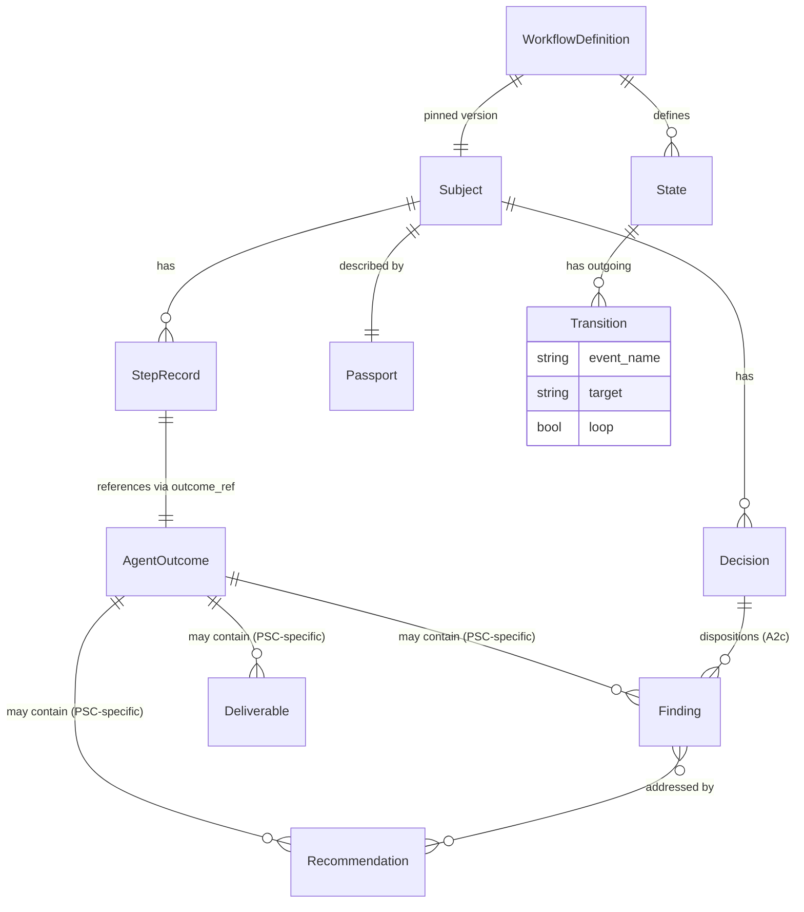

# 02 — High-Level Design: Semantics, Ontology, and Architecture Decisions

> **Status:** DRAFT. Decisions marked **[LOCKED]** or **[TENTATIVE]**.

---

## Workflow Semantics — BPMN 2.0.2 + ASL Vocabulary + LTS Graph [LOCKED]

Grounded in authoritative research (see [06-references.md](06-references.md)).
Our terms map to industry standards as follows:

| Our term | Standard term | Authority |
|----------|--------------|-----------|
| Phase | (no BPMN equivalent; grouping/ordinal) | Metadata field, not a graph element |
| Step / State | **Task** (BPMN) / **State** (ASL) | A node in the graph |
| Gate | **Gateway** (BPMN) / **Choice state** (ASL) | A routing node with conditions |
| Decision | **User Task** (BPMN) | Blocks until a human/PM supplies a form; output becomes variables; a downstream Choice routes on them |
| Outcome | **Task output / event payload** (ASL) | The JSON that flows along the edge to the next state |
| Verdict | **Choice Rule condition** (ASL) / **Gateway condition** (BPMN) | The evaluated predicate that selects which outgoing edge to take |
| Kind | **State type** (ASL: Task, Choice, Parallel, Wait, Succeed, Fail) | The category of a node |
| Tier | (no standard; project-specific) | Metadata on a gate |
| Retry | **Retry** block (ASL: `max_attempts`, `interval`, `backoff`) | Re-execute the *same* state on transient failure, with a budget |
| Loop-back | **Explicit `Next` edge to an earlier state** (ASL) / **Boundary error event** (BPMN) | Transition to an *earlier* state on substantive failure — a cycle in the graph |
| Subject | (no standard; our generalisation) | The entity a workflow tracks — may be a ticket, survey, process, or review |
| Transition | **Sequence flow** (BPMN) / **Next** (ASL) | A labelled edge with a mandatory `event_name` |
| Lifecycle event | **Execution event** (all engines) | Engine-level event fired on every state entry/exit, gate, decision |
| Domain event | **event_name** on the transition | Project-specific event for event bus dispatch (Kafka topic) |

**Representation:** a **labelled transition system** (graph, not linked list),
ASL-influenced. Each state holds a `transitions: dict[Verdict, Transition]`
where `Transition = {target, event_name, loop, skip}`. Edges are labeled by
outcomes; multiple states can transition to the same state (multiple incoming
edges). Every transition has a **mandatory `event_name`** (Kafka-topic-safe).

**Retry vs loop-back — two distinct mechanisms, two distinct budgets:**

- **Retry** = re-execute the *same* state due to a transient error, with a
  budget (`max_attempts`). Modeled as an ASL-style `retry` block on the state.
- **Loop-back** = transition to an *earlier* state due to a substantive gate
  failure, with its own budget. Modeled as an explicit edge with
  `loop: true` flag — a cycle in the graph.

---

## Ontology

Every entity in the domain and how it maps to a Python entity. The mapping
is the contract between the language-agnostic spec and the Python prototype.

### Engine entities (generic — the engine knows these)

| Entity | Definition | Python entity |
|--------|------------|---------------|
| **Workflow** | A labelled transition system: states + transitions, with `start_at` and terminal states. Versioned (SemVer). | `StateRegistry` + workflow JSON |
| **State** | A node in the graph. Has name, title, phase, step ordinal, kind, dispatch_handler, outcome_schema, transitions. Comparable via forward-progress DAG ancestry. | `State` (frozen dataclass) |
| **StateKind** | `task` / `parallel` / `gate` / `decision_required` / `terminal` | `StateKind(StrEnum)` |
| **Transition** | A labelled edge: "on this outcome, go to that state." Has mandatory `event_name`. May be a loop-back (`loop: true`, excluded from comparison DAG). | `Transition` (frozen dataclass) |
| **Verdict** | The label on a transition — the result that selects the outgoing edge. | `Verdict(StrEnum)` |
| **OutcomeContract** | The minimal contract the engine routes on: `{ verdict, decision?, confidence? }`. Everything else is opaque payload. | `dict` validated against `outcome.base` schema |
| **Context** | What a state handler sees: `input` + `vars` (flat blackboard) + `meta` (`from_state`, `entry_count`, `attempt`, `entered_at`). O(1) memory. | `Context` + `StateMeta` |
| **Subject** | The entity a workflow tracks. Generalised — ticket/survey/process/review. Engine is agnostic to subject type. | `str` (subject id) |
| **Passport** | The persisted runtime state of one subject: current state, step log, gate results, decisions, retries, parallel progress, vars. JSON-authoritative; Markdown mirror derived. | `dict[str, Any]` |
| **StepRecord** | One entry in the step log, identified by UUIDv7. Carries a reference to the AgentOutcome, not the outcome itself. | `StepRecord` (frozen dataclass) |
| **DispatchHandler** | Protocol for dispatching a state to its actor. `dispatch(state, ctx, schema) → outcome`. Engine doesn't branch on actor kind. | `DispatchHandler` (Protocol) |
| **DispatcherRegistry** | Maps handler names to DispatchHandler implementations. Extensible at startup. | `DispatcherRegistry` |
| **SchemaRegistry** | Maps schema names to JSON Schemas. Extensible at startup. Validates outcomes + decisions. | `SchemaRegistry` |
| **SchemaProfile** | A project's collection of extended schemas (e.g. `workflows/psc-profile.json`). | JSON file loaded at startup |
| **LifecycleHook** | Global handler fired on every engine event + domain event. Fire-and-forget; exception-safe. | `LifecycleHook` (Protocol) |
| **HookRegistry** | Holds lifecycle hooks. Calls ALL registered hooks for each event. | `HookRegistry` |
| **EngineEvent** | Well-known engine-level events (`state.entered`, `gate.passed`, `workflow.started`, etc.) | `EngineEvent(StrEnum)` |
| **SubjectStore** | Protocol for subject persistence. Implementations: JSON, SQLite, PostgreSQL. | `SubjectStore` (Protocol) |
| **EventStore** | Protocol for the mandatory append-only step-event log. | `EventStore` (Protocol) |
| **WorkflowDefinitionStore** | Protocol for workflow definition storage. | `WorkflowDefinitionStore` (Protocol) |
| **Classification** | `public` (default) / `private` / `protected` — schema-level annotation on data fields | JSON Schema custom keyword |
| **Redactor** | Transforms a protected value for external emission. `redact(value) → redacted_value`. | `Redactor` (Protocol) |
| **RedactorRegistry** | Maps redactor names to Redactor implementations. Built-ins: Default, Email, Token. | `RedactorRegistry` |
| **project()** | Recursive function that omits private, redacts protected, passes public. Applied at every external boundary. | `project()` function |
| **StepWriter** | Computes the deterministic storage path for a step's outcome. Agent never picks the path. | `StepWriter` |
| **RosterResolver** | Proposes a roster from domain signals; validates any user selection against `agents_folder`. | `RosterResolver` + `RosterProposal` |
| **Config** | Engine configuration: paths, roster defaults/minimum/max/signals. | `Config` (frozen dataclass) |
| **WorkflowDefinitionError** | Raised at load time when the workflow JSON is malformed. | Exception class |

### PSC project entities (project-specific — in `psc-profile.json`)

| Entity | Definition | Found in example logs |
|--------|------------|----------------------|
| **Finding** | A review finding: `id`, `confidence` (0-100), `severity`, `category`, `description`, `file_line`, `suggested_fix`, `status`, `reference` | A1-SW, A1-DX, C2-SX |
| **Gap** | A finding with impact + recommendation: `id`, `confidence`, `finding`, `impact`, `severity`, `recommendation` | A1-SW |
| **Recommendation** | A suggested action: `id`, `priority` (must_fix/should_fix/consider), `description`, `confidence`, `addresses` (finding IDs), `links` | A1-SW, A1-DX |
| **Reference** | Authoritative citation: `claim`, `source`, `url`, `verification_date` | A1-DX |
| **Deliverable** | What the agent produced: `type` (file/adr/decision/advisory/clarification), `ref`, `sha`, `lines_changed` | A0-B1-B2 |
| **Agreement** | Challenger agreement: `id`, `description`, `covers`, `links` | Challenger pattern |
| **Disagreement** | Challenger disagreement: `id`, `description`, `primary_view`, `challenger_view`, `links` | Challenger pattern |
| **MissingConsideration** | Challenger finding: `id`, `description`, `edge_case`, `links` | Challenger pattern |
| **GateResult** | Per-gate result: `gate`, `tier`, `result`, `attempt` | C4 |
| **SpecialistVerdict** | Per-specialist verdict: `specialist`, `verdict`, `key_findings` | C4 |
| **CorrectionRecord** | Post-rejection correction: `retry`, `gate`, `tier`, `rc_category`, `root_cause`, `corrective_action` | C4 |
| **PlanUnit** | B1 plan unit: `unit_number`, `description`, `files` | A0-B1-B2 |
| **ApplyUnit** | B2 apply unit: `unit_number`, `build_result`, `files_changed`, `what_was_done` | A0-B1-B2 |
| **ValidateResult** | B3 validate: `full_build`, `ac_coverage`, `acceptance_criteria[]` | A0-B1-B2 |
| **SelfAuditEntry** | Self-audit checklist row: `category`, `checked`, `result` | A1-SW, A1-DX, C2-SX |
| **SelfReflection** | Structured reflection: `why`, `what_caught_it`, `knowledge_update` | C2-SX |
| **OWASPExpansion** | Security concern: `concern_category`, `trigger`, `assessment` | C2-SX |
| **NewTicketCreated** | Follow-up ticket: `ticket_id`, `type`, `reason` | C4 |

> **Note:** These are PSC-specific. A different project (survey, process,
> review) would define its own entities in its own profile. The engine
> validates them via the SchemaRegistry but never deserializes them into
> Python objects — they are opaque JSON stored by StepWriter.

---

## Architecture Decisions

### 2.1 State-machine access boundary — dual surface [TENTATIVE]

Design both MCP server (`psc-state`) and CLI (`python -m psc_engine`) surfaces.
Identical API contracts; pick at runtime. See open question 1 in
[00-README.md](00-README.md).

### 2.2 Storage — JSON + advisory lock + derived Markdown mirror [LOCKED]

JSON passport authoritative; Markdown mirror regenerated on every `advance()`.
Database (SQLite/PG) for persistence + concurrency via protocol-based stores.

### 2.3 Decision-required states — five judgement points [LOCKED]

A0 roster confirmation, A2c user disposition, C4 PM completion, gate-fail
RC correction, A0 clarification loop. The machine records; it doesn't compute.

### 2.4 Schema evolution — snapshot workflow definition only [LOCKED]

At A0, the workflow definition JSON is snapshotted into the subject directory.
**Agent files are NOT snapshotted** — agents self-reflect and update regularly,
so a task always uses the latest agent version. The engine resolves agent
files from `agents_folder` at dispatch time.

Versioning: SemVer; max 2 concurrent MAJOR; 90-day grace; force-migrate-or-close.

### 2.5 Human review trail — derived Markdown mirror [LOCKED]

JSON authoritative; mirror regenerated on every `advance()`; drift = CI failure.

### 2.6 Adhoc tasks — separate workflow file `psc-adhoc` [LOCKED]

### 2.7 Process context — input + flat vars + meta [LOCKED]

O(1) memory; no full path surfaced to handlers.

### 2.8 Implicit start + terminal detection + cancel [LOCKED]

- **Start:** `WORKFLOW_STARTED` event + transition to `start_at`. No `__START__` node.
- **End:** terminal detection (`kind: "terminal"` OR no transitions) → `WORKFLOW_COMPLETED`.
- **Cancel:** external signal (`cancel_subject` API); writes CANCELLED; fires `WORKFLOW_CANCELLED`; abrupt (no `STATE_EXITED` for the abandoned state).

### 2.9 Lifecycle hooks [LOCKED]

Global, fire-and-forget, exception-safe. `on_event(event: str, context: dict)`.
Event is either an `EngineEvent` enum member (`state.entered`) or a
transition's `event_name` (`subject.phase-a.classified`). Both go through the
same channel.

Built-in hooks: LoggingHook, ObservabilityHook, EventDispatchHook, AuditHook.

Firing sequence during `advance()`:
1. `state.exited` (engine event)
2. The transition's `event_name` (domain event — e.g. `ticket.phase-a.classified`)
3. `transition.triggered` (engine event carrying the `event_name` in context)
4. `state.entered` (engine event)
5. If terminal → `workflow.completed` / `workflow.cancelled` / `workflow.escalated`

### 2.10 Data classification & redaction [LOCKED]

- `public` (default) / `private` (omitted) / `protected` (redacted)
- Classification on the schema, not on the data (JSON Schema custom keywords)
- `Redactor` protocol + `RedactorRegistry`; if no `redactor` specified, `DefaultRedactor` → `[REDACTED]`
- Passport JSON stores cleartext; `project()` applied at all emission boundaries (events, logs, audit, API, mirror)

### 2.11 Pluggable dispatch handlers [LOCKED]

State declares `dispatch_handler` name. Engine calls `handler.dispatch()`.
Doesn't branch on actor_kind. Built-ins: `engine.subagent_dispatch`,
`engine.human_form_dispatch`, `engine.system_webhook_dispatch`.

### 2.12 Schema registry + opaque payload [LOCKED]

Engine validates outcome against schema; doesn't interpret project-specific
fields. PSC profile at `workflows/psc-profile.json`.

### 2.13 Mandatory event_name on transitions [LOCKED]

Every transition has `event_name` (Kafka-topic-safe pattern
`subject.<phase>.<event>`). `subject` prefix replaced with actual
`subject_type` at dispatch time. Validated at load time.

### 2.14 Load-time validation [LOCKED]

`WorkflowDefinitionError` raised if: missing `event_name` on a transition,
target doesn't exist, schema/handler unresolvable, forward-DAG cyclic,
`start_at` missing, no terminal state exists.

---

## Logical Data Model

> **Note:** Finding, Recommendation, Deliverable, Gap, etc. are PSC-specific
> entities inside the opaque payload. The engine stores them but doesn't
> interpret them. A different project would have different payload entities.

---

## Risks and Opportunities

### Three biggest risks

1. **The Supreme Leader's permission block forbids the call path the original
   brief assumes.** Resolved by designing both surfaces (MCP + CLI) and
   deferring the choice to runtime. No agent overhead either way.
2. **Per-subject versioning without a deprecation policy is a slow-burning
   liability.** Resolved by SemVer + max 2 concurrent MAJOR + 90-day grace +
   force-migrate-or-close + workflow definition snapshot per subject.
3. **Markdown→JSON migration destroys the human-review audit trail.** Resolved
   by JSON authoritative + auto-generated Markdown mirror + CI drift check.

### Three biggest opportunities

1. **Deterministic, unit-testable routing.** Routing correctness becomes a
   compile-time artefact, not a prompt-time hope.
2. **Cross-subject analytics.** Structured per-subject state answers "which
   tier fails most?", "which specialist issues the most REJECTEDs?" —
   impossible today without grepping hundreds of markdown files.
3. **Adhoc routing without bypass.** A defined `psc-adhoc` workflow enforces
   the No-Hotfix-Bypass rule structurally rather than rhetorically.