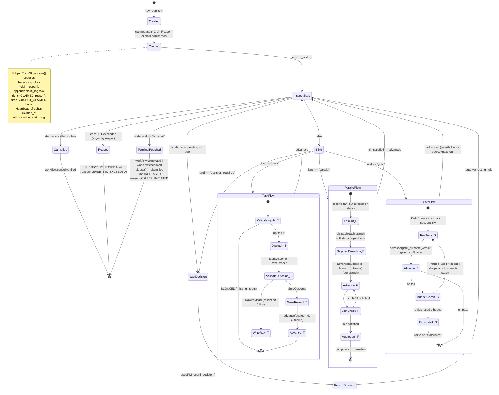
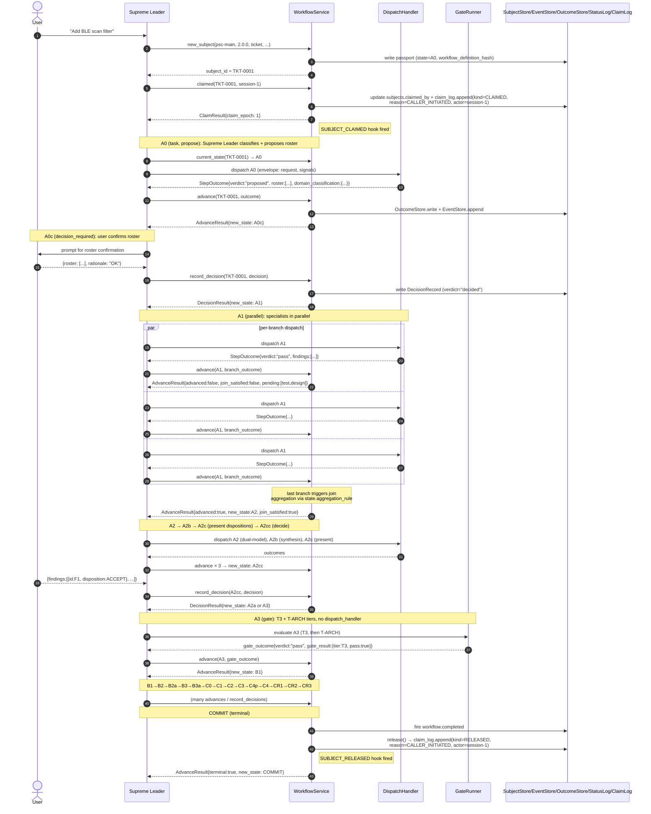
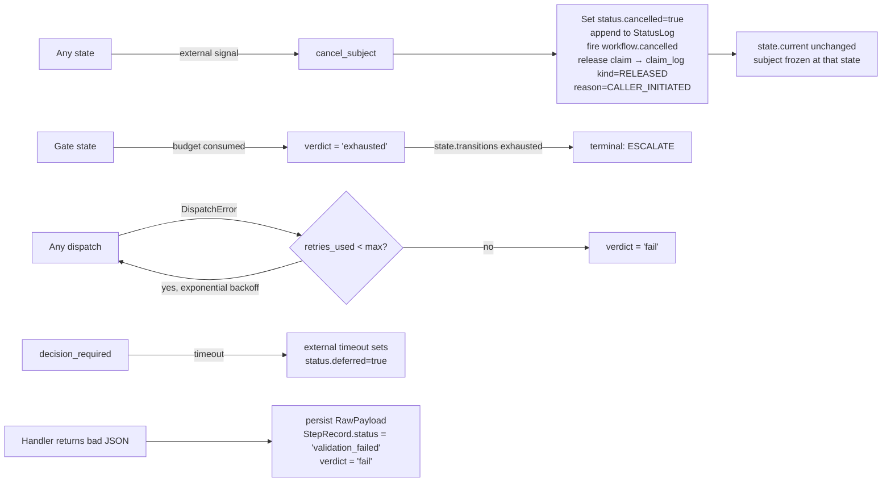
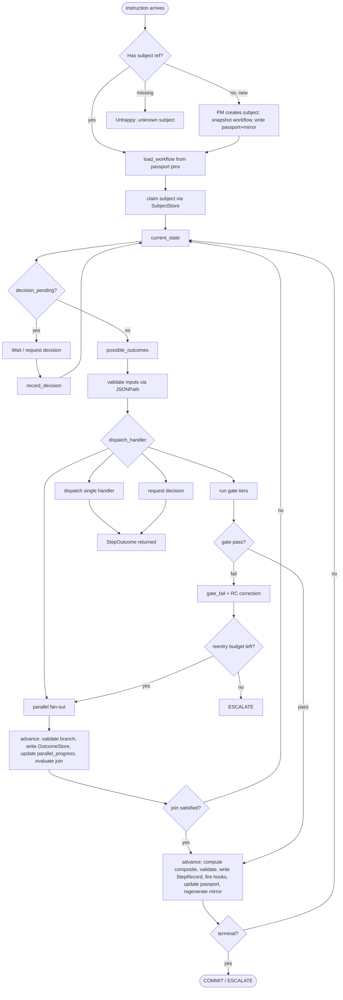
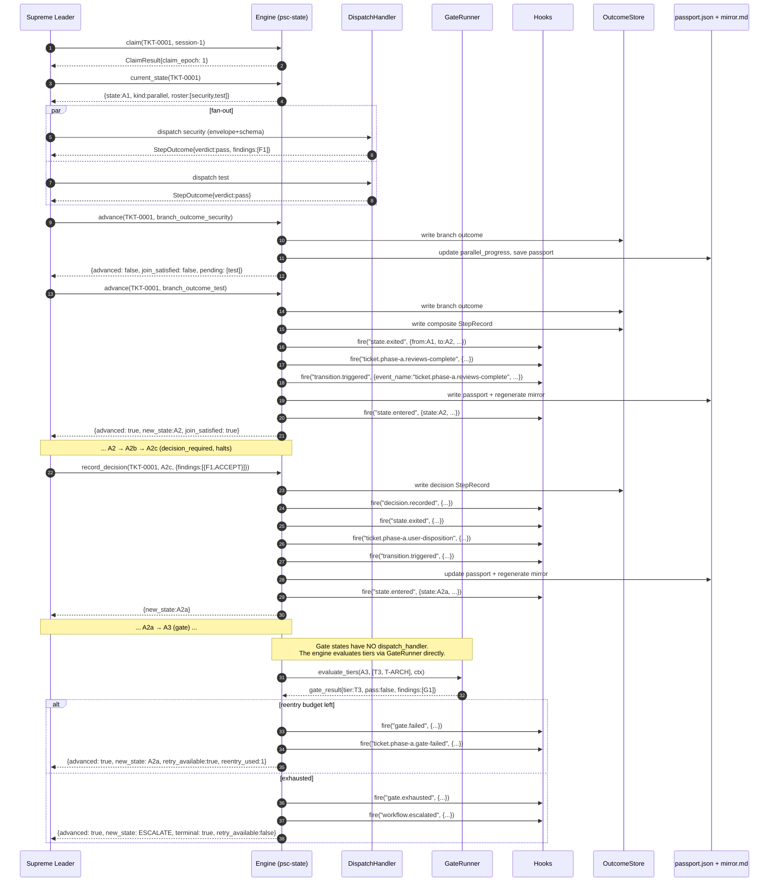

# 04 — Low-Level Design: Process, Diagrams, Persistence, API

> **Status:** DRAFT. All diagrams Mermaid.

---

## 4.0 Application Lifecycle

The end-to-end lifecycle of one subject, from creation to a terminal state.
This section is the entry point for developers implementing the engine or
integrators embedding it — everything after §4.1 zooms in on the pieces
introduced here.

### 4.0.1 State-Kind Behaviour Matrix

Each state kind has a distinct execution shape. The engine dispatches, blocks,
and records differently based on `state.kind`.

| Kind | Trigger | Dispatch | Blocking? | How the engine progresses |
|------|---------|----------|-----------|---------------------------|
| `task` | `advance(subject_id, outcome)` | `DispatchHandler.dispatch(state, ctx)` — returns `StepOutcome \| RawPayload` | No | Validate outcome → look up `state.transitions[verdict]` → next state |
| `parallel` | `advance(subject_id, branch_outcome)` (once per branch) | Same handler invoked per branch with per-branch `Context` (deep-copied `vars`, `step = "<state>#<branch_id>"`) | No, but the state stays until the join is satisfied | Update `parallel_progress` → evaluate `JoinAll`/`JoinQuorum` → when satisfied, aggregate via `state.aggregation_rule` → transition |
| `gate` | `advance(subject_id, gate_outcome)` (once per tier) | **No** `dispatch_handler`. Caller drives `GateRunner` externally; `GateRunner` produces a `pass`/`fail`/`exhausted` outcome | No | On `fail`, increment `retries_used[state][tier]`; when count ≥ budget, coerce to `exhausted`. Route on `pass`/`fail`/`exhausted`. |
| `decision_required` | `record_decision(subject_id, decision)` | Not applicable — decision comes from caller, not a handler | **Yes** — `is_decision_pending: true`. `advance()` is rejected while pending | Validate decision → evaluate `routing_rule` (SQL-CASE) → transition |
| `terminal` | Reached via any transition to a state with `kind: "terminal"` (or a state with empty `transitions`) | Not applicable | N/A | Fire `workflow.completed` (or `workflow.escalated`); release claim |

### 4.0.2 Master Lifecycle Diagram



### 4.0.3 Happy-Path Walkthrough (psc-main)

The nominal PSC ticket lifecycle, from user request to COMMIT. Every state
transition corresponds to one row in the passport `step_log` and one row in
the `events` table.



### 4.0.4 Unhappy-Path Overview

Each unhappy path is triggered by an engine-managed condition; the state
machine reacts deterministically. See §4.1 Unhappy paths table for the full
matrix.



### 4.0.5 Key Guarantees

1. **Atomic advance.** `advance()` and `record_decision()` are transactional:
   OutcomeStore write + EventStore append + Passport save either all succeed
   or none do. Re-alignment (§4.5) recovers from partial failure using the
   `step_log` as source of truth.
2. **Fencing token.** Every write CAS on both `version` AND `claim_epoch`
   (§4.6). Stale writers hit `LeaseLostError`; concurrent writers hit
   `ConcurrentWriteError`.
3. **Idempotency.** Deterministic key
   `sha256(canonical_json({"v":1, subject_id, step, entry_count, attempt}))`
   dedupes retries and replays. Same inputs → same key → same outcome.
4. **Hash-chained audit — three chains.** Every event row includes
   `row_hash = sha256(prev_hash || canonical_json(row_data))`. Three
   independent chains: `events` (step transitions), `status_log`
   (cancelled/deferred/archived flag transitions), `claim_log` (ownership
   transitions: claimed/released with typed reasons). Tampering with any
   chain is detectable via `WorkflowService.verify_chain()`.
5. **Fail-closed classification.** `project()` omits any field without a
   `classification` annotation (default `private`). Undeclared fields at any
   depth are not emitted.
6. **Load-time validation.** Every workflow definition is validated on load
   (§2.14). Malformed definitions never reach production.
7. **Snapshotted definition.** The workflow definition JSON is snapshotted
   into the subject directory at creation; the `workflow_definition_hash`
   verifies at load time. Agent files are NOT snapshotted (they self-reflect
   and may evolve during a subject's lifetime; a warning is logged if they
   change between dispatches).

### 4.0.6 State-Machine Invariants (enforced by the engine)

- Every non-terminal state has at least one transition; every transition has
  a target that exists; every transition has a mandatory `event_name`.
- The forward-progress DAG (loop-back transitions removed) is acyclic —
  `StateRegistry.is_ancestor(a, b)` is well-defined.
- Gate transitions use ONLY `pass`/`fail`/`exhausted` verdicts; project-defined
  verdicts on a gate are rejected at load time.
- `Transition.verdict` MUST equal the dict key it lives under.
- `kind: "parallel"` states MUST declare `aggregation_rule`.
- No handler may write to a path in `ENGINE_RESERVED_VARS_PATHS` (attempted
  writes raise `ReservedVarsPathError`).
- Every decision is a **two-state pair** in the workflow: a `task` that
  proposes, then a `decision_required` that confirms/decides. Pairs in
  `psc-main`: A0→A0c, A2c→A2cc, C4p→C4. Adhoc: A0L→A0Lc. (Q2 decision.)

---

## 4.1 Process Flow

### Numbered list (instruction arrives at the Supreme Leader)

1. Supreme Leader receives an instruction.
2. **Has subject?** Parse for `TKT-####` / `SVY-####` / `PRC-####` / `REV-####`.
   - None + new request → dispatch PM to create subject; PM snapshots workflow
     definition, writes passport JSON (state=`start_at`) + mirror.
   - References a missing subject → unhappy path (E2).
3. `load_workflow(workflow_id, workflow_version)` from the passport's version pins.
4. `claim(subject_id, session_id)` — atomic CAS claim, returns `ClaimResult` with `claim_epoch`. Long-running callers SHOULD use the `claimed()` context manager instead, which auto-heartbeats and releases on exit (Q21).
5. `current_state(subject_id)` → `State` object + metadata.
6. **Decision pending?** If `is_decision_pending` → do not dispatch; wait.
7. `possible_outcomes(subject_id)` → outcome keys + schemas + handler + inputs.
8. **Validate inputs** — JSONPath required paths exist in `ctx.vars`.
9. **Dispatch** — resolve `dispatch_handler` from `DispatcherRegistry`; call
   `handler.dispatch(state, ctx)`. Handler returns outcome JSON.
10. **Parallel state?** If `state.kind == "parallel"` → fan-out to specialists.
    Each branch returns; `advance(subject_id, branch_outcome)` handles join+aggregation
    internally (see §4.3). No public `aggregate_outcomes` API.
11. **Decision required?** If `state.kind == "decision_required"` → call
    `record_decision(subject_id, decision_object)` (see §4.1a).
12. **Otherwise** → `advance(subject_id, outcome)` — validate against schema, compute
    transition, write StepRecord via OutcomeStore, update passport, fire lifecycle
    hooks (state.exited → domain event_name → transition.triggered → state.entered),
    regenerate mirror.
13. If terminal → fire `workflow.completed` / `workflow.escalated`; release claim.
    Else loop to step 5.

### 4.1a `advance()` Flow (11 steps for parallel state)

1. Load passport (atomic claim/version-CAS).
2. Resolve current state. Assert `kind == "parallel"`.
3. Compute idempotency key = `sha256(canonical_json({"v":1, "subject_id":..., "step":...+"#"+branch_id, "entry_count":..., "attempt":...}))` (Q14). Registry.
4. Idempotency check — if StepRecord with this key exists, short-circuit.
5. Validate branch outcome against `branch_schema` (NOT the composite schema).
6. Write branch outcome via OutcomeStore.
7. Update `parallel_progress` atomically — remove branch_id from `pending`, add to `returned` with outcome_ref + verdict.
8. Evaluate join: `JoinAll` → satisfied when `pending == []`; `JoinQuorum(n)` → satisfied when `len(returned) >= n`.
9. If join NOT satisfied: save passport, fire `parallel.branch.completed`, return `{advanced: false, join_satisfied: false, pending: [...]}`.
10. If join satisfied: compute composite via `state.aggregation_rule` (looked up in `AggregationRegistry`), validate composite against `outcome_schema`, write composite StepRecord, fire standard hook sequence, update passport (state.current = target, clear parallel_progress, **merge vars with strict-collision detection**, see below), save + regenerate mirror.
11. Return `{advanced: true, new_state, composite, join_satisfied: true}`.

**vars merge at join (Q9 — strict mode + branch namespacing):**

- Engine merges each branch's `ctx.vars` into the join point's `ctx.vars`.
- If two branches wrote different values to the same key, the engine raises
  `VarsCollisionError` (fail-fast; no silent data loss).
- To avoid collisions, use branch-namespaced `outputs.produced` on the
  parallel state's definition:

  ```jsonc
  "outputs": {
    "produced": {
      "/branches/{branch_id}/findings": "$.findings",
      "/branches/{branch_id}/verdict":  "$.verdict"
    },
    "carried_forward": true
  }
  ```

  The engine substitutes `{branch_id}` with each returning branch's ID
  (e.g. `security`, `test`), so per-branch data lives at deterministic,
  non-colliding paths.
- Handler writes to any path in `ENGINE_RESERVED_VARS_PATHS` are rejected
  with `ReservedVarsPathError` (Q20).

### 4.1b `record_decision` Flow (10 steps)

1. Load passport (claim/CAS).
2. Assert `state.kind == "decision_required"` and `is_decision_pending == true`.
3. Idempotency key = `sha256(subject_id + state + entry_count + null + 0)`.
4. Validate `decision_object` against `state.decision_schema`.
5. Evaluate `routing_rule` (SQL-CASE-style) — first match → target + event_name.
6. Write decision via OutcomeStore (decision_object IS the outcome for audit).
7. Fire hooks: `decision.recorded` → `state.exited` → domain event → `transition.triggered` → `state.entered`.
8. Update passport: `state.current = target`, `is_decision_pending = false`, append StepRecord (with `verdict: "decided"`), apply outputs mapping.
9. Save + regenerate mirror.
10. Return `{new_state, terminal, mirror_updated}`.

### 4.1c `advance()` Flow (9 steps for task state)

1. Load passport (atomic claim/version-CAS on `version` AND `claim_epoch`).
2. Resolve current state. Assert `kind == "task"`.
3. Compute idempotency key = `sha256(subject_id + state + entry_count + attempt)` (no branch_id for non-parallel).
4. Idempotency check — if StepRecord with this key exists, short-circuit.
5. Validate outcome against `outcome_schema` (per-state). Materialise verdict enum via `VerdictSchemaBuilder`.
6. Look up `transition = state.transitions[outcome.verdict]`. If missing → `RoutingError`.
7. Write outcome via OutcomeStore; append StepRecord to passport.
8. Fire hooks: `state.exited` → domain event_name (substituted) → `transition.triggered` → `state.entered`. If terminal: also `workflow.completed` / `workflow.escalated`.
9. Update passport (state.current = transition.target, apply outputs mapping, deep-copy vars), save + regenerate mirror. Return `{advanced: true, new_state, terminal, mirror_updated, join_satisfied: None, pending: None}`.

### 4.1d `advance()` Flow (10 steps for gate state)

Gates have NO `dispatch_handler`. The engine evaluates tiers internally via
`GateRunner` (read from `gate_config`). The caller invokes `advance()` with a
synthetic outcome carrying the gate's verdict (`pass`, `fail`, or `exhausted`)
that the GateRunner produces. The outcome MUST also carry a
`gate_result: {tier: str, pass: bool}` field that tells the engine which tier
produced the verdict; `failed_tier := gate_result.tier` for any `fail` outcome.

1. Load passport.
2. Resolve current state. Assert `kind == "gate"`.
3. Compute idempotency key (same shape as task).
4. Idempotency check.
5. Validate outcome against `gate_config.base` semantics — verdict MUST be one of `pass | fail | exhausted`. Project-defined verdicts on a gate are rejected. The outcome MUST carry `gate_result.tier` so the engine can determine `failed_tier` and update `retries_used[state.name][failed_tier]` correctly.
6. **If `fail`**: let `failed_tier = outcome.gate_result.tier`; increment `passport.retries_used[state.name][failed_tier]` (lazy init to 0 first). If the resulting value is **≥** `gate_config.reentry_budget[failed_tier]` → coerce verdict to `exhausted` (gate is out of budget for that tier). `>=` (not `>`) because a budget of N means N allowed re-entries — the (N+1)-th failure exhausts.
7. **If `exhausted`**: look up `state.transitions["exhausted"]` (typically routes to `ESCALATE`). If missing → `WorkflowDefinitionError` (should have been caught at load time).
8. **Otherwise** (`pass` / `fail`): look up `state.transitions[verdict]`.
9. Write outcome via OutcomeStore; append StepRecord; fire hooks (`gate.passed` / `gate.failed` / `gate.exhausted` BEFORE the standard exit/transition/entered sequence).
10. Update passport (state.current = transition.target), save + regenerate mirror. Return `{advanced: true, new_state, terminal, mirror_updated, retry_available: (verdict == "fail" and retries_used[failed_tier] < budget[failed_tier]), reentry_used: passport.retries_used[state.name][failed_tier], failed_tier: failed_tier or None}`.

> **Note:** The caller drives the gate by repeatedly invoking the gate's
> tiers and calling `advance()` with the synthesised outcome each time.
> The engine never invokes a dispatch_handler for a gate. Gate tier
> evaluation is sequential and first-fail triggers loop-back (decision 2.27).
> The `failed_tier` is derived from `outcome.gate_result.tier`, which the
> GateRunner (or the caller) sets explicitly. Without `gate_result.tier`,
> the engine cannot route a `fail` outcome and raises `RoutingError`.

### Mermaid flowchart



### Happy path

1. User issues request → PM creates subject (`psc new-subject --workflow=psc-main`),
   snapshots workflow definition, writes passport (state=A0) + mirror.
2. `current_state` → A0 (task). Supreme Leader classifies domain and proposes roster;
   emits `verdict="proposed"` via `advance()`.
3. `advance` → A0c (decision_required). User confirms via `record_decision` →
   A1 (parallel per route.roster_confirmation) OR back to A0 (empty roster loops).
4. A1: specialists dispatched in parallel. Each returns an outcome;
   `advance` marks returned; when join satisfied, engine computes composite
   via `state.aggregation_rule` (Q6); `advance` → A2.
5. A2 → A2b → A2c (task: present proposed dispositions) → A2cc
   (decision_required, halts). User confirms dispositions via `record_decision`.
6. `record_decision` → routing rule → A2a or A3.
7. A3 gate → B1 → B2/B2a (loops) → B3a → C0 → C1 → C2 → C3 →
   C4p (task: analyse completion) → C4 (decision_required: PM decides) →
   CR1 → CR2 (gate: pass/fail/exhausted per Q1) → CR3 → COMMIT.

### Unhappy paths

| Case | Trigger | Returns | Action |
|------|---------|---------|--------|
| E2 Unknown subject | `TKT-0099` doesn't exist | `{error:"subject_not_found"}` | Halt; ask user |
| E3 Ambiguous | No ref + unclear | A0 stays; `needs_clarification` → pm | PM asks user; loops at A0 |
| E4 Passport missing | JSON absent | `{error:"passport_missing"}` | PM restores from step_log |
| E5 Prior step unstamped | Missing stamp or pending | `{valid:false, errors:[...]}` — no mutation | Re-dispatch missing specialist |
| E6 Gate exhausted | `reentry_budget exhausted` | `{exhausted:true, terminal:ESCALATE}` | Report to user |
| E7 Decision never arrives | `is_decision_pending` + no response | State unchanged | Re-request; after timeout → deferred flag |
| E8 Cancel | External `cancel_subject` call | `workflow.cancelled` fired | Sets cancelled flag; releases claim; no synthetic state |

---

## 4.2 Sequence Diagram



---

## 4.3 Parallel Flows & Aggregation

A `parallel` state declares `fan_out` (static list or `$roster`) and `join`
(`all` or `quorum:N`). On entry, `advance` writes `parallel_progress`:

```jsonc
"parallel_progress": {
  "expected": ["security","test","design"],
  "returned": {
    "security": {"verdict": "pass", "outcome_ref": "uuid7-...", "timestamp": "..."}
  },
  "pending":  ["test","design"],
  "join": {"type": "all"}
}
```

`returned` is a **map** (not array): `{branch_id: {verdict, outcome_ref, uuid, timestamp}}` — O(1) lookup.
`join` is an **object** (not string): `{"type": "all"}` or `{"type": "quorum", "n": 2, "on_satisfied": "cancel_pending"}`.
`on_satisfied` controls pending-branch fate: `"cancel_pending"` (default — late outcomes rejected), `"supersede"` (recompute composite), `"discard_late"` (silently discard).

**Dynamic fan_out:** `$roster` resolves to `ctx.vars["domain_classification"]["roster"]` at state entry (not at branch return). The roster is pinned by the A0 decision; never re-resolved.

**Two schemas per parallel state:** `branch_schema` (validated per-branch) + `outcome_schema` (validated on composite). For non-parallel states, `branch_schema` is absent.

Each specialist dispatched with per-specialist step ID (e.g. `A1#security`).
When an agent returns, `advance` marks it returned. State doesn't advance until
join satisfied.

### Crashed specialist recovery

Caller re-dispatches by step ID (`A1#design`) with `attempt+1`. New idempotency key (attempt incremented). Branch retry budget (default 3) — if exceeded, branch marked `failed` with `verdict: "fail"`.

### Aggregation rule

- **verdict**: A1 → `pass` if all `pass`; `fail` if any `fail`. C2 →
  `all_approved` if every `approved`; `any_rejected` if any `fail`.
- **findings**: union, deduplicated by `(category, message)` hash, highest severity.
- **confidence**: min across returned (weakest link).
- **flags/deliverables**: union.

Aggregation rule is project-specific (`psc.aggregation.specialist_review`), resolved from `AggregationRegistry`. Built-ins: `engine.aggregation.verdict_all_pass`, `engine.aggregation.verdict_unanimous`. The engine calls `rule.aggregate(...)`, validates result against `outcome_schema`, reads `composite["verdict"]` for routing. The engine never interprets PSC fields.

---

## 4.4 Deterministic vs Judgement Transition Table

`loop?` marks back-edges (excluded from comparison DAG). `event_name` shown.
Q2 (propose/confirm split): every user-facing decision is now two states —
a `task` that PROPOSES and a `decision_required` that CONFIRMS. Judgement
is entirely inside the `decision_required` state's routing rule.

| # | Transition | Class | loop? | event_name |
|---|-----------|-------|-------|------------|
| 1 | A0→A0c | DETERMINISTIC | no | subject.phase-a.roster-proposed |
| 2 | A0c→A1 | JUDGEMENT | no | subject.phase-a.roster-confirmed |
| 3 | A0c→A0 | DETERMINISTIC | yes | subject.phase-a.roster-rejected (loops on empty) |
| 4 | A1→A2 | DETERMINISTIC | no | subject.phase-a.reviews-complete |
| 5 | A2→A2b | DETERMINISTIC | no | subject.phase-a.challenge-complete |
| 6 | A2b→A2c | DETERMINISTIC | no | subject.phase-a.synthesized |
| 7 | A2c→A2cc | DETERMINISTIC | no | subject.phase-a.disposition-presented |
| 8 | A2cc→A2a/A3 | JUDGEMENT | no | (routing rule) |
| 9 | A2a→A3 | DETERMINISTIC | no | subject.phase-a.adr-written |
| 10 | A3→B1 | DETERMINISTIC | no | subject.phase-a.gate-passed |
| 11 | A3→A2a | DET/JUDGEMENT(RC) | yes | subject.phase-a.gate-failed |
| 12 | A3→ESCALATE | DETERMINISTIC | no | subject.phase-a.gate-exhausted |
| 13-18 | B-phase | similar pattern | varies | subject.phase-b.* |
| 19-22 | B3→B3a→C0 | DETERMINISTIC | varies | subject.phase-b/c.* |
| 23-26 | C0→C1→C2 | DETERMINISTIC | no | subject.phase-c.* |
| 27-29 | C3 | DET/JUDGEMENT(RC) | yes | subject.phase-c.gate-* |
| 30 | C3→C4p | DETERMINISTIC | no | subject.phase-c.gate-passed |
| 31 | C4p→C4 | DETERMINISTIC | no | subject.phase-c.completion-analysed |
| 32 | C4→CR1/etc | JUDGEMENT | varies | (routing rule) |
| 33-37 | CR-phase | DET/JUDGEMENT(RC) | varies | subject.phase-cr.* |
| 38 | CR2 | DET/JUDGEMENT(RC) | yes | pass/fail/exhausted per Q1 |
| 39 | terminal | terminal | — | workflow.completed/escalated |

**Five judgement points (all inside `decision_required` states after Q2):**
A0c roster confirmation, A2cc user disposition, C4 PM completion,
gate-fail RC correction (A3/B3a/C3/CR2), and A0c empty-roster loop.

---

## 4.5 Persistence and Reload

Snapshot model (Step Functions-style). Minimal resume set:
1. Workflow identity (workflow_id + version)
2. Current position (`active_steps` — JSON array for parallel-aware)
3. Variables/passport (state_json)
4. Claim owner (claimed_by, claimed_at, claim_epoch)
5. Version (CAS counter)

SQLite WAL mode. `load_inflight()` returns all non-terminal subjects with
their `active_steps` array. No replay — resume at `active_steps` with
`state_json`. Events table is mandatory audit trail.

### Re-alignment

The **step_log is the source of truth**. If a StepRecord exists but the passport
wasn't updated accordingly, the re-alignment process corrects the passport from
the step_log. The mirror is derived from the passport/step_log and can always be
regenerated. `mirror.disabled` is a deployment-time global flag (not per-request,
not per-workflow).

### Passport vs StepArtifact

| Aspect | Passport | StepArtifact |
|--------|----------|--------------|
| What it is | Runtime state — what the engine needs for the next routing decision | Outcome content — the full record of what one step produced |
| Size | Small, bounded | Large, unbounded |
| Load cost | Fast — single JSON read | On-demand — loaded only when content is required |
| Storage | `passports/<subject>.json` + SQLite `state_json` | `outcomes/<subject>/<step>/<uuid7>.json` on filesystem |
| Mutability | Mutated on every `advance()`; version-bumped | Immutable once written; never rewritten |
| Engine reads | `state.current`, `vars`, `retries_used`, `parallel_progress`, `step_log` (INDEX only), decisions, status flags | `verdict` via `step_log[].verdict` (no need to load artifact); artifact loaded only for queries/display |

The passport's `step_log` is an INDEX, never a container. Each entry holds enough
metadata to (a) route without loading the artifact and (b) locate the artifact
when needed. The artifact content never appears inline.

---

## 4.6 Multi-Session Parallel Safety

Atomic CAS claim via `SubjectClaimStore.claim()`:
- SQLite: `UPDATE ... WHERE claimed_by IS NULL`
- PostgreSQL: same + optional `SELECT FOR UPDATE`
- JSON: `flock` + atomic read-modify-write

Every ownership transition (claim, release) writes a hash-chained row to
`claim_log`. Heartbeats update `subjects.claimed_at` in-place without a
`claim_log` row (heartbeats are lease liveness, not ownership change).

Lease + reaper: claim with TTL (default 5 min, `config.lease_ttl_seconds`);
heartbeat refreshes `claimed_at`; reaper releases claims older than TTL and
appends `claim_log` row with `reason=lease_ttl_exceeded`,
`actor="system:reaper"`.

### Fencing Token

`claim()` returns `ClaimResult` with `claim_epoch` — a monotonically increasing
integer assigned to each successful claim. Every write (`save`, `advance`,
`record_decision`) CAS on both `version` AND `claim_epoch`. If `claim_epoch`
mismatches, `LeaseLostError` is raised (non-retryable; must re-claim and recompute).
If `version` mismatches but `claim_epoch` matches, `ConcurrentWriteError` is raised
(retryable).

The reaper does NOT touch `claim_epoch` — only nulls `claimed_by`/`claimed_at`.
The next `claim()` increments past the reaped session's token.

### Answering "who held what, when?"

The `subjects` table gives the **current** claim state; the `claim_log`
table gives the **history**. Sample queries:

```sql
-- Is subject TKT-0001 currently claimed? (from event log)
SELECT kind FROM claim_log
WHERE subject_id = 'TKT-0001'
ORDER BY id DESC LIMIT 1;

-- All subjects currently claimed (fast path — from state table):
SELECT id, claimed_by, claimed_at, claim_epoch
FROM subjects WHERE claimed_by IS NOT NULL;

-- All subjects reaped in the last 24h (from event log):
SELECT subject_id, ts, session_id
FROM claim_log
WHERE kind = 'released' AND reason = 'lease_ttl_exceeded'
  AND ts > datetime('now', '-1 day');

-- Full ownership history for one subject:
SELECT ts, kind, session_id, actor, reason, claim_epoch
FROM claim_log WHERE subject_id = 'TKT-0001'
ORDER BY id;
```

`SubjectClaimStore.load_currently_claimed()` cross-checks the two — a
discrepancy (subject shown as claimed in one but not the other) raises
`PassportValidationError`.

---

## 4.7 Deterministic Step Writing

Agent never picks the path. `OutcomeStore.write(subject_id, step, outcome, ...)`
stores the outcome (implementation-specific: file, PostgreSQL JSONB, SQLite JSON
string, compressed bytes) and returns a `StepRecord`. The `StepRecord` is appended
to the passport's `step_log`.

UUIDv7 (RFC 9562): time-ordered, lexically sortable, collision-free across
parallel agents. Python 3.14+ `uuid.uuid7()`.

### StepOutcome vs RawPayload

| Entity | What it is | Mandatory | Read by engine |
|--------|-----------|-----------|----------------|
| **StepOutcome** | Validated, schema-conformant record (verdict + decision + confidence + validated payload fields). Exists only AFTER schema validation passes. | **Mandatory** for every completed step | Yes — routing reads `verdict` and `validated_fields` |
| **RawPayload** | Unprocessed bytes from the DispatchHandler (agent text, HTTP response, form submission) BEFORE normalization/validation. Forensic evidence. | **Optional** but strongly recommended; MANDATORY when validation fails (no StepOutcome exists) | No — never read by routing; only by auditors, challengers, replay tools |

Both stored in `OutcomeStore` with a `kind` discriminator (`step_outcome` vs `raw_payload`).
`outcome_ref` → StepOutcome (the validated canonical). `raw_ref` → RawPayload (nullable, separate).

---

## 4.8 Cancel

External signal, not a graph edge. `cancel_subject(subject_id, reason, cancelled_by)`
sets the `cancelled` status flag on the passport, fires `workflow.cancelled`,
releases claim. No synthetic `CANCELLED` state in the graph — `state.current`
stays at whatever state the workflow was actually at when the flag was set.
Abrupt — no `STATE_EXITED` for the abandoned state.

Cancelled, deferred, and archived are **status flags** on the passport, not
synthetic terminal states. The history stays loyal to what actually happened.

---

## 4.9 Lifecycle Hook Firing Points

### 4.9.1 During `advance()` and `record_decision()`

1. Write StepRecord via OutcomeStore + update passport BEFORE firing any hook.
2. `state.exited` (engine event)
3. The transition's `event_name` with `subject` replaced by actual `subject_type` (domain event)
4. `transition.triggered` (engine event carrying event_name in context)
5. `state.entered` (engine event)
6. If terminal → `state.entered` first, then `workflow.completed` / `workflow.escalated`

For cancel: only `workflow.cancelled` (no `state.entered`, no `state.exited`).

All context dicts are projected (private omitted, protected redacted) before
firing. The passport retains cleartext.

### 4.9.2 Claim / Release events

Claim and release events are fired AFTER the corresponding `claim_log` row
commits (persistence-before-hook, same rule as `advance()`).

**`SUBJECT_CLAIMED`** — fired by `SubjectClaimStore.claim()` on success:

- Fired AFTER `subjects.claimed_by/claimed_at/claim_epoch` update AND
  `claim_log.append(kind=CLAIMED, ...)` commit.
- Context payload:
  ```
  {
    "subject_id": str,
    "session_id": str,
    "claim_epoch": int,
    "actor":       str,          # session_id for caller; 'system:...' otherwise
    "reason":      str,          # ClaimReason value
    "ts":          str,          # ISO-8601
    "row_hash":    str           # for chain-verification consumers
  }
  ```
- One event per claim. Heartbeats do NOT fire this event.

**`SUBJECT_RELEASED`** — fired by `SubjectClaimStore.release()`,
`reap_stale_claims()`, or `claimed(...)` context-manager exit:

- Fired AFTER `subjects.claimed_by/claimed_at` are nulled AND
  `claim_log.append(kind=RELEASED, ...)` commit.
- `claim_epoch` is NOT reset — the reaper preserves the epoch so the next
  `claim()` increments monotonically.
- Context payload:
  ```
  {
    "subject_id":        str,
    "session_id":        str,        # session whose claim was released
    "claim_epoch":       int,        # epoch of the released claim
    "actor":             str,        # session_id | 'system:reaper' | 'system:admin'
    "reason":            str,        # ReleaseReason value
    "held_for_seconds":  int,        # now - claimed_at
    "ts":                str,        # ISO-8601
    "row_hash":          str
  }
  ```
- **Downstream consumers** discriminate by `payload.reason`:
  - Alerting on abnormal release: `reason == "lease_ttl_exceeded"` (reaper) or `"forced_by_admin"`.
  - Normal audit: `reason == "caller_initiated"`.

**Heartbeat** — NO event fired. `SubjectClaimStore.heartbeat()` updates
`subjects.claimed_at` and returns; no `claim_log` row is written and no
`LifecycleHook.on_event` invocation occurs. Rationale: heartbeats fire every
TTL/2 seconds — emitting hooks would produce thousands of events per hour
per active claim, drowning the event bus with liveness pings. Consumers that
need liveness signals watch `subjects.claimed_at` directly or run a periodic
"still alive?" probe.

### 4.9.3 Hook Error Handling

`HookErrorSink` — critical hooks (audit) fail-closed, non-critical swallow.
`AuditHook` is dropped; the `EventStore`, `StatusLog`, and `ClaimLog` tables
ARE the audit trail. `EventDispatchHook` uses a transactional outbox for
at-least-once delivery (Phase 5).

---

## 4.10 OpenCode Hooks Research

OpenCode has no standalone hooks page. Hooks live in the plugin system
(`tool.execute.before/after`, `event`). The `task` tool fires these hooks but
the docs don't explicitly document that the subagent's returned text is in the
`tool.execute.after` payload.

**Decision [LOCKED]:** use agent-instructed + OutcomeStore (path 1 only). The
agent returns its outcome as JSON text; the Supreme Leader calls `advance()`
which uses OutcomeStore to place it. The agent never writes a file.

---

## 4.11 API Contract Table

| Tool | Inputs | Returns |
|------|--------|---------|
| `load_workflow` | `workflow_id`, `version` | `WorkflowDefinition` (frozen dataclass + StateRegistry) |
| `load_workflow_for_subject` | `subject_id` | `WorkflowDefinition` — pinned by passport, hash-verified |
| `new_subject` | `workflow_id`, `version`, `subject_type`, `title`, `request`, `domain_signals` | `subject_id` |
| `current_state` | `subject_id` | `CurrentStateResult` (State + metadata) |
| `possible_outcomes` | `subject_id` | list of outcomes + schemas + inputs |
| `advance` | `subject_id`, `outcome` | `AdvanceResult` (`{advanced, new_state, next_role, terminal, mirror_updated, join_satisfied, pending, composite_ref, retry_available, reentry_used, failed_tier}`) |
| `record_decision` | `subject_id`, `decision_object` | `{new_state, terminal, mirror_updated}` |
| `route_for_outcome` | `subject_id`, `outcome` | `{target, agent, loop?}` — read-only preview of advance's routing |
| `validate_passport` | `subject_id` | `{valid, errors[]}` — checks: step_log integrity, state reachability, parallel_progress consistency, retries_used ≤ budget, vars schema conformance, status flag consistency, claim_epoch validity |
| `load_outcome` | `subject_id`, `outcome_ref` | `StepOutcome` or `None` |
| `query` | `subject_id`, `what: QueryWhat` | `QueryResult` (per-subject only) |
| `list_subjects` | `filter: SubjectListFilter`, `limit`, `offset` | `list[SubjectSummary]` — cross-subject listing |
| `migrate` | `subject_id`, `target_version` | `{migrated, incompatibilities[]}` — migration contract with mapping files |
| `propose_roster` | `subject_id`, `domain_signals` | `RosterProposal` |
| `validate_roster` | `subject_id`, `selection` | `{valid, errors[]}` |
| `cancel_subject` | `subject_id`, `reason`, `cancelled_by` | `{cancelled, terminal}` |
| `claim` | `subject_id`, `session_id`, `reason: ClaimReason = CALLER_INITIATED` | `ClaimResult{claim_epoch}`; appends `claim_log` row; fires `SUBJECT_CLAIMED` |
| `claimed` (context manager) | `subject_id`, `session_id`, `reason: ClaimReason = CALLER_INITIATED`, `heartbeat_interval_seconds=None` | context manager yielding `ClaimResult`; auto-heartbeats; releases on exit |
| `release` | `subject_id`, `session_id`, `reason: ReleaseReason = CALLER_INITIATED` | `{released: bool}`; appends `claim_log` row; fires `SUBJECT_RELEASED` |
| `verify_chain` | `subject_id`, `include_status_log=True` | `ChainVerificationResult{valid, broken_at, errors}` |

---

## 4.12 Clean Architecture

### Layering

```
psc_engine/
├── domain/                         # Inner layer — no dependencies
│   ├── state.py                    # State, StateRegistry, is_ancestor()
│   ├── context.py                  # Context (frozen), is_loop_back, is_retry
│   ├── outcome.py                  # StepOutcome, StepRecord, Verdict (NewType[str])
│   ├── passport.py                 # Passport, ParallelProgress, StatusFlags
│   ├── workflow.py                 # WorkflowDefinition, Transition, RoutingRule
│   ├── api_results.py              # CurrentStateResult, AdvanceResult, ... (§3.9)
│   ├── registries.py               # DispatcherRegistry, HookRegistry, ... (§3.10)
│   ├── protocols.py                # OutcomeStore, SubjectReader, SubjectWriter,
│   │                               #   SubjectClaimStore, EventStore, StatusLog,
│   │                               #   ClaimLog, WorkflowDefinitionStore,
│   │                               #   DispatchHandler, HookErrorSink,
│   │                               #   AggregationRule, SignalMatcher,
│   │                               #   Redactor, ConfigPort
│   │                               # (Note: VerdictSchemaBuilder is in
│   │                               #  infrastructure/schema/, NOT domain — it
│   │                               #  manipulates JSON Schemas — Q11)
│   └── exceptions.py               # WorkflowError(base) + 13 subclasses
├── application/                    # Use cases — depends on domain
│   ├── workflow_service.py         # WorkflowService (method surface below)
│   ├── advance.py                  # advance() orchestration
│   ├── record_decision.py          # record_decision() orchestration
│   ├── claim.py                    # claim() with fencing token
│   ├── gate_runner.py              # GateRunner — sequential tier evaluation
│   └── reaper.py                   # stale claim reaper
├── infrastructure/                 # Adapters — depends on domain + application
│   ├── config.py                   # Config (implements ConfigPort)
│   ├── outcome_store/
│   │   ├── json_outcome_store.py
│   │   ├── sqlite_outcome_store.py
│   │   └── pg_outcome_store.py
│   ├── subject_store/
│   │   ├── json_subject_store.py
│   │   ├── sqlite_subject_store.py
│   │   └── pg_subject_store.py
│   ├── event_store/
│   │   ├── sqlite_event_store.py
│   │   └── pg_event_store.py
│   ├── status_log/
│   │   ├── sqlite_status_log.py
│   │   └── pg_status_log.py
│   ├── claim_log/
│   │   ├── sqlite_claim_log.py
│   │   └── pg_claim_log.py
│   ├── workflow_definition_store/
│   │   ├── json_workflow_definition_store.py
│   │   └── pg_workflow_definition_store.py
│   ├── dispatch/
│   │   ├── subagent_dispatch.py
│   │   ├── human_form_dispatch.py
│   │   └── system_webhook_dispatch.py
│   ├── hooks/
│   │   ├── hook_registry.py
│   │   └── event_dispatch_hook.py
│   └── schema/
│       ├── schema_registry.py
│       └── verdict_schema_builder.py
└── presentation/                   # CLI / MCP / HTTP
    ├── cli.py
    └── mcp_server.py
```

### WorkflowService

```python
class WorkflowService:
    def __init__(self,
                 workflows_folder: str,
                 subject_reader: SubjectReader,
                 subject_writer: SubjectWriter,
                 subject_claim_store: SubjectClaimStore,
                 outcome_store: OutcomeStore,
                 event_store: EventStore,
                 status_log: StatusLog,
                 claim_log: ClaimLog,
                 workflow_definition_store: WorkflowDefinitionStore,
                 schema_registry: SchemaRegistry,
                 dispatcher_registry: DispatcherRegistry,
                 hook_registry: HookRegistry,
                 aggregation_registry: AggregationRegistry,
                 redactor_registry: RedactorRegistry,
                 roster_resolver: RosterResolver,
                 config: ConfigPort): ...

    def new_subject(self, workflow_id: str, version: str,
                    subject_type: str, title: str, request: str,
                    domain_signals: list[str]) -> str: ...

    # -- Workflow loading ---------------------------------------------------
    def load_workflow(self, workflow_id: str, version: str) -> WorkflowDefinition: ...
    def load_workflow_for_subject(self, subject_id: str) -> WorkflowDefinition:
        """Q23 convenience: reads subject.workflow_id + workflow_version and
        loads the pinned workflow. Verifies workflow_definition_hash against
        the store (raises WorkflowIntegrityError on mismatch)."""
        ...

    # -- Claim / heartbeat --------------------------------------------------
    def claim(self, subject_id: str, session_id: str,
              reason: ClaimReason = ClaimReason.CALLER_INITIATED) -> ClaimResult: ...
    def release(self, subject_id: str, session_id: str,
                reason: ReleaseReason = ReleaseReason.CALLER_INITIATED) -> bool: ...

    @contextmanager
    def claimed(self, subject_id: str, session_id: str,
                reason: ClaimReason = ClaimReason.CALLER_INITIATED,
                heartbeat_interval_seconds: int | None = None):
        """Q21 context manager: acquires a claim on enter; releases on exit.
        If heartbeat_interval_seconds is set (or defaults to
        config.lease_ttl_seconds // 2), a background thread calls
        claim_store.heartbeat() periodically. Yields ClaimResult. Reraises
        LeaseLostError if the heartbeat detects the lease has been reaped.
        `reason` is used on the initial claim; release uses
        `ReleaseReason.CALLER_INITIATED` on normal exit."""
        ...

    # -- Progression --------------------------------------------------------
    def current_state(self, subject_id: str) -> CurrentStateResult: ...
    def possible_outcomes(self, subject_id: str) -> list[PossibleOutcome]: ...
    def advance(self, subject_id: str, outcome: StepOutcome) -> AdvanceResult: ...
    def record_decision(self, subject_id: str, decision: dict) -> DecisionResult: ...
    def route_for_outcome(self, subject_id: str, outcome: StepOutcome) -> RoutePreview: ...

    # -- Reads --------------------------------------------------------------
    def validate_passport(self, subject_id: str) -> ValidationResult: ...
    def load_outcome(self, subject_id: str, outcome_ref: OutcomeRef) -> StepOutcome | None: ...
    def query(self, subject_id: str, what: QueryWhat) -> QueryResult: ...
    def list_subjects(self, filter: SubjectListFilter,
                      limit: int = 100, offset: int = 0) -> list[SubjectSummary]:
        """Q4 decision: cross-subject listing lives on its own method,
        not on query(). Returns a paginated list of SubjectSummary rows."""
        ...

    # -- Migration ----------------------------------------------------------
    def migrate(self, subject_id: str, target_version: str) -> MigrationResult: ...

    # -- Roster -------------------------------------------------------------
    def propose_roster(self, subject_id: str, domain_signals: list[str] | None = None) -> RosterProposal: ...
    def validate_roster(self, subject_id: str, selection: list[str]) -> RosterValidation: ...

    # -- Status flags -------------------------------------------------------
    def cancel_subject(self, subject_id: str, reason: str, cancelled_by: str) -> CancelResult: ...

    # -- Integrity ----------------------------------------------------------
    def verify_chain(self, subject_id: str,
                     include_status_log: bool = True) -> "ChainVerificationResult":
        """Q17 decision: recompute the hash chain for events (and optionally
        status_log) and compare row-by-row against stored row_hash values.
        Returns ChainVerificationResult with `valid: bool`, `broken_at: int | None`
        (0-based row index of first mismatch), and `errors: list[str]`."""
        ...
```

> **Note:** `SubjectStore` was split into `SubjectReader`, `SubjectWriter`,
> and `SubjectClaimStore`. The service receives each protocol separately
> (interface segregation) rather than a fat `SubjectStore`. `StatusLog` and
> `WorkflowDefinitionStore` are explicit dependencies — they were previously
> implicit. `cancel_subject` appends to `StatusLog` (not to step_log).
> `load_outcome` returns `StepOutcome | None` (not the older `StepArtifact`);
> raw payloads are loaded via `outcome_store.load_raw()` separately.
> `list_subjects` (Q4) replaces the cross-subject overload of `query`.
> `verify_chain` (Q17) exposes hash-chain integrity verification at runtime.
> `claimed(...)` context manager (Q21) provides auto-heartbeat for
> long-running handlers.

> **Note:** `SubjectStore` was split into `SubjectReader`, `SubjectWriter`,
> and `SubjectClaimStore`. The service receives each protocol separately
> (interface segregation) rather than a fat `SubjectStore`. `StatusLog` and
> `WorkflowDefinitionStore` are explicit dependencies — they were previously
> implicit. `cancel_subject` appends to `StatusLog` (not to step_log).
> `load_outcome` returns `StepOutcome | None` (not the older `StepArtifact`);
> raw payloads are loaded via `outcome_store.load_raw()` separately.

### Connection Lifecycle

Per-operation connection from pool. No long-lived connections. Each `advance()`,
`record_decision()`, `claim()`, or `query()` call acquires a connection from the
pool, executes its work within a transaction, and returns the connection to the pool.

---

## 4.13 End-to-End Test Prototype

```python
# tests/test_e2e.py
import pytest
from psc_engine.application.workflow_service import WorkflowService
from psc_engine.domain.outcome import StepOutcome, Verdict
from psc_engine.infrastructure.config import ConfigReader
from psc_engine.infrastructure.subject_store import JsonSubjectStore
from psc_engine.infrastructure.outcome_store import JsonOutcomeStore
from psc_engine.infrastructure.event_store import SqliteEventStore
from psc_engine.infrastructure.status_log import SqliteStatusLog
from psc_engine.infrastructure.workflow_definition_store import JsonWorkflowDefinitionStore

@pytest.fixture
def svc(tmp_path):
    cfg = ConfigReader(tmp_path / "psc_engine.yaml").read()
    subject_store = JsonSubjectStore(cfg.passports_folder)
    return WorkflowService(
        workflows_folder=cfg.workflows_folder,
        subject_reader=subject_store,
        subject_writer=subject_store,
        subject_claim_store=subject_store,
        outcome_store=JsonOutcomeStore(cfg.outcomes_folder),
        event_store=SqliteEventStore(cfg.db_path),
        status_log=SqliteStatusLog(cfg.db_path),
        workflow_definition_store=JsonWorkflowDefinitionStore(cfg.workflows_folder),
        schema_registry=...,            # Pre-loaded with profile
        dispatcher_registry=...,         # Pre-loaded with built-in handlers
        hook_registry=...,
        aggregation_registry=...,
        redactor_registry=...,
        roster_resolver=...,
        config=cfg,
    )

def _outcome(verdict: str = "pass",
             decision: dict | None = None,
             confidence: int | None = 100,
             **validated_fields) -> StepOutcome:
    """Construct a StepOutcome. PSC-specific payload fields (findings,
    deliverables, etc.) go under validated_fields — the engine never reads
    them, but the profile schema does."""
    return StepOutcome(
        verdict=Verdict(verdict),
        decision=decision,
        confidence=confidence,
        validated_fields=dict(validated_fields),
    )

# HAPPY PATH: A0 -> COMMIT (with Q2 propose/confirm split states)
def test_happy_path(svc):
    subj = svc.new_subject(workflow_id="psc-main", version="2.0.0",
        subject_type="ticket", title="add BLE scan filter",
        request="drop advs without mfr UUID", domain_signals=["wireless","security"])
    # A0 (task: propose roster) — Supreme Leader analyses signals, proposes roster.
    assert svc.current_state(subj).state.name == "A0"
    proposal = svc.propose_roster(subj)
    svc.advance(subj, _outcome(verdict="proposed",
                               domain_classification={"primary":"security","secondary":["wireless"]},
                               roster=proposal.suggested))
    # A0c (decision_required: confirm roster) — user/PM confirms via record_decision().
    assert svc.current_state(subj).state.name == "A0c"
    svc.record_decision(subj, {"roster": proposal.suggested, "rationale": "default suggested"})
    assert svc.current_state(subj).state.name == "A1"
    # A1 (parallel): each branch returns; only the LAST advance satisfies the join.
    for s in proposal.suggested[:-1]:
        r = svc.advance(subj, _outcome(verdict="pass", findings=[]))
        assert r.advanced is False
        assert r.join_satisfied is False
    last = svc.advance(subj, _outcome(verdict="pass", findings=[]))
    assert last.advanced is True
    assert last.join_satisfied is True
    assert svc.current_state(subj).state.name == "A2"
    # ... A2 → A2b → A2c (task: propose dispositions) → A2cc (decide) → A2a → A3 → C0..C3 → C4p (analyse) → C4 (decide) → CR1 → CR2 → CR3 → COMMIT
    svc.record_decision(subj, {"decision": "complete", "rationale": "all green"})
    assert svc.current_state(subj).state.name == "CR1"
    svc.advance(subj, _outcome(verdict="reviewed"))    # CR1 → CR2
    svc.advance(subj, _outcome(verdict="pass", gate_result={"tier":"T3","pass":True}))   # CR2 → CR3
    svc.advance(subj, _outcome(verdict="accepted"))    # CR3 → COMMIT
    cur = svc.current_state(subj)
    assert cur.state.name == "COMMIT"
    assert cur.is_terminal is True

# UNHAPPY PATHS
def test_unknown_subject(svc):
    r = svc.current_state("TKT-9999")
    assert r.error == "subject_not_found"

def test_ambiguous_loops_a0(svc):
    # A0 is task (propose) → A0c is decision_required. Ambiguous input:
    # SL emits an empty roster proposal; user confirms empty; route.roster_confirmation
    # ELSE routes A0c → A0 (loop back to re-propose).
    subj = svc.new_subject("psc-main","2.0.0","ticket","fix the thing","fix the thing",[])
    svc.advance(subj, _outcome(verdict="proposed",
                               domain_classification={"primary":"unknown","secondary":[]},
                               roster=[]))                    # A0 → A0c
    assert svc.current_state(subj).state.name == "A0c"
    svc.record_decision(subj, {"roster": [], "rationale": "ambiguous"})  # A0c → A0 (loop)
    assert svc.current_state(subj).state.name == "A0"

def test_parallel_pending_rejects(svc):
    subj = svc.new_subject("psc-main","2.0.0","ticket","x","x",["security"])
    roster = ["sw-engineer","test-engineer","docs-writer","security-reviewer"]
    # A0 (propose) → A0c (confirm) → A1 (parallel)
    svc.advance(subj, _outcome(verdict="proposed",
                               domain_classification={"primary":"security","secondary":[]},
                               roster=roster))
    svc.record_decision(subj, {"roster": roster, "rationale": ""})
    r = svc.advance(subj, _outcome(verdict="pass"))
    assert r.advanced is False
    assert r.join_satisfied is False
    assert r.pending is not None and len(r.pending) > 0

def test_gate_exhaust_then_escalate(svc):
    subj = svc.new_subject("psc-main","2.0.0","ticket","x","x",[])
    # ... walk to A3 ...
    for i in range(3):
        r = svc.advance(subj, _outcome(verdict="fail",
                                       gate_result={"tier":"T3","pass":False},
                                       root_cause="RC-2"))
        # On the third failure, retry_available is False and we land on ESCALATE.
        assert r.retry_available == (i < 2)
    assert svc.current_state(subj).state.name == "ESCALATE"

def test_cancel(svc):
    subj = svc.new_subject("psc-main","2.0.0","ticket","x","x",[])
    svc.cancel_subject(subj, reason="user changed mind", cancelled_by="user")
    cur = svc.current_state(subj)
    assert cur.status_flags.cancelled is True
    assert cur.state.name == "A0"   # state.current stays at A0; cancel is a flag

def test_state_ancestry(svc):
    subj = svc.new_subject("psc-main","2.0.0","ticket","x","x",[])
    workflow = svc.load_workflow("psc-main", "2.0.0")
    A0 = workflow.registry.get_start_state()
    A3 = workflow.registry.get_state("A3")
    assert workflow.registry.is_ancestor(A0, A3)
    assert not workflow.registry.is_ancestor(A3, A0)
```

---

## 4.14 Implementation Phasing

| Phase | Build | Test |
|-------|-------|------|
| 1 | Schemas + domain layer (State, StateRegistry, Context, OutcomeStore, protocols, SchemaRegistry, DispatcherRegistry, HookRegistry, RedactorRegistry, project()). CLI validate. uv + pyproject. | Schema validation + invariants |
| 2 (riskiest) | advance, record_decision, routing rules, JSONPath I/O validation, lifecycle hook firing, cancel, load-time validation | Exhaustive transition tests + property tests |
| 3 | Backends (Json/Sqlite/Postgres), MCP/CLI, workflow snapshotting, Markdown mirror + drift CI, built-in dispatch handlers | Manual round-trip; restart-resume; concurrent-claim; backend swap |
| 4 | Parallel aggregation wiring, crashed-specialist recovery | 3-specialist fan-out with one failure |
| 5 | psc-adhoc workflow, migrate, DEPRECATED lifecycle, transactional outbox for EventDispatchHook | Cross-MAJOR migration rejection; adhoc end-to-end |
| 6 | UI/UX integration (see 05-ui-ux.md) | Manual UI walkthrough |

---

## 4.15 Adhoc Workflow (`psc-adhoc`)

Separate workflow definition. Skips: A1 parallel → single reviewer; A2
challenge → dropped; A2c user-disposition → PM inline; T2/T3 → T1 only;
reentry budgets halved (2); review rounds 3. Mandatory: A0L (decision_required
with `decision.roster_confirmation`), T1 gate, B build + B3a, CR review.

---

## 4.16 Key Design Decisions Summary

| Decision | Topic | Summary |
|----------|-------|---------|
| D-001 | Atomicity + re-alignment | step_log is source of truth; passport corrected from step_log; mirror regenerated from passport; `mirror.disabled` is deployment-time global flag |
| D-002 | StepOutcome | Replace `AgentOutcome` with `StepOutcome` — agnostic to actor kind |
| D-004 | Verdict | `NewType[str]`; engine knows `pass`/`fail`; transition keys are source of truth |
| D-005 | Skip removed | No implicit skipping; workflow must model alternative paths explicitly |
| D-006 | Routing rules | SQL-CASE-style: `CASE WHEN condition THEN target ELSE default END` |
| D-007 | Retry | `dispatch_retry` (global, exponential backoff) + `reentry_budget` (default 3, per-gate); `retry_policy` removed; gates have NO dispatch_handler |
| D-008 | Cancel/defer/archive | Status flags on passport, not synthetic terminal states |
| D-009 | Context | Frozen; `vars` deep-copied per parallel branch; merged at join |
| D-010 | Idempotency | Deterministic key = `sha256(subject_id + state + entry_count + branch_id + attempt)`; claim ownership enforced as precondition |
| D-011 | State comparison | `StateRegistry.is_ancestor(a, b)` replaces `State.__lt__`; `State.id` removed |
| D-012 | Transition.verdict | `Transition.outcome` renamed to `verdict` |
| D-013 | Parallel advance | `advance()` absorbs join+aggregation; no public `aggregate_outcomes`; `returned` is map; `join` is object; two schemas per parallel state |
| D-014 | record_decision | Separate from `advance`; writes StepRecord; fires `decision.recorded` hook |
| D-024 | Passport vs artifact | Passport = runtime state + step_log INDEX; StepArtifact = full outcome; `outcomes` dict removed |
| D-030 | Fencing token | `claim()` returns `ClaimResult{claim_epoch}`; all writes CAS on version AND claim_epoch |
| D-031 | OutcomeStore | `StepWriter` renamed to `OutcomeStore`; storage format implementation-specific |
| #27 | Context.is_retry | Split into `is_loop_back` (entry_count>1) + `is_retry` (attempt>0) |
| #28 | DispatchHandler | Takes `State`, not `dict` |
| #29 | DispatchHandler | Takes `state, ctx` only; schema resolved at construction |
| #30 | EventStore.append | Takes `StepRecord`, not individual fields |
| #33 | SubjectStore.save | Takes `passport_json` only; store extracts `active_steps` internally |
| #36 | HookErrorSink | Critical hooks fail-closed, non-critical swallow |
| #37 | AuditHook | Dropped; EventStore IS the audit trail |
| #38 | EventDispatchHook | Transactional outbox (Phase 5) |
| #39 | Hook order | Write StepRecord + update passport BEFORE hooks |
| #40 | Terminal hooks | `state.entered` first, then terminal event; cancel: only `workflow.cancelled` |
| #41 | $roster | Resolves to `ctx.vars["domain_classification"]["roster"]` |
| #43 | carried_forward | Produced outputs merged into `ctx.vars` of target state |
| #53 | migrate | Migration contract with mapping files |
| #54 | max_review_rounds | Removed; keep `round_budget` on gate |
| #55 | review_round | Increment at CR2→B2 loop-back (CR2 verdict=`fail`) |
| #56 | B+C re-walk | Full B+C re-walk after CR2 `fail` verdict (the "request changes" case) |
| #57 | Completion | Engine computes completion from plan units (`len(applied)==len(plan)`) |
| #61 | A0 | Becomes `decision_required` with `decision.roster_confirmation` |
| #66 | route_for_outcome | Read-only preview of advance's routing |
| #67 | validate_passport | Checks enumerated: step_log integrity, state reachability, parallel_progress consistency, retries_used ≤ budget, vars schema conformance, status flag consistency, claim_epoch validity |
| #73 | agent field | Becomes abstract role (orchestrator/architect/reviewer); maps to agent, human, or service |
| #74 | WorkflowService | Defined with full method surface |
| #75 | Clean architecture | Layering subsection with file tree |
| #80 | Deadlock | No deadlock detection; reaper handles it |
| #81 | Events retention | Unbounded; events stay forever |
| #87 | Connection lifecycle | Per-operation from pool |
| #88 | Path sanitisation | subject_id sanitised; subdirectory structure via OutcomeStore |
| D18 | Gate tiers | Sequential tier evaluation, first-fail triggers loop-back |
| D16/D17 | psc-adhoc | A0L defined; full workflow JSON in data model |
| S4 | Fencing token | See D-030 |
| S8 | Sanitisation | All data sanitised; path traversal prevention |
| S22 | SQLite perms | 0600 permissions + dedicated user |
| S24 | Content validation | In profile: max-length, no control chars |
| S28 | root_cause | Validated as enum RC-1..RC-5 at API boundary |
| S29 | confidence | Documented as advisory; challenger validates if used in routing |
| S30 | model | Engine records model from dispatch handler response metadata |
| S35 | event_name | Re-validate after substitution |
