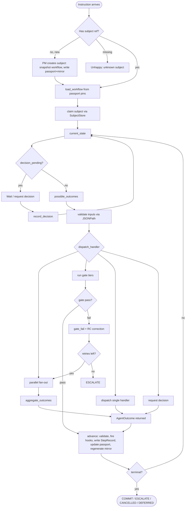
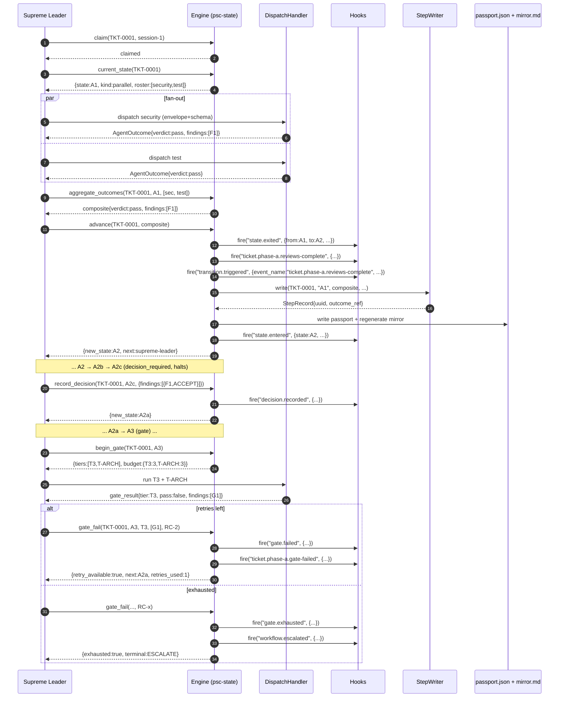

# 04 — Low-Level Design: Process, Diagrams, Persistence, API

> **Status:** DRAFT. All diagrams Mermaid.

---

## 4.1 Process Flow

### Numbered list (instruction arrives at the Supreme Leader)

1. Supreme Leader receives an instruction.
2. **Has subject?** Parse for `TKT-####` / `SVY-####` / `PRC-####` / `REV-####`.
   - None + new request → dispatch PM to create subject; PM snapshots workflow
     definition, writes passport JSON (state=`start_at`) + mirror.
   - References a missing subject → unhappy path (E2).
3. `load_workflow(workflow_id, workflow_version)` from the passport's version pins.
4. `claim(subject_id, session_id)` — atomic CAS claim.
5. `current_state(subject_id)` → `State` object + metadata.
6. **Decision pending?** If `is_decision_pending` → do not dispatch; wait.
7. `possible_outcomes(subject_id)` → outcome keys + schemas + handler + inputs.
8. **Validate inputs** — JSONPath required paths exist in `ctx.vars`.
9. **Dispatch** — resolve `dispatch_handler` from `DispatcherRegistry`; call
   `handler.dispatch(state, ctx, schema)`. Handler returns outcome JSON.
10. `advance(subject_id, outcome)` — validate against schema, compute transition,
    fire lifecycle hooks (state.exited → domain event_name → transition.triggered
    → state.entered), write via StepWriter, update passport, regenerate mirror.
11. If terminal → fire `workflow.completed` / `workflow.cancelled` /
    `workflow.escalated`; release claim. Else loop to step 5.

### Mermaid flowchart



### Happy path

1. User issues request → PM creates subject (`psc new-subject --workflow=psc-main`),
   snapshots workflow definition, writes passport (state=A0) + mirror.
2. `current_state` → A0. Supreme Leader classifies domain → proposes roster;
   user confirms via checklist.
3. `advance` → A1 (parallel). Specialists dispatched in parallel.
4. Each returns an outcome; `advance` marks returned; when `pending==[]`,
   `aggregate_outcomes` builds composite; `advance` → A2.
5. A2 → A2b → A2c (decision_required, halts). User dispositions findings.
6. `record_decision` → routing rule → A2a or skip to A3.
7. A3 gate → B1 → B2/B2a (loops) → B3a → C0 → C1 → C2 → C3 → C4 →
   CR1 → CR2 → CR3 → COMMIT.

### Unhappy paths

| Case | Trigger | Returns | Action |
|------|---------|---------|--------|
| E2 Unknown subject | `TKT-0099` doesn't exist | `{error:"subject_not_found"}` | Halt; ask user |
| E3 Ambiguous | No ref + unclear | A0 stays; `needs_clarification` → pm | PM asks user; loops at A0 |
| E4 Passport missing | JSON absent | `{error:"passport_missing"}` | PM restores from git/mirror |
| E5 Prior step unstamped | Missing stamp or pending | `{valid:false, errors:[...]}` — no mutation | Re-dispatch missing specialist |
| E6 Gate exhausted | `retries >= budget` | `{exhausted:true, terminal:ESCALATE}` | Report to user |
| E7 Decision never arrives | `is_decision_pending` + no response | State unchanged | Re-request; after timeout → DEFERRED |
| E8 Cancel | External `cancel_subject` call | `WORKFLOW_CANCELLED` | Abrupt; no STATE_EXITED |

---

## 4.2 Sequence Diagram



---

## 4.3 Parallel Flows & Aggregation

A `parallel` state declares `fan_out` (static list or `$roster`) and `join`
(`all` or `quorum:N`). On entry, `advance` writes `parallel_progress`:

```jsonc
"parallel_progress": {
  "expected": ["security","test","design"],
  "returned": [],
  "pending":  ["security","test","design"],
  "join": "all"
}
```

Each specialist dispatched with per-specialist step ID (e.g. `A1#security`).
When an agent returns, `advance` marks it returned. State doesn't advance until
join satisfied. Crashed specialist leaves a `pending` entry; re-dispatch by
step ID, not whole fan-out.

### Aggregation rule

- **verdict**: A1 → `pass` if all `pass`; `fail` if any `fail`. C2 →
  `all_approved` if every `approved`; `any_rejected` if any `fail`.
- **findings**: union, deduplicated by `(category, message)` hash, highest severity.
- **confidence**: min across returned (weakest link).
- **flags/deliverables**: union.

---

## 4.4 Deterministic vs Judgement Transition Table

`loop?` marks back-edges (excluded from comparison DAG). `event_name` shown.

| # | Transition | Class | loop? | event_name |
|---|-----------|-------|-------|------------|
| 1 | A0→A1 | DETERMINISTIC/JUDGEMENT | no | subject.phase-a.classified |
| 2 | A0→A0 | DETERMINISTIC | yes | subject.phase-a.clarification-needed |
| 3 | A1→A2 | DETERMINISTIC | no | subject.phase-a.reviews-complete |
| 4 | A2→A2b | DETERMINISTIC | no | subject.phase-a.challenge-complete |
| 5 | A2b→A2c | DETERMINISTIC | no | subject.phase-a.synthesized |
| 6 | A2c→A2a/skip | JUDGEMENT | no | (routing rule) |
| 7 | A2a→A3 | DETERMINISTIC | no | subject.phase-a.adr-written |
| 8 | A3→B1 | DETERMINISTIC | no | subject.phase-a.gate-passed |
| 9 | A3→A2a | DET/JUDGEMENT(RC) | yes | subject.phase-a.gate-failed |
| 10 | A3→ESCALATE | DETERMINISTIC | no | subject.phase-a.gate-exhausted |
| 11-16 | B-phase | similar pattern | varies | subject.phase-b.* |
| 17-20 | B3→B3a→C0 | DETERMINISTIC | varies | subject.phase-b/c.* |
| 21-24 | C0→C1→C2 | DETERMINISTIC | no | subject.phase-c.* |
| 25-27 | C3 | DET/JUDGEMENT(RC) | yes | subject.phase-c.gate-* |
| 28 | C4→CR1/etc | JUDGEMENT | varies | (routing rule) |
| 29-33 | CR-phase | DET/JUDGEMENT(RC) | varies | subject.phase-cr.* |
| 34 | terminal | terminal | — | workflow.completed/cancelled/escalated |

Five judgement points: A0 roster, A2c user disposition, C4 PM completion,
gate-fail RC correction, A0 clarification.

---

## 4.5 Persistence and Reload

Snapshot model (Step Functions-style). Minimal resume set:
1. Workflow identity (workflow_id + version)
2. Current position (`active_steps` — JSON array for parallel-aware)
3. Variables/passport (state_json)
4. Claim owner (claimed_by, claimed_at)
5. Version (CAS counter)

SQLite WAL mode. `load_inflight()` returns all non-terminal subjects with
their `active_steps` array. No replay — resume at `active_steps` with
`state_json`. Events table is mandatory audit trail.

---

## 4.6 Multi-Session Parallel Safety

Atomic CAS claim via `SubjectStore.claim()`:
- SQLite: `UPDATE ... WHERE claimed_by IS NULL`
- PostgreSQL: same + optional `SELECT FOR UPDATE`
- JSON: `flock` + atomic read-modify-write

Lease + reaper: claim with TTL (5 min); heartbeat refreshes `claimed_at`;
reaper releases claims older than TTL.

---

## 4.7 Deterministic Step Writing

Agent never picks the path. `StepWriter.write(subject_id, step, outcome, ...)`
computes `outcomes/<subject>/<step>/<uuidv7>.json` and returns a `StepRecord`.
The `StepRecord` is appended to the passport's `step_log`.

UUIDv7 (RFC 9562): time-ordered, lexically sortable, collision-free across
parallel agents. Python 3.14+ `uuid.uuid7()`.

---

## 4.8 Cancel

External signal, not a graph edge. `cancel_subject(subject_id, reason, cancelled_by)`
writes CANCELLED to passport, fires `WORKFLOW_CANCELLED`, releases claim.
Abrupt — no `STATE_EXITED` for the abandoned state.

---

## 4.9 Lifecycle Hook Firing Points

During `advance()`:
1. `state.exited` (engine event)
2. The transition's `event_name` with `subject` replaced by actual `subject_type` (domain event)
3. `transition.triggered` (engine event carrying event_name in context)
4. `state.entered` (engine event)
5. If terminal → `workflow.completed` / `workflow.cancelled` / `workflow.escalated`

All context dicts are projected (private omitted, protected redacted) before
firing. The passport retains cleartext.

---

## 4.10 OpenCode Hooks Research

OpenCode has no standalone hooks page. Hooks live in the plugin system
(`tool.execute.before/after`, `event`). The `task` tool fires these hooks but
the docs don't explicitly document that the subagent's returned text is in the
`tool.execute.after` payload.

**Decision [LOCKED]:** use agent-instructed + StepWriter (path 1 only). The
agent returns its outcome as JSON text; the Supreme Leader calls `advance()`
which uses StepWriter to place it. The agent never writes a file.

---

## 4.11 API Contract Table

| Tool | Inputs | Returns |
|------|--------|---------|
| `load_workflow` | `workflow_id`, `version` | workflow object |
| `current_state` | `subject_id` | `State` + metadata |
| `possible_outcomes` | `subject_id` | list of outcomes + schemas + inputs |
| `advance` | `subject_id`, `outcome` | `{new_state, next_agent, terminal, mirror_updated}` |
| `route_for_outcome` | `subject_id`, `outcome` | `{target, agent, loop?, skip[]?}` |
| `validate_passport` | `subject_id` | `{valid, errors[]}` |
| `record_decision` | `subject_id`, `state`, `decision_object` | `{new_state, ...}` |
| `begin_gate` | `subject_id`, `gate_state` | `{gate_id, tiers, retry_budget}` |
| `gate_fail` | `subject_id`, `gate_state`, `tier`, `findings`, `root_cause` | `{retry_available, next_state, exhausted}` |
| `aggregate_outcomes` | `subject_id`, `state`, `outcomes[]` | composite outcome |
| `query` | `subject_id`, `what` | result set |
| `migrate` | `subject_id`, `target_version` | `{migrated, incompatibilities[]}` |
| `propose_roster` | `subject_id`, `domain_signals` | `RosterProposal` |
| `validate_roster` | `subject_id`, `selection` | `{valid, errors[]}` |
| `cancel_subject` | `subject_id`, `reason`, `cancelled_by` | `{cancelled, terminal}` |
| `claim` | `subject_id`, `session_id` | `{claimed: bool}` |
| `release` | `subject_id`, `session_id` | `{released: bool}` |

---

## 4.12 End-to-End Test Prototype

```python
# tests/test_e2e.py
import pytest
from psc_engine.application.workflow_service import WorkflowService
from psc_engine.domain.outcome import AgentOutcome
from psc_engine.infrastructure.config import ConfigReader

@pytest.fixture
def svc(tmp_path):
    cfg = ConfigReader(tmp_path / "psc_engine.yaml").read()
    return WorkflowService(workflows_folder=cfg.workflows_folder,
                            store=JsonSubjectStore(cfg.passports_folder),
                            config=cfg)

def _outcome(step, agent, verdict="pass", **extra):
    return AgentOutcome(step=step, agent=agent, verdict=verdict,
        confidence=100, findings=[], deliverables=[], flags=[],
        decision=None, gate_result=None, root_cause=None, **extra)

# HAPPY PATH: A0 -> COMMIT
def test_happy_path(svc):
    subj = svc.new_subject(workflow_id="psc-main", version="2.0.0",
        subject_type="ticket", title="add BLE scan filter",
        request="drop advs without mfr UUID", domain_signals=["wireless","security"])
    assert svc.current_state(subj).state.name == "A0"
    proposal = svc.propose_roster(subj)
    svc.record_decision(subj, "A0", {"roster": proposal.suggested, "rationale":""})
    assert svc.current_state(subj).state.name == "A1"
    for s in proposal.suggested:
        r = svc.advance(subj, _outcome(f"A1#{s}", s, verdict="pass"))
        assert r.advanced == (s == proposal.suggested[-1])
    svc.advance(subj, svc.aggregate_outcomes(subj, "A1"))
    assert svc.current_state(subj).state.name == "A2"
    # ... A2 → A2b → A2c → decision → A2a → A3 → ... → COMMIT
    svc.record_decision(subj, "C4", {"decision":"complete","rationale":"all green"})
    assert svc.current_state(subj).state.name == "CR1"
    svc.advance(subj, _outcome("CR3","code-reviewer","accepted"))
    assert svc.current_state(subj).state.name == "COMMIT"
    assert svc.current_state(subj).state.kind.value == "terminal"

# UNHAPPY PATHS
def test_unknown_subject(svc):
    assert svc.current_state("TKT-9999").error == "subject_not_found"

def test_ambiguous_loops_a0(svc):
    subj = svc.new_subject("psc-main","2.0.0","ticket","fix the thing","fix the thing",[])
    svc.advance(subj, _outcome("A0","supreme-leader","needs_info"))
    assert svc.current_state(subj).state.name == "A0"

def test_parallel_pending_rejects(svc):
    subj = svc.new_subject("psc-main","2.0.0","ticket","x","x",["security"])
    svc.record_decision(subj,"A0",{"roster":["sw-engineer","test-engineer","docs-writer","security-reviewer"],"rationale":""})
    r = svc.advance(subj, _outcome("A1#sw-engineer","sw-engineer","pass"))
    assert r.advanced is False
    assert "parallel_pending" in r.errors

def test_gate_exhaust_then_escalate(svc):
    subj = svc.new_subject("psc-main","2.0.0","ticket","x","x",[])
    # ... walk to A3 ...
    svc.begin_gate(subj,"A3")
    for i in range(3):
        r = svc.gate_fail(subj,"A3","T3",[{"id":"G1"}],root_cause="RC-2")
        assert r.retry_available == (i < 2)
    assert svc.current_state(subj).state.name == "ESCALATE"

def test_cancel(svc):
    subj = svc.new_subject("psc-main","2.0.0","ticket","x","x",[])
    svc.cancel_subject(subj, reason="user changed mind", cancelled_by="user")
    assert svc.current_state(subj).state.name == "CANCELLED"
    assert svc.current_state(subj).state.kind.value == "terminal"

def test_state_comparison(svc):
    subj = svc.new_subject("psc-main","2.0.0","ticket","x","x",[])
    A0 = svc.current_state(subj).state
    # ... walk to A3 ...
    A3 = svc.current_state(subj).state
    assert A0 < A3
    assert not (A3 < A0)
```

---

## 4.13 Implementation Phasing

| Phase | Build | Test |
|-------|-------|------|
| 1 | Schemas + domain layer (State, StateRegistry, Context, StepWriter, protocols, SchemaRegistry, DispatcherRegistry, HookRegistry, RedactorRegistry, project()). CLI validate. uv + pyproject. | Schema validation + invariants |
| 2 (riskiest) | advance, gate_fail, record_decision, aggregate_outcomes, routing rules, JSONPath I/O validation, lifecycle hook firing, cancel, load-time validation | Exhaustive transition tests + property tests |
| 3 | Backends (Json/Sqlite/Postgres), MCP/CLI, workflow snapshotting, Markdown mirror + drift CI, built-in dispatch handlers | Manual round-trip; restart-resume; concurrent-claim; backend swap |
| 4 | Parallel aggregation wiring, crashed-specialist recovery | 3-specialist fan-out with one failure |
| 5 | psc-adhoc workflow, migrate, DEPRECATED lifecycle | Cross-MAJOR migration rejection; adhoc end-to-end |
| 6 | UI/UX integration (see 05-ui-ux.md) | Manual UI walkthrough |

---

## 4.14 Adhoc Workflow (`psc-adhoc`)

Separate workflow definition. Skips: A1 parallel → single reviewer; A2
challenge → dropped; A2c user-disposition → PM inline; T2/T3 → T1 only;
retry budgets halved (2); review rounds 3. Mandatory: A0L, T1 gate, B build
+ B3a, CR review.