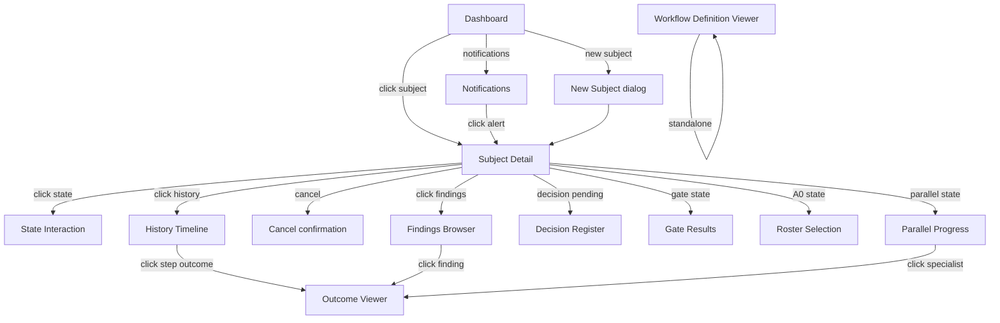
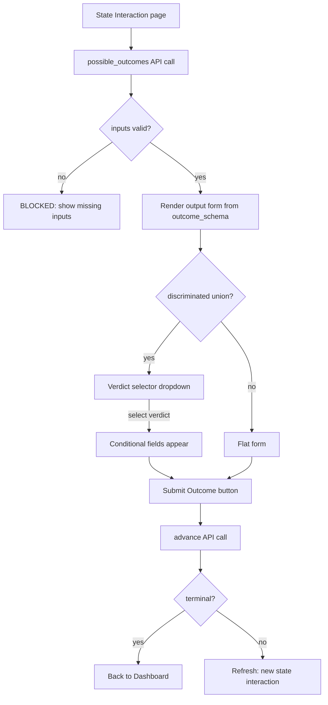
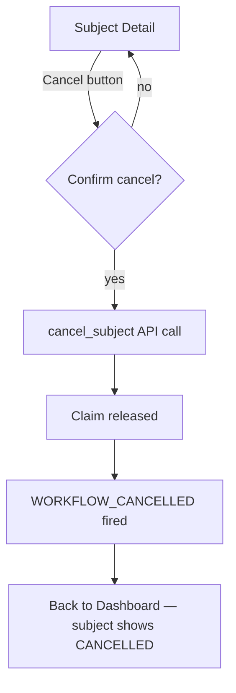
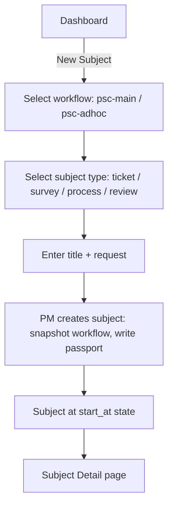

# 05 — UI/UX: Views, API Integration, User Flow Diagrams

> **Status:** DRAFT. Tech-stack agnostic — defines views, actions, and API
> calls without prescribing framework or component structure.

---

## 5.1 Views

### 1. Dashboard — Subject List

**Purpose:** List all subjects (tickets/surveys/processes/reviews) across all
workflows.

**Shows:**
- Table of subjects: ID, type, title, workflow, current state, status (active/completed/blocked/escalated/cancelled), last updated
- If subject is at a parallel state, expandable sub-items showing each parallel branch (e.g. `A1#security`, `A1#test`, `A1#docs`) with per-branch status (pending/returned)
- Filters: by status, by workflow, by subject_type, by phase
- Search bar (full-text across titles)

**Actions:**
- Click a subject → navigates to Subject Detail (view 2)
- "New Subject" button → opens workflow selection dialog

**API calls:**
- `query(subject_id=None, what="all")` — list all subjects with current state
- `current_state(subject_id)` for each — to get parallel progress

### 2. Subject Detail — Workflow Graph

**Purpose:** Open an active subject and see the workflow with current position.

**Shows:**
- Workflow visualisation (Mermaid state diagram rendered) with current state highlighted
- Subject metadata: ID, type, title, request, created_at, workflow_id + version
- Current state name, kind, phase
- If decision_pending: a callout "Decision required — waiting for [user/PM]"
- If parallel: the fan-out branches as a list with per-branch status

**Actions:**
- Click a state in the graph → shows that state's detail (inputs/outputs/transitions)
- "Cancel Subject" button → calls `cancel_subject`
- "View History" button → navigates to History Timeline (view 4)

**API calls:**
- `current_state(subject_id)` — current state + metadata
- `load_workflow(workflow_id, version)` — for the graph visualisation

### 3. State Interaction — The Active State Form

**Purpose:** When a subject is at an active state, show the inputs and request
the outputs.

**Shows:**
- **Inputs** (resolved via JSONPath from `ctx.vars`): each required input
  shows its resolved value. Missing inputs → "BLOCKED: missing input $.findings"
- **Outputs** (fields to fill): based on the `outcome_schema`, the engine
  renders a form. If the schema is a discriminated union (verdict-conditional),
  the form shows a verdict selector first; selecting a verdict reveals the
  conditional fields (e.g. `approve` → `note` + `links`; `reject` → `reason`).
- **Verdict selector** — dropdown of possible verdicts (from the transition
  table's outcome keys)
- **Dispatch info** — which handler will be used, which agent, the instruction

**Actions:**
- Fill the output form → "Submit Outcome" → calls `advance(subject_id, outcome)`
- For decision_required states: "Submit Decision" → calls `record_decision`
- For gate states: shows tier results, retry budget; "Submit Gate Result"

**API calls:**
- `possible_outcomes(subject_id)` — outcome keys + schemas + inputs
- `advance(subject_id, outcome)` or `record_decision(subject_id, state, decision)`

### 4. History Timeline — Full Step Log

**Purpose:** Show the full history of a subject.

**Shows:**
- Vertical timeline of every StepRecord, ordered by UUIDv7 (chronological)
- Each entry: UUID (truncated), step, agent, from_state, verdict, event_name,
  timestamp, entry_count, attempt
- Click an entry → loads the AgentOutcome JSON from `outcome_ref` (view 5)
- Loop-backs clearly marked (e.g. "↻ re-entered from A3 (RC-2)")
- Gate results inline (tier, pass/fail, attempt/budget)
- Decisions inline (decision object fields)

**API calls:**
- `query(subject_id, what="step_log")`
- `load(outcome_ref)` on StepWriter to load the AgentOutcome

### 5. Outcome Viewer — AgentOutcome Detail

**Purpose:** View the full outcome JSON for a specific step.

**Shows:**
- Full AgentOutcome JSON, rendered as a readable form (not raw JSON)
- PSC-specific fields rendered: findings (table with confidence/severity/category),
  recommendations, gaps, deliverables, references, self-audit, self-reflection,
  OWASP expansion
- Classification badges on fields: 🔒 private (not shown externally),
  🛡️ protected (redacted in events), 🌐 public

**API calls:**
- `load(outcome_ref)` on StepWriter

### 6. Workflow Definition Viewer

**Purpose:** Show the workflow JSON as a visual state graph.

**Shows:**
- Mermaid state diagram rendered from the workflow definition
- Click a state → shows: kind, phase, step, dispatch_handler, outcome_schema,
  inputs (JSONPath), outputs (path mapping), transitions (with event_name),
  retry config
- "Validate Workflow" button → calls `load_workflow` and shows validation errors

**API calls:**
- `load_workflow(workflow_id, version)`

### 7. Findings Browser

**Purpose:** All findings across a subject's history.

**Shows:**
- Table of all findings from all outcomes: ID, confidence, severity, category,
  description, file:line, status (open/resolved), reference
- Filters: by severity (≥80 = blocking), by category, by status, by confidence
  range
- Click a finding → navigates to the outcome that produced it (view 5)
- Group by step or by severity

**API calls:**
- `query(subject_id, what="step_log")` then load each outcome and extract findings

### 8. Decision Register (A2c)

**Purpose:** For user-disposition states — show all findings with dispositions.

**Shows:**
- Checklist of findings from the A2 synthesis
- Each finding has a disposition selector: ACCEPT / REJECT / BACKLOG / DEFER /
  IMPLEMENT_NOW
- "Submit All Dispositions" button

**API calls:**
- `record_decision(subject_id, "A2c", {findings: [{finding_id, disposition}]})`

### 9. Gate Results

**Purpose:** Per-gate view showing tiers, retry budget, findings per tier.

**Shows:**
- For each gate (A3, B2a, B3a, C3, CR2): tiers, retry budget per tier,
  attempts consumed, pass/fail
- Correction records (RC-1..RC-5, root cause, corrective action)
- If exhausted: escalation notice

**API calls:**
- `query(subject_id, what="gate_results")`
- `query(subject_id, what="corrections")`

### 10. Roster Selection (A0)

**Purpose:** For A0 — checklist of proposed specialists.

**Shows:**
- Proposed roster (defaults pre-selected from config + domain signals)
- Available specialists (all `.md` files in `agents_folder`)
- User can deselect, add from available, or add a custom entry
- Minimum specialists cannot be deselected
- "Confirm Roster" button

**API calls:**
- `propose_roster(subject_id, domain_signals)`
- `validate_roster(subject_id, selection)`
- `record_decision(subject_id, "A0", {roster: [...], rationale: "..."})`

### 11. Parallel Progress

**Purpose:** For parallel states — show fan-out as a list with per-branch status.

**Shows:**
- Expected specialists, returned (✓), pending (⏳)
- Per-specialist: click to view their outcome (view 5)
- "Re-dispatch" button for a crashed/pending specialist (by step ID)

**API calls:**
- `current_state(subject_id)` → `parallel_progress`

### 12. Notifications

**Purpose:** Alert on blocked/escalated/decision-pending subjects.

**Shows:**
- Blocked subjects (prior step unstamped)
- Escalated subjects (retries exhausted)
- Decisions pending (awaiting user/PM)
- Stale claims (reaper released)

**API calls:**
- `query(what="blocked")`, `query(what="escalated")`, `query(what="pending")`

---

## 5.2 User Flow Diagrams

### Navigation between pages

### State interaction flow (outcome submission)

### Cancel flow

### New subject flow

---

## 5.3 API Integration Summary

| View | API calls | Read/Write |
|------|-----------|-----------|
| Dashboard | `query(what="all")` | Read |
| Subject Detail | `current_state`, `load_workflow` | Read |
| State Interaction | `possible_outcomes`, `advance`, `record_decision` | Read + Write |
| History Timeline | `query(what="step_log")`, `load(outcome_ref)` | Read |
| Outcome Viewer | `load(outcome_ref)` | Read |
| Workflow Definition Viewer | `load_workflow` | Read |
| Findings Browser | `query(what="step_log")` + outcome loading | Read |
| Decision Register | `record_decision` | Write |
| Gate Results | `query(what="gate_results")`, `query(what="corrections")` | Read |
| Roster Selection | `propose_roster`, `validate_roster`, `record_decision` | Read + Write |
| Parallel Progress | `current_state` | Read |
| Notifications | `query(what="blocked/escalated/pending")` | Read |
| Cancel | `cancel_subject` | Write |
| Claim/Release | `claim`, `release` | Write |