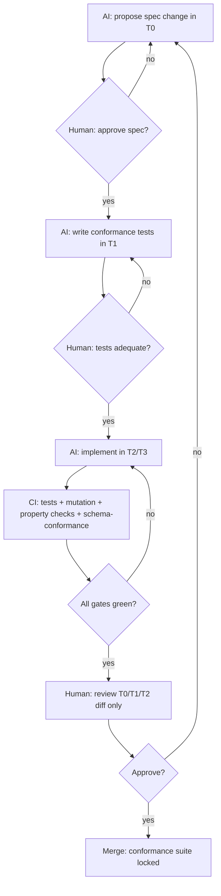
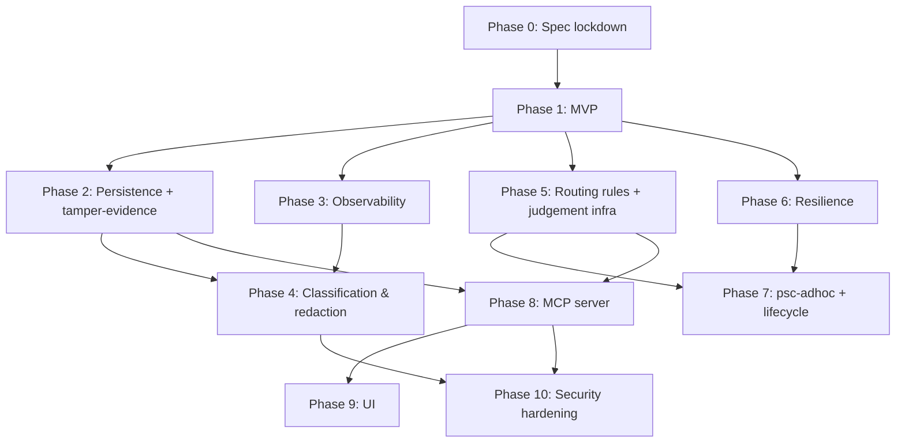

# 09 — MVP and Phased Roadmap

> **Status:** DRAFT.
> **Branch:** `feature/workflow-engine`.
> **Audience:** Project owner, reviewers, and any agent picking up implementation work.
>
> Scope: defines the **Minimum Viable Product** for the PSC workflow engine
> and a phased roadmap to deliver the remaining capabilities. The roadmap is
> structured around the project's actual bottleneck — **human validation
> capacity**, not AI build time.

---

## 9.1 Purpose

The design document set (00-07) describes *what* the engine is. This
document describes *how it gets built*, in what order, and — most
importantly — how a single human reviewer can keep up with an AI building
at effectively unbounded throughput.

This file is not a schedule. There are no week numbers, no story points,
no sprints. The unit of progress is a **conformance gate** (§9.4): an
immutable test suite that locks a slice of validated behaviour into the
codebase forever.

---

## 9.2 The Validation Asymmetry

### The bottleneck is reading, not writing

| Activity | Throughput |
|----------|-----------|
| AI writes code | Effectively unbounded |
| AI writes tests | Effectively unbounded |
| AI writes specs | Effectively unbounded |
| Human reviews specs | Bounded — minutes per page |
| Human reviews tests | Bounded — minutes per test |
| Human reviews code | **Severely bounded** — the bottleneck |

A naive "AI writes code, human reviews every line" pipeline will saturate
the human and stall the AI. A naive "AI writes code, ship it" pipeline
will accumulate subtle regressions faster than anyone can detect.

The solution is **leverage**: humans should review the smallest possible
surface that determines the largest possible behaviour. Specifications,
schemas, public protocols, and conformance tests are leverage points;
internal implementations are not.

### The three failure modes this roadmap prevents

1. **Reviewer saturation** — the human becomes the bottleneck; AI sits idle.
2. **Silent regression** — AI ships code that passes tests but violates
   an invariant nobody encoded.
3. **Spec drift** — the implementation diverges from the design docs;
   neither is authoritative.

The mitigations are in §9.4 (validation strategy).

---

## 9.3 MVP Definition

### Principle

The MVP is the **smallest end-to-end vertical slice** that proves the
five most-load-bearing design decisions are correct. It is not a
production system; it is a falsification test for the architecture.

If the MVP works, the design is sound and remaining phases extend it.
If the MVP fails, the design has a flaw that must be fixed before any
further investment.

### What the MVP must prove

| # | Architectural premise | How the MVP proves it |
|---|----------------------|----------------------|
| 1 | A labelled transition system can route a real workflow deterministically | The MVP walks a real workflow start_at → terminal with zero routing ambiguity |
| 2 | The engine boundary (deterministic routing vs. judgement) holds in practice | The MVP includes one `decision_required` state that halts and resumes correctly |
| 3 | Parallel fan-out + join + aggregation can live *inside* `advance()` | The MVP includes one `parallel` state with real fan-out, join, and aggregation |
| 4 | Real LLM dispatch handlers conform to `DispatchHandler` without leaking actor specifics into the engine | The MVP uses `engine.subagent_dispatch` against a real OpenCode subagent |
| 5 | The JSON-authoritative passport survives crash/restart with no information loss | The MVP test suite kills the process mid-`advance()` and verifies clean resume |

### MVP IN scope

**Workflow:**
- One workflow JSON, deliberately small but non-trivial:
  - 1 `task` start state
  - 1 `parallel` state (fan-out = 2 specialists, join = `all`)
  - 1 `task` synthesis state
  - 1 `decision_required` state
  - 1 `task` follow-up state
  - 1 `gate` state with a reentry budget
  - 1 `terminal` state
- Total ~7 states, one loop-back, one decision point, one parallel branch.
- Workflow profile is a stripped `psc-mvp.json` (NOT the full `psc-main`).

**Engine surface:**
- CLI only — no MCP server.
- API methods: `new_subject`, `current_state`, `possible_outcomes`,
  `advance`, `record_decision`, `cancel_subject`, `claim`, `release`,
  `load_outcome`, `query`.
- Dispatch handlers: `engine.subagent_dispatch` (real LLM via OpenCode
  task tool), `engine.human_form_dispatch` (CLI prompt for decisions).
- Storage: JSON only (`JsonSubjectStore`, `JsonEventStore`,
  `JsonWorkflowDefinitionStore`, file-based `OutcomeStore`).
- Concurrency: file-lock + fencing token (`claim_epoch`) — required
  because parallel branches need it.

**Engine semantics:**
- `StateRegistry` + forward-progress DAG comparison.
- Mandatory `event_name` on every transition.
- Load-time validation (`WorkflowDefinitionError`) for the structural
  invariants enumerated in §2.14: missing `event_name`, unknown targets,
  unresolvable schemas/handlers, cyclic forward-DAG, missing `start_at`,
  no terminal state, gate states with `dispatch_handler` or `retry`,
  phase FK, name==dict_key.
- `StepOutcome` (engine-validated, schema-conformant) — no `RawPayload`
  yet.
- Deterministic idempotency key: `sha256(subject_id + step + entry_count + attempt)`.
- Parallel join + aggregation inside `advance()` (no public
  `aggregate_outcomes` API).
- Per-branch context isolation: `Context` is frozen, `vars` is deep-copied
  per parallel branch, merged at join time under the engine's control.
- Fencing token (`claim_epoch`) on every write.

**Verdicts:**
- Engine-known verdicts: `pass`, `fail` (only — per D-004).
- Workflow-declared verdicts in the MVP workflow: `classified`,
  `reviews_complete`, `synthesized`, `accept`, `done`.
- JSON Schema `enum` built dynamically by `VerdictSchemaBuilder` from
  the workflow's transition keys + engine defaults.

### MVP OUT of scope (deferred)

| Capability | Deferred to |
|-----------|-------------|
| SQLite / PostgreSQL backends | Phase 2 |
| Hash chain on events; status_log table | Phase 2 |
| MCP server | Phase 8 |
| Markdown mirror, re-alignment process | Phase 3 |
| Lifecycle hooks beyond a single LoggingHook | Phase 3 |
| Data classification, redaction, `project()` | Phase 4 |
| SQL-CASE routing rules | Phase 5 |
| `RosterResolver`, `propose_roster`, `validate_roster` | Phase 5 (MVP hardcodes the roster in the workflow JSON) |
| Crashed-specialist re-dispatch | Phase 6 (MVP tests happy parallel only) |
| `dispatch_retry` + backoff for transient handler failures | Phase 6 |
| `psc-adhoc`, profile versioning, `migrate`, DEPRECATED lifecycle | Phase 7 |
| UI (all 12 views) | Phase 9 |
| Security backlog (S1-S36) | Phase 10 |

### MVP success criteria

The MVP is "done" when **all** of these are true:

1. The happy path (start_at → terminal) walks with zero manual intervention
   in `advance()` chains, including the parallel fan-out and the
   decision halt.
2. Property tests pass for the five MVP invariants (§9.5).
3. A killed-mid-`advance()` test recovers cleanly with no duplicate
   StepRecord and no missing StepRecord.
4. The CLI surface passes `mypy --strict`.
5. Load-time validation rejects ≥8 distinct classes of malformed
   workflows (enumerated in the MVP conformance suite).
6. The MVP conformance gate (§9.4) is green on CI and locked.

---

## 9.4 Validation Strategy — How One Human Keeps Up

### 9.4.1 Tiered reviewability

Code is partitioned into tiers by review depth. AI may freely modify any
tier; humans review depth scales with tier.

| Tier | Examples | Review depth | Change cadence |
|------|----------|--------------|----------------|
| **T0 — Spec** | Files 00-07, `psc-profile.json`, workflow JSON shape, JSON Schemas, public protocols (`DispatchHandler`, `SubjectStore`, `Redactor`, `LifecycleHook`), `StateKind` enum | Every line, every change, every PR | Slow — spec changes are infrequent |
| **T1 — Invariants** | Conformance test suites, property-based tests, load-time validators | Every line, every change | Each phase adds one suite |
| **T2 — Public API** | CLI command signatures, `WorkflowService` method surface, dispatch handler implementations, error hierarchy | Every signature, every contract change | Per-feature |
| **T3 — Internal** | Adapters, persistence backends, factory wiring, helpers, glue | Spot-check; rely on T0/T1/T2 tests | Continuous |
| **T4 — Generated** | CLI help text, auto-generated docs, formatted output | Skim only; review the generator, not the output | Continuous |

**Rule of thumb:** if a change touches a higher tier, the change is
re-elevated for review at that tier — even if the change began in T3.
Cross-tier changes are flagged automatically by CI.

### 9.4.2 The five validation primitives

1. **Spec-first.** AI cannot ship any feature without first proposing a
   spec change in T0. The human reviews the spec; the AI implements
   against it. This makes the spec authoritative and reduces what gets
   reviewed to spec diffs.

2. **Conformance gates.** Each phase ships an **immutable test suite**
   that locks the phase's validated behaviour. Conformance tests can be
   added but **never weakened, deleted, or rewritten** without explicit
   human approval recorded as a spec change. This makes regressions
   structurally impossible.

3. **Properties over examples.** Critical invariants are expressed as
   **property-based tests** (Hypothesis-style) rather than concrete
   examples. A single property — "for any workflow JSON that loads,
   every reachable state has a path to a terminal" — replaces hundreds
   of example tests. Humans read properties in minutes; AI satisfies
   them with whatever implementation works.

4. **Mutation testing.** Every phase's conformance suite is run through
   a mutation tester. If a generated mutant survives, the test suite is
   too weak — AI must add a test that kills it before the phase is
   accepted. This prevents AI from gaming validation by writing
   tautological tests.

5. **Diff-only review.** The human's review surface for each PR is:
   - T0 diff (spec)
   - T1 diff (conformance + property tests)
   - T2 diff (public signatures)
   - T3 changes collapsed to a file list (counted, not read)
   - T4 changes invisible (sampled by CI lint)

### 9.4.3 The per-feature flow

**Key property:** at every step where the human says "no", the AI
iterates without blocking on anything else. Other phases continue in
parallel.

### 9.4.4 What prevents AI from gaming validation

| Attack | Defence |
|--------|---------|
| AI writes weak tests that always pass | Mutation testing — surviving mutants block merge |
| AI deletes / rewrites previously-validated tests | Conformance suites are immutable; deletion requires a spec change |
| AI ships code without a spec | CI fails any PR where T2/T3 diff exists without a corresponding T0/T1 diff |
| AI proposes a plausible-but-wrong spec | Spec changes always reviewed by a human; no self-approval |
| AI ships code that conforms to tests but violates an unstated invariant | Property tests must cover the invariant; if it's not in T1, it doesn't exist |
| AI subtly breaks a higher-tier file under cover of a T3 change | Cross-tier flag triggers re-elevation; CI labels the PR |

### 9.4.5 What the human reviews — explicit budget

A reviewer reading 100 lines per minute reviewing T0+T1+T2 only:

| Item | Typical size | Read time |
|------|-------------|-----------|
| Spec change diff (T0) | 50-200 lines | 1-5 min |
| Conformance suite diff (T1) | 100-500 lines | 5-20 min |
| Public API diff (T2) | 20-100 lines | 1-5 min |
| **Total per feature** | ~200-800 lines | **~10-30 min** |

This puts an upper bound of ~10-20 features per reviewer per day before
fatigue. AI delivery rate must throttle to fit; CI enforces it by
limiting in-flight PRs requiring review.

---

## 9.5 MVP Conformance Gate — Concrete Invariants

The MVP conformance gate is the immutable suite that locks Phase 1.
Below are the five property-based invariants that every later phase
must continue to satisfy.

| # | Invariant | Property statement |
|---|-----------|-------------------|
| I1 | **Routing determinism** | For any subject in any state, given the same outcome, `advance()` produces the same target state — across processes, across restarts, across backends. |
| I2 | **Forward-DAG soundness** | For any two states `a`, `b` in the loaded workflow, exactly one of holds: `a < b`, `b < a`, `a == b`, or `IncomparableStates`. The relation is a strict partial order on the back-edge-free graph. |
| I3 | **Idempotency** | Calling `advance(subject_id, outcome)` twice with the same idempotency key produces exactly one StepRecord, one event row, one passport mutation. |
| I4 | **Crash safety** | For any sequence of operations interrupted by SIGKILL between any two filesystem writes, the next process can reconstruct a consistent passport via re-alignment from the step_log. No duplicate StepRecord; no missing StepRecord. |
| I5 | **Parallel correctness** | For any `parallel` state with N branches and `join: all`, `advance()` does not transition until all N branches return; the aggregated outcome is independent of branch return order. |

Plus the structural validators (≥8 classes of malformed workflow JSON
all raise `WorkflowDefinitionError` at load time).

Every later phase MUST keep these five properties green. They are the
permanent regression net.

---

## 9.6 Phased Roadmap

### Ordering principle

Phases are ordered by **dependency**, not preference. A later phase MAY
depend on an earlier phase's conformance gate; an earlier phase MUST NOT
depend on a later phase.

### Phase 0 — Spec lockdown

**What it adds:** Nothing executable. Establishes:
- The conformance test format and harness (pytest + Hypothesis).
- The mutation testing tool (mutmut or cosmic-ray).
- The CI pipeline with tier classification, cross-tier flagging, and
  in-flight PR throttling.
- The Reviewer's checklist for T0/T1/T2 diffs.

**Conformance gate:** docs 00-07 reviewed and locked; CI pipeline green
on an empty repo.

**AI can build:** nothing yet — the spec must be approved first.

---

### Phase 1 — MVP

**What it adds:** see §9.3. Vertical slice with parallel + real dispatch.

**Conformance gate:** the five MVP invariants (§9.5) + structural
validators + the killed-mid-`advance()` recovery test.

**Why first:** every other phase depends on the engine boundary, the
state machine, the StepOutcome contract, and JSON passport correctness.
If the MVP fails, the design must be revisited before further work.

---

### Phase 2 — Persistence backends + tamper-evidence

**What it adds:**
- `SqliteSubjectStore`, `SqlitePostgresStore`, `PgSubjectStore`.
- Fencing token (`claim_epoch`) enforced on all writes (already present
  in MVP for parallel; this phase makes it a load-bearing property
  across backends).
- `events` table with hash chain (`row_hash = H(prev_hash, row_data)`).
- `status_log` table with its own hash chain.
- `subjects_summary` table for fast queries.
- SQLite migration mechanism (numbered SQL files).
- `PRAGMA foreign_keys = ON`.
- Indices on `subjects.claimed_at` / `claimed_by`.

**Conformance gate:**
- Backend swap is invisible — the MVP conformance suite passes on JSON,
  SQLite, and PostgreSQL, with zero conformance-suite changes.
- Hash chain breaks are detected: any row tampered with → CI test fails.
- Concurrent-write race tests pass (10 processes, 1000 advance calls
  each, zero duplicate StepRecords, zero lost writes).

**Why second:** persistence determines all downstream observability. If
we add hooks / mirror / redaction first and then change the storage
model, we redo everything.

---

### Phase 3 — Observability layer

**What it adds:**
- Lifecycle hook registry (`HookRegistry`) with fail-closed critical
  hooks (per S19) and fire-and-forget non-critical hooks.
- Built-in hooks: `LoggingHook`, `ObservabilityHook`, `EventDispatchHook`
  (with outbox pattern for at-least-once — per #37).
- Markdown mirror with deployment-time `mirror.disabled` flag.
- Re-alignment process: `step_log` is source of truth; passport
  corrected from `step_log`; mirror regenerated from passport.

**Conformance gate:**
- Hooks fire in the declared order (write StepRecord + update passport
  BEFORE hooks; then `state.exited` → domain `event_name` →
  `transition.triggered` → `state.entered`).
- Property test: for any sequence of `advance` calls, the regenerated
  mirror is a pure function of the step_log.
- Re-alignment recovers from injected mid-write failures (passport
  out-of-sync with step_log → re-aligned correctly).
- Failure of a critical (audit) hook fails the `advance()` call closed,
  not silently.

---

### Phase 4 — Data classification & redaction

**What it adds:**
- `Redactor` protocol + `RedactorRegistry`.
- Default-private classification (fail-closed per D-016).
- `project()` function with full recursion over `additionalProperties`,
  `patternProperties`; rejection of `unevaluatedProperties` schemas at
  load time.
- Battle-tested `EmailRedactor`, `TokenRedactor`, `DefaultRedactor`
  built TDD-first.
- `RedactorNotRegisteredError`.
- CI lint for sensitive field names not classified as protected/private.
- All hook context dicts projected before emission.

**Conformance gate:**
- Property test: for any outcome and any schema, no `private` value
  appears in any of {event dispatch payload, audit log row, markdown
  mirror line, API response, CLI output}.
- Property test: every `protected` value passes through a registered
  redactor; an unregistered redactor name raises `RedactorNotRegisteredError`.
- Mutation test for each redactor: every plausible bug class is killed
  by ≥1 test.

---

### Phase 5 — Routing rules + judgement infrastructure

**What it adds:**
- SQL-CASE-style routing rule DSL (`route.<name>`):
  `CASE WHEN cond THEN target; ELSE default; END`.
- Mandatory `event_name` on every routing-rule branch.
- `record_decision` writes a `StepRecord` and fires hooks (per D-014).
- `decision_required` state semantics: halts `advance`, requires a
  typed `decision` object validated against `decision_schema`.
- `RosterResolver` with `propose_roster` (signal-matched) and
  `validate_roster` (against `agents_folder`).
- `SignalMatcher` protocol with case-fold matching.
- `decision.user_disposition`, `decision.roster_confirmation`, and
  `decision.c4_completion` schemas.

**Conformance gate:**
- Property test: every `decision_required` state halts `advance` and
  only proceeds via `record_decision`.
- Property test: every routing rule's branches are mutually exclusive
  and total (no input falls through silently).
- Recorded decisions appear in the audit trail and the markdown mirror.

---

### Phase 6 — Resilience

**What it adds:**
- `dispatch_retry` block (global + per-state) with exponential backoff,
  per D-007 / D-033.
- `reentry_budget` (per-gate, default 3, configurable per gate).
- Crashed-specialist re-dispatch by step ID (e.g., `A1#security`) — not
  the whole fan-out.
- Lease reaper: stale claims released after TTL; the reaper appends a
  `claim_log` row (`kind='released'`, `reason='lease_ttl_exceeded'`,
  `actor='system:reaper'`) and fires a `SUBJECT_RELEASED` event.

**Conformance gate:**
- 3-specialist fan-out with one specialist killed mid-dispatch
  re-dispatches only the failed specialist and joins correctly.
- Exhausted dispatch_retry surfaces `DispatchError` and writes a
  StepRecord with the failure cause.
- Exhausted `reentry_budget` triggers the `exhausted` transition
  (typically → ESCALATE), not a silent loop.

---

### Phase 7 — psc-adhoc + workflow lifecycle

**What it adds:**
- Full `psc-adhoc` workflow JSON with A0L state defined.
- SemVer enforcement on workflow definitions (max 2 concurrent MAJOR,
  90-day grace).
- `migrate(subject_id, target_version)` API with cross-MAJOR rejection.
- Workflow definition lifecycle (DRAFT / ACTIVE / DEPRECATED / ARCHIVED).
- Profile versioning (`psc-profile.json` SemVer; workflow pins
  `profile_version`).

**Conformance gate:**
- A cross-MAJOR migration is rejected with a structured error listing
  incompatibilities.
- The `psc-adhoc` workflow walks start_at → terminal end-to-end on a
  realistic scenario (a one-file hotfix subject).
- A DEPRECATED workflow accepts in-flight subjects but rejects new ones.

---

### Phase 8 — MCP server

**What it adds:**
- `psc-state` MCP server exposing the identical API surface as the CLI.
- MCP transport security (per S23).

**Conformance gate:**
- The MVP conformance suite + Phase 2-7 conformance suites all pass on
  the MCP surface with zero changes.
- An end-to-end test drives the engine via MCP from a stub Supreme
  Leader.

---

### Phase 9 — UI

**What it adds:** all 12 views from 05-ui-ux.md.

**Conformance gate:**
- Every view's API integration round-trips correctly (form submission
  produces the documented API call, response renders the documented
  fields).
- HTML-escape lint on all dynamic content (per S25).
- A manual end-to-end walkthrough of every view exists as a recorded
  script.

---

### Phase 10 — Security hardening

**What it adds:** the security backlog (S1-S36):
- AuthN/AuthZ model (S1).
- Encryption-at-rest for passport storage (S5).
- SSRF protections for `system_webhook_dispatch` (S12).
- Event dispatch auth + TLS + message signing (S13).
- Secret management (S14).
- Rate limiting (S15).
- Threat model document (S16).
- Path traversal hardening (S8).
- Stored XSS hardening (S25).
- Plus all remaining S* items.

**Conformance gate:**
- Each S* item has a documented threat scenario and a test that
  demonstrates the mitigation.
- A penetration-test script runs in CI against a known-bad set of
  inputs and passes.

---

## 9.7 Risks and Mitigations

### Risk 1: human reviewer saturation

**Mitigation:** the tier system (§9.4.1) bounds the per-feature review
budget to T0 + T1 + T2 diffs only. The CI pipeline rejects PRs whose
T0/T1/T2 diffs are larger than the per-PR cap (default 1,000 lines
across all three tiers combined). Larger features are split.

### Risk 2: AI ships subtle regressions

**Mitigation:** immutable conformance suites + mutation testing
(§9.4.2). Every phase's invariants become a permanent regression net.

### Risk 3: spec drifts from implementation

**Mitigation:** the spec docs (00-07) live in the same repo as the
code. The CI pipeline includes a `spec-impl-consistency` check that:
- Parses the JSON Schemas from the spec.
- Parses the protocols from the code.
- Fails if a schema field has no corresponding code field, or vice versa.
- Fails if a protocol method's signature differs from its spec definition.

### Risk 4: AI proposes plausible-but-wrong specs

**Mitigation:** spec changes always reviewed by a human; AI cannot
self-approve. The "spec-first" primitive enforces this structurally.

### Risk 5: phase boundaries blocked on a single reviewer

**Mitigation:** the dependency graph (§9.6) shows where phases can run
in parallel. Phases 2, 3, 5, 6 can all proceed concurrently after
Phase 1 ships. A blocked Phase 4 does not block Phase 5.

### Risk 6: AI satisfies the letter of a conformance test but misses the intent

**Mitigation:** property-based tests (§9.4.2 primitive 3) express
intent rather than examples. A property test that says "for any
parallel state with N branches, join order does not affect aggregation"
is harder to game than an example test with one specific 3-branch case.

### Risk 7: a conformance suite becomes an obstacle to legitimate refactoring

**Mitigation:** suites are immutable to AI but mutable to humans. A
legitimate refactor that requires changing a conformance assertion
goes through the spec-change flow (T0 diff → human approval). This is
slow on purpose — refactoring a conformance suite is a load-bearing
event.

---

## 9.8 Open Questions

1. **Reviewer identity.** Who is the human in §9.4? One owner, a panel,
   asynchronous? The per-PR review budget assumes one reviewer with
   ~30 min per feature. If there are multiple reviewers, the throttle
   relaxes; if there is intermittent availability, the throttle must
   account for batching.

2. **In-flight PR cap.** What is the default cap on PRs awaiting review?
   The CI throttle (§9.7 risk 1) needs a concrete number. Suggested
   starting value: **3 PRs in-flight per reviewer**.

3. **Mutation testing budget.** Mutation testing is expensive. Do we
   run all mutants on every PR, or sample N mutants per PR with a full
   sweep nightly? Suggested: sample on PR (fast feedback), full sweep
   on `main` post-merge (catches escaped mutants).

4. **MVP workflow content.** The MVP workflow JSON needs concrete
   states/transitions. Should it mirror a slice of `psc-main` (e.g.,
   A0 → A1 → A2 → A2b → A2c → A2a → A3 → COMMIT) or a synthetic
   minimal workflow? Mirroring a slice gives us a faster path to dog-
   fooding; a synthetic workflow is easier to debug.

5. **Real dispatch in MVP — fallback policy.** The MVP includes
   `engine.subagent_dispatch` against real OpenCode subagents. What
   happens when the subagent returns malformed JSON? Does the MVP
   include a structured retry, a hard fail, or a fallback to the stub
   handler? Recommendation: hard fail; structured retry is Phase 6.

6. **Phase 0 prerequisites.** Phase 0 says "establish the CI pipeline."
   Is the CI pipeline existing infrastructure (e.g., GitHub Actions
   inherited from the workflow repo) or new build-out? If new, Phase 0
   has more substance than the doc currently implies.

7. **What constitutes "phase complete"?** Each phase's conformance gate
   is described but not yet specified as a concrete test file count.
   Suggested artefact: each phase ships `tests/conformance/phase_N/`
   with a top-level `README.md` enumerating the invariants and the
   mutation-coverage report.

---

## 9.9 Summary

| Concept | Value |
|---------|-------|
| Bottleneck | Human review of code |
| Unit of progress | Conformance gate (an immutable test suite) |
| Reviewer's surface per feature | T0 + T1 + T2 diff only (~200-800 lines) |
| MVP scope | Vertical slice including parallel + real dispatch |
| MVP success | Five property-based invariants + crash safety + ≥8 structural validators |
| Total phases | 11 (Phase 0 + Phases 1-10) |
| Parallelisable phases | 2, 3, 5, 6 after Phase 1; 8 and 9 sequenced; 10 last |
| Anti-regression mechanism | Immutable conformance suites + mutation testing |
| Anti-drift mechanism | Spec-impl consistency CI check |
| Anti-gaming mechanism | Mutation testing + property tests + cross-tier flagging |
