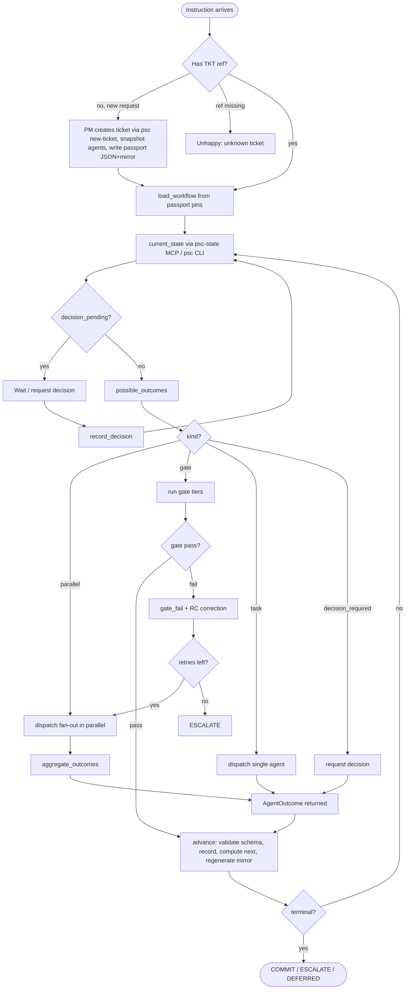
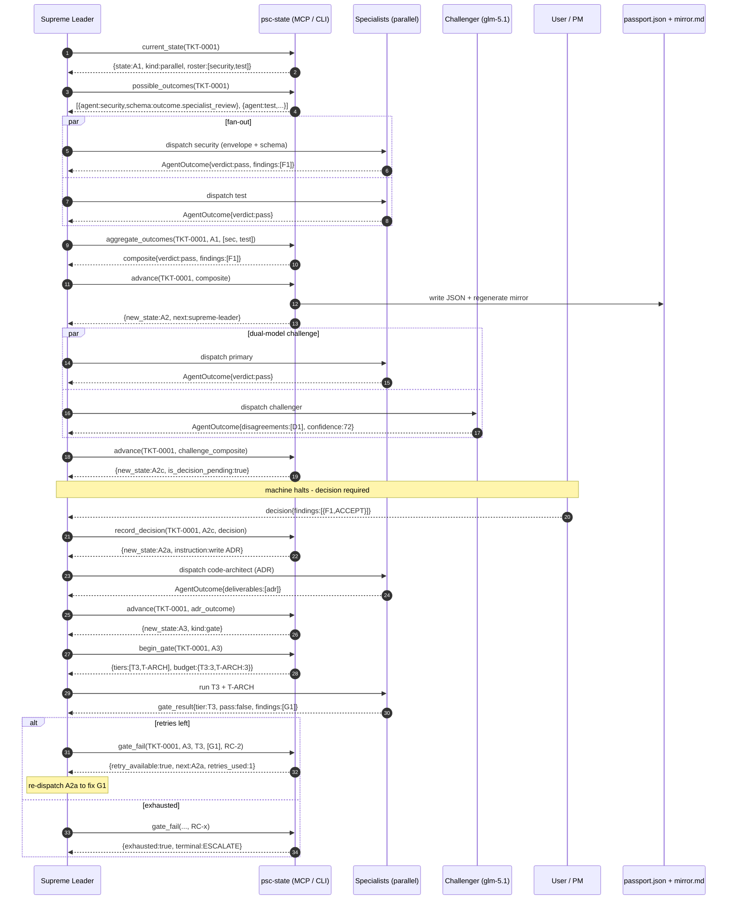

# PSC Workflow Engine — Design Document

> **Status:** DRAFT. All architecture decisions are marked **[LOCKED]** or **[TENTATIVE]**.
> **Branch:** `feature/workflow-engine` (created as the first executable step, per §0).
> **Owner:** Supreme Leader (orchestrating); design synthesised from parallel agent
> exploration + critique + authoritative research on workflow semantics.

---

## Purpose

Replace the loosely-defined markdown passport and prose-driven agent handoff
with a **deterministic, semi-structured workflow engine**: JSON + JSON Schema
for the workflow definition and passport, a Python library that answers
state-machine questions, and an MCP/CLI surface the dispatch-only Supreme
Leader can call without violating its permission block.

The agent never decides "what's next" for deterministic transitions — it calls
a function and gets a response. The five genuine judgement points (A0 roster
confirmation, A2c user disposition, C4 PM completion, gate-fail root-cause
correction, and ambiguous-instruction clarification) are recorded as typed
decision objects and routed by their declared fields.

---

## Philosophy of Approach

This design follows four philosophical commitments, each grounded in the
authoritative research cited in §12:

1. **Make the machine a machine, not a document.** The current PSC pipeline
   encodes its state machine in 2,000+ lines of prose across
   `pipeline/SKILL.md`, `supreme-leader.md`, and `pm.md`. An LLM must read
   and follow all of it — and LLMs drift. The philosophical commitment here
   is that routing correctness belongs in a **compile-time artefact** (the
   JSON workflow definition), not a **prompt-time hope** (prose an agent is
   told to obey). The state machine becomes testable; the agent becomes a
   caller of deterministic functions.

2. **Separate routing from judgement.** A workflow has two kinds of decision
   points: those that are a pure function of recorded state (gate pass/fail,
   retry budget, join satisfaction), and those that require human or agent
   judgement (roster classification, user disposition, PM completion,
   root-cause classification). The design refuses to bake the second kind
   into the transition graph. Judgement points are first-class
   `decision_required` states that halt the machine; a typed decision object
   is supplied; routing then proceeds deterministically off the decision's
   declared fields. This keeps the state machine dumb and puts the
   intelligence in declared objects the machine can reason about
   structurally.

3. **The worker is a pure producer; placement is computed above it.** No
   mature workflow engine lets the worker decide where its output lands. In
   Camunda the engine decides via BPMN element scope + output mappings; in
   Temporal the framework decides via activity ID + workflow run ID; in
   Step Functions the engine decides via ASL state name + `ResultPath`. The
   PSC engine follows the same principle: **the agent does not choose where
   to write its outcome**. A class that is aware of the step identity and the
   ticket identity computes the storage path/id deterministically. This is
   the "engine-managed output binding" pattern (see §13.3).

4. **Preserve what works; replace what drifts.** The existing PSC audit model
   — git-committable markdown passports, ADRs, decision/advisory/clarification
   files, human review in diffs — is the project's greatest strength. The
   design preserves it via a derived Markdown mirror regenerated on every
   state transition. What gets replaced is the prose-driven routing and the
   un-enforced handoff protocol, not the reviewable artefacts.

---

## Design Agnosticism — A Principle

> **Principle:** The workflow definition, state machine semantics, passport
> shape, and routing rules defined in this document are **language-agnostic**.
> They are expressed as JSON data and a labelled transition system, not as
> Python code. The design should be valid for re-implementation in any
> language that can read JSON, evaluate boolean conditions, and persist
> state.

This Python prototype is the **reference implementation**, not the
specification. The specification is the JSON workflow definition (§2.1),
the passport schema (§2.2), the AgentOutcome contract (§2.3), and the
transition table (§7). A Rust, Go, or TypeScript implementation that reads
the same workflow JSON, implements the same `advance`/`gate_fail`/
`record_decision` semantics, and writes the same passport JSON is a valid
interoperable engine.

**What is Python-specific and must not leak into the spec:**

- `StrEnum`, `@dataclass(frozen=True)`, `field(default_factory=...)` are
  implementation conveniences in the reference library, not contract
  requirements.
- `State.__lt__` (forward-progress DAG comparison) is a Python ergonomic; a
  Rust implementation would use a `PartialOrd` impl with the same semantics.
- The `StateRegistry` class is a Python idiom for a graph store; other
  languages may use a struct, a map, or a database.

**What is language-agnostic and IS the spec:**

- The workflow JSON shape (states map, transitions with `outcome → target`,
  `loop` flag, `retry` blocks, `kind` enum values).
- The passport JSON shape.
- The AgentOutcome JSON shape and its `verdict` enum values.
- The forward-progress DAG comparison semantic (`a < b` iff `a` is a strict
  ancestor of `b` in the graph with `loop:true` edges removed;
  `IncomparableStates` when no path either way).
- The context model (`input` + `vars` + `meta`).
- The deterministic-vs-judgement transition table.

**Python 3.14+ is chosen for the reference implementation** because it offers
`enum.StrEnum`, `uuid.uuid7()` (RFC 9562, time-ordered UUIDs — see §13.2),
deferred annotations (PEP 649), `copy.replace()`, and improved error
messages — all of which reduce boilerplate and improve the prototype's
fidelity to the spec. Requiring 3.14+ is a prototype decision, not a spec
decision.

---

## Semantics and Ontology

This section defines the ontology of the workflow engine — every entity in
the domain and how it maps to a Python entity in the reference
implementation. The mapping is the contract between the language-agnostic
spec (left) and the Python prototype (right).

| Domain entity | Definition | Python entity | Authority |
|---------------|------------|---------------|-----------|
| **Workflow** | A labelled transition system: a set of states + transitions, with a start state and terminal states. Versioned (SemVer). | `StateRegistry` (holds the loaded graph) + the workflow JSON document | ASL `States` map; BPMN process |
| **State** | A node in the workflow graph. Has a name, title, phase, step ordinal, kind, and outgoing transitions. Comparable via forward-progress DAG ancestry. | `State` (frozen dataclass) | ASL "State"; BPMN "Task/Activity" |
| **StateKind** | The category of a state: `task`, `parallel`, `gate`, `decision_required`, `terminal`. | `StateKind(StrEnum)` | ASL state types (Task, Choice, Parallel, Succeed, Fail); BPMN User Task for `decision_required` |
| **Transition** | A labelled edge: "on this outcome, go to that state." May be a loop-back (`loop: true`, excluded from the comparison DAG). | `Transition` (frozen dataclass) | ASL `Next`; BPMN `sequenceFlow` |
| **Verdict** | The label on a transition — the evaluated result of a state that selects the outgoing edge. | `Verdict(StrEnum)` | ASL `Choice Rule` condition; BPMN gateway condition |
| **Gate** | A state of kind `gate` that runs compliance tiers (T1/T2/T3/T-ARCH) with per-tier retry budgets. | `State` with `kind=StateKind.GATE` + `gate_config` reference | BPMN exclusive gateway + error boundary event |
| **Tier** | A compliance check dimension (T1 mechanical, T2 architectural, T3 semantic, T-ARCH cross-cutting). Project-specific; not a BPMN standard. | `str` literal in `gate_config.tiers` | PSC-specific |
| **Decision** | A typed object supplied at a `decision_required` state by a human or PM. The machine records it and routes off its fields. | `dict[str, Any]` validated against `decision_schemas[state]` | BPMN User Task output; ASL task output payload |
| **Outcome** | The payload an agent returns at a state — the data that flows along the transition edge to the next state. | `AgentOutcome` (dataclass) | ASL task output; Camunda job variables |
| **Context** | What a state handler sees: `input` (predecessor's output) + `vars` (flat blackboard) + `meta` (`from_state`, `entry_count`, `attempt`, `entered_at`). O(1) memory; no full path surfaced. | `Context` (dataclass) + `StateMeta` (frozen dataclass) | ASL Context Object; Camunda variable scope; Temporal replay-reconstructed locals |
| **Passport** | The persisted runtime state of one ticket: current state, step log, gate results, decisions, retries, parallel progress, vars, version pins. JSON-authoritative; Markdown mirror derived. | `dict[str, Any]` (the passport JSON) + `JsonPassportStore` adapter | ASL execution snapshot; Camunda process instance variables |
| **Ticket** | A single workflow execution — one run of a workflow definition, pinned to a snapshot of the definition + agents at A0. | `str` (ticket id, e.g. `TKT-0001`) | Temporal workflow execution; Step Functions execution ARN |
| **Roster** | The set of specialist agents dispatched in parallel at A1/C2. Dynamic (3–10), resolved from `agents_folder` contents + domain signals; user confirms via checklist. | `RosterResolver` + `RosterProposal` | PSC-specific (no standard equivalent) |
| **Config** | Engine configuration: paths (agents_folder, workflows_folder, passports_folder), roster defaults/minimum/max/signals. | `Config` (frozen dataclass) + `ConfigReader` (YAML) | PSC-specific |
| **Step Log** | The append-only audit trail of every state entry: `{step, agent, from_state, entry_count, attempt, uuid, timestamp, outcome_ref}`. The persisted history (what all engines keep); NOT surfaced to handlers. | `list[StepRecord]` in the passport | Temporal Event History; Camunda event stream; Step Functions execution history |
| **StepRecord** | One entry in the step log, identified by a UUIDv7 (time-ordered, sortable, collision-free across parallel agents). Carries a reference to the AgentOutcome, not the outcome itself. | `StepRecord` (frozen dataclass) with `uuid: uuid.UUID` (UUIDv7) | RFC 9562 §5.7; Temporal event |

### Python 3.14+ syntax in the reference implementation

The reference implementation uses the following 3.14+ features. Per the
**Design Agnosticism principle**, these are prototype conveniences, not spec
requirements — a re-implementation in another language uses its own idioms
for the same semantics.

| Feature | Use | Version | Authority |
|---------|-----|---------|-----------|
| `enum.StrEnum` | `StateKind`, `Verdict` — string-valued enums whose `__str__` returns the raw value (drop-in for string constants) | 3.11+ | https://docs.python.org/3.14/library/enum.html |
| `uuid.uuid7()` | StepRecord UUIDs — time-ordered, lexically sortable, collision-free | 3.14 (RFC 9562) | https://docs.python.org/3.14/library/uuid.html |
| `@dataclass(frozen=True)` + `field(default_factory=...)` | `State`, `Transition`, `Config`, `StepRecord` — immutable value objects | 3.11+ (refined) | https://docs.python.org/3.14/library/dataclasses.html |
| `type` statement | Type aliases (`type OutcomeRef = str`) | 3.12+ (PEP 695) | https://peps.python.org/pep-0695/ |
| `typing.Self` | Return-type annotations on `StateRegistry` methods | 3.11+ | https://docs.python.org/3.14/library/typing.html |
| `typing.override` | Marking overridden methods | 3.12+ | https://docs.python.org/3.14/library/typing.html |
| Deferred annotations (PEP 649) | No `from __future__ import annotations` needed | 3.14 | https://docs.python.org/3.14/whatsnew/3.14.html |
| `copy.replace()` | Immutable updates on frozen dataclasses | 3.14 | https://docs.python.org/3.14/whatsnew/3.14.html |
| `except*` / `ExceptionGroup` | Structured concurrency in parallel aggregation | 3.11+ | https://docs.python.org/3.14/library/exceptions.html |

**Context7 verification:** all library APIs used in the reference
implementation MUST be checked against Context7 (or the official docs
fetched directly) for the latest version-specific style before writing
code. This is mandated by the project's Authoritative Reference Principle
(AGENTS.md). The `enum.StrEnum` and `uuid.uuid7()` citations above were
verified against the Python 3.14.6 docs.

---

## 0. Executable Steps (ordered)

These are the concrete first actions. Each is a shippable, testable unit.
**The API contracts (§0.1–0.3) are agreed before any code is written.**

| # | Step | What gets locked | Why first |
|---|------|------------------|-----------|
| **0.1** | **Align on workflow steps & state machine** — walk every state (A0…CR3), its `kind` (task/parallel/gate/decision_required/terminal), its outgoing transitions, and whether each transition is a loop-back. Lock the transition table (§7) as the contract. | State machine contract | Foundation everything depends on |
| **0.2** | **Align on outcomes per state** — for each state, agree the `outcome_schema` (the fields an agent fills and returns). Lock the AgentOutcome shape (§2.3) and the per-state variants. Includes the Python prototypes for `State`, `StateRegistry`, `Context`, `ConfigReader`, `RosterResolver` (§2.4, §2.5). | Outcome contracts | The data contracts the state machine routes on |
| **0.3** | **Align on API contracts** — lock the MCP/CLI tool surface (§3): tool names, inputs, outputs, deterministic-vs-error semantics. Both surfaces (MCP + CLI) share these contracts; only the transport differs. Includes the end-to-end test prototype (§3.3) as the executable spec. | API contracts | "All API contracts agreed before coding" — no implementation starts until these are signed off |
| **0.4** | **Create the feature branch** `feature/workflow-engine` | First executable step | Isolates all workflow-engine work from `main` |
| **0.5** | Commit this design doc to `docs/design/workflow-engine.md` on the branch | Version-controlled record of the locked design | Reviewable before any code |
| **0.6** | Begin Phase 1 of implementation (§9) — schemas + library core | Implementation begins | The contracts from 0.1–0.3 become the spec |

> **Status:** Steps 0.4 and 0.5 are complete (this commit). Steps 0.1–0.3 are
> the next review cycle; no implementation begins until they are signed off.

---

## 1. Architecture Decisions

### 1.1 State-machine access boundary — dual surface [TENTATIVE]

**Decision:** Design both surfaces; pick at runtime.

The `psc_engine` library is pure logic with no I/O. Two thin, swappable wrappers
expose identical contracts:

- **MCP server `psc-state`** — the Supreme Leader calls `mcp__psc_state__*`
  tools. No `bash` needed; MCP is a separate channel from `bash:`. Preserves
  `edit: deny, bash: deny` and the dispatch-only invariant. Requires the
  OpenCode runtime to expose MCP tools to the primary agent.
- **CLI `python -m psc_engine ...`** — the Supreme Leader calls via `bash`.
  Simpler, no MCP infrastructure. Requires updating the Permission
  Validation Rule (dispatch-only no longer implies `bash: deny` when the only
  permitted bash invocations are `psc_engine` calls).

The API contracts (tool names, inputs, outputs) are identical across both.
The choice is deferred to runtime / §11 open question 1. No agent overhead
either way — neither surface requires a helper agent.

**Review note:** if you prefer one surface, the library implementation
underneath is identical; only the wrapper changes.

---

### 1.2 Storage — JSON + advisory lock + derived Markdown mirror [LOCKED]

Each ticket stores its state as a **JSON file** (`passports/<TKT>.json`)
guarded by an advisory `flock`. On every state transition, a **read-only
Markdown mirror** (`passports/<TKT>.md`) is auto-generated and committed;
drift between regenerated and committed copy is a CI failure.

**Why:** The current system is already **single-writer** — agents return
outcomes as text; the Supreme Leader (via the state service) aggregates and
writes. Parallel agents do not write the passport concurrently. Therefore:

- The locking/retry problem the original brief worried about is largely
  **theoretical** under the single-writer model. `flock` guards the rare
  re-entrant write.
- SQLite-WAL offers atomicity/queries that are wasted on single-writer-per-
  ticket, breaks per-ticket portability, and destroys the git-diff-reviewable
  property the audit model depends on.
- JSON preserves portability, version-pinning, and human reviewability at
  near-zero cost.

**Markdown mirror rationale:** humans review markdown diffs today; building
JSON review tooling is unbudgeted. JSON is authoritative; the mirror is
regenerated on every `advance()` and committed, marked
`<!-- AUTO-GENERATED from <TKT>.json; do not edit -->`. A `validate_passport`
check regenerates the mirror and diffs it against the committed copy — drift
is a CI failure. A reviewer never has to learn JSON.

---

### 1.3 Decision-required states — five judgement points [LOCKED]

The five judgement points are **first-class `decision_required` states** in the
workflow, not branches baked into the transition graph. The machine halts at a
decision state; a typed decision object is supplied (by user or PM); the
outbound transition is computed **deterministically from the decision object's
fields** via routing rules declared in the workflow.

**The five judgement points:**

1. **A0 — task-domain classification + roster confirmation** (Supreme Leader
   proposes a roster from domain signals; user confirms via a checklist with
   defaults pre-selected; user can keep as-is, deselect, or add a custom
   specialist entry if `<name>.md` exists in `agents_folder`).
2. **A2c — user disposition** (human rules on each A2 finding:
   ACCEPT/REJECT/BACKLOG/DEFER/IMPLEMENT_NOW).
3. **C4 — PM completion decision** (6-way:
   complete/backlog_split/rework/escalate/defer/add_tests).
4. **Gate-fail root-cause correction** (agent classifies RC-1..RC-5 before
   retry; routing is deterministic by tier, but the RC classification is
   agent judgement).
5. **A0 clarification loop** (ambiguous instruction → Supreme Leader cannot
   classify → outcome `needs_clarification` → routes to PM to ask the user;
   loops at A0 until clarified).

**Rule:** the state machine never *computes* a judgement; it *records* it and
routes off its declared fields.

---

### 1.4 Schema evolution — snapshot workflow + agents into the ticket at A0 [LOCKED]

At task creation (A0), the workflow definition JSON **and** the referenced
agent definition files are **copied into the ticket directory**
(`snapshots/<TKT>/workflow.json`, `snapshots/<TKT>/agents/`). The passport
pins that snapshot. In-flight tickets run against their frozen snapshot for
their entire lifetime.

**Why:** if the security specialist's role changes mid-flight, re-running C2
against the new definition can produce conclusions inconsistent with the
B-phase assumptions — a silent correctness regression. Snapshots guarantee
reproducibility. This is the **snapshot-per-instance** consensus across
Camunda, Step Functions, and Temporal-Pinned (see §1.7, §12 references).

**Versioning policy:**

- Workflows are **SemVer** (`MAJOR.MINOR.PATCH`).
- PATCH (transition/schema bugfix, backward compatible) and MINOR (new
  optional states/fields, additive) auto-apply to **new** tickets only.
- MAJOR (breaking schema/transition change) creates a new workflow file;
  new tickets pin the new MAJOR, in-flight tickets keep theirs.
- **Max 2 concurrent MAJOR versions supported.** Shipping a third retires
  the oldest immediately (its grace window already elapsed).
- When a new MAJOR ships, the old enters `DEPRECATED` (rejects new tickets,
  serves in-flight). After a **90-day grace** window, any ticket still on
  the deprecated version is force-migrated (PM review + recorded decision)
  or closed.
- **No auto-migration of in-flight tickets.** A ticket that needs a new
  workflow version is closed and re-opened, or explicitly re-pinned by the
  PM with a recorded decision.

---

### 1.5 Human review trail — derived Markdown mirror, JSON authoritative [LOCKED]

JSON is authoritative; `passports/<TKT>.md` is regenerated on every `advance()`
and committed. A `validate_passport` check regenerates the mirror and diffs it
against the committed copy — drift is a CI failure.

**Why:** building JSON review tooling is a large investment for a payoff
humans already get from `git diff` + a Markdown viewer. The mirror preserves
the existing review workflow with zero new tooling. JSON tooling is built only
for machines (the state service, CI, the `psc` CLI); humans get Markdown.

---

### 1.6 Adhoc tasks — separate workflow file `psc-adhoc` [LOCKED]

Adhoc/small tasks run a **separate workflow definition** `psc-adhoc`
(version-pinned independently), not a branch inside `psc-main`.

**Why:** branching inside one workflow couples the two lifecycles and makes
the state table unreadable; a distinct workflow file lets small-task rules
evolve without touching the main pipeline, and a ticket pins whichever it uses.

**The `psc-adhoc` workflow** (full definition in §8):

- **Skipped/lightened:** A1 parallel fan-out → single reviewer; A2 dual-model
  challenge → dropped; A2c user-disposition → PM decides inline; T2/T3 deep
  tiers → T1 only (findings still collected opportunistically but not
  gating); retry budgets halved (2 not 3); review rounds 3 not 5.
- **Mandatory, never skippable:**
  1. A0L task definition (an ambiguous adhoc task is more dangerous than a
     structured one because there's less downstream scrutiny).
  2. T1 mechanical gate (build/docs/grep) at B2a, B3a, C3L — a non-building
     change is always wrong regardless of task size. T1 is the cheapest,
     highest-signal check.
  3. B build + B3a gate — no change ships unvalidated.
  4. CR code review — even small changes get a reviewer pass (reduced rounds,
     not optional).

**Selection:** the Supreme Leader chooses the workflow at ticket creation
(`psc new-ticket --workflow=psc-adhoc`) based on the A0 classification's
`is_adhoc` heuristic (single-concern, single-file-class, no architecture
impact). The choice is recorded and not re-evaluated mid-flight (would break
the version-pin invariant). If an adhoc task grows scope, the PM closes it
and opens a `psc-main` ticket.

---

### 1.7 Workflow semantics — BPMN 2.0.2 + ASL vocabulary + LTS graph [LOCKED]

Grounded in authoritative research (see §12 references). Our terms map to
industry standards as follows:

| Our term | Standard term | Authority |
|----------|--------------|-----------|
| Phase | (no BPMN equivalent; grouping/ordinal) | Metadata field, not a graph element |
| Step / State | **Task** (BPMN) / **State** (ASL) | A node in the graph |
| Gate | **Gateway** (BPMN) / **Choice state** (ASL) | A routing node with conditions |
| Decision | **User Task** (BPMN) | Blocks until a human/PM supplies a form; output becomes variables; a downstream Choice routes on them |
| Outcome | **Task output / event payload** (ASL) | The JSON that flows along the edge to the next state |
| Verdict | **Choice Rule condition** (ASL) / **Gateway condition** (BPMN) | The evaluated predicate that selects which outgoing edge to take |
| Kind | **State type** (ASL: Task, Choice, Parallel, Wait, Succeed, Fail) | The category of a node |
| Tier | (no standard; project-specific) | Metadata on a gate |
| Retry | **Retry** block (ASL: `max_attempts`, `interval`, `backoff`) | Re-execute the *same* state on transient failure, with a budget |
| Loop-back | **Explicit `Next` edge to an earlier state** (ASL) / **Boundary error event** (BPMN) | Transition to an *earlier* state on substantive failure — a cycle in the graph |

**Representation:** a **labeled transition system** (graph, not linked list),
ASL-influenced. Each state holds a `transitions: dict[Verdict, Transition]`
where `Transition = {target: state_name, loop: bool, skip: list[str]}`.
Edges are labeled by outcomes; multiple states can transition to the same
state (multiple incoming edges). This matches ASL exactly: "States can have
multiple incoming transitions from other states" (ASL spec, §Transitions).

**Retry vs loop-back — two distinct mechanisms, two distinct budgets:**

- **Retry** = re-execute the *same* state due to a transient error, with a
  budget (`max_attempts`). Modeled as an ASL-style `retry` block on the state.
  Budget is per-state-execution; resets on transition.
- **Loop-back** = transition to an *earlier* state due to a substantive gate
  failure, with its own budget. Modeled as an explicit `Next` edge with
  `loop: true` flag — a cycle in the graph. The graph allows arbitrary
  `next` targets. Track a `gate_failure_count` variable to cap iterations.

---

### 1.8 Process context model — input + vars + meta [LOCKED]

Grounded in ASL, Camunda, and Temporal (see §12 references). A state handler
receives a `Context` with exactly three things:

1. **`input`** — the payload passed in from the transition (the
   predecessor's output or the loop-back payload). Mirrors ASL's "output
   from the first state is passed as input to the second" and Camunda's job
   variables.
2. **`vars`** — a **flat** mutable mapping of workflow variables visible to
   this state. This is the ASL/Camunda blackboard. Handlers read what they
   need; they write selected outputs back via an explicit `set` API, mirroring
   Camunda's output mappings and ASL's `Assign`. Flat (not hierarchically
   scoped) — sufficient for our single-process-per-ticket model; our parallel
   branches are short-lived specialists, not long subprocesses.
3. **`meta`** — a small fixed-shape metadata record:
   `{ from_state, entry_count, attempt, entered_at }`. `from_state` is the
   single predecessor name (one-step window). `entry_count` lets a gate ask
   "am I being revisited?" the way ASL's `State.RetryCount` does. `attempt`
   exposes Retrier attempts. O(1) memory.

**Do NOT expose a full path list.** None of ASL, Camunda, or Temporal does,
and for good reason: it couples every state to the entire history shape,
blows up memory for long-lived runs, and breaks if the graph is refactored.
The "where did I come from" question is answered by *one step* (`from_state`)
plus *intentional signals stored in `vars`* (e.g.
`vars["retry_reason"] = "gate_failed"` set by the gate's own retry handler).

The full `step_log` in the passport is the persisted audit trail (what all
three engines keep service-side), but it is **not** surfaced to handlers.

---

## 2. Data Model

Schemas are JSON Schema 2020-12. Python prototypes are embedded verbatim —
they are the executable spec for §0.2 and §0.3, not the final implementation.

### 2.1 Workflow Definition — `workflows/<id>/<version>.json`

ASL-influenced. A `states` map + `start_at` + explicit `transitions` with
`outcome → target` + `loop` flag on back-edges + `kind` (state type) +
`retry` blocks for transient retry + `decision_schema`/`routing_rule` for
User Task (decision) states.

```jsonc
{
  "workflow_id": "psc-main",
  "version": "2.0.0",
  "start_at": "A0",
  "phases": [
    {"id":"A","ord":0},
    {"id":"B","ord":1},
    {"id":"C","ord":2},
    {"id":"CR","ord":3}
  ],
  "states": {
    "A0": {
      "name":"A0","title":"Task Definition & Domain Classification",
      "phase":"A","step":0,"kind":"task","agent":"supreme-leader",
      "transitions": {
        "classified":          {"target":"A1"},
        "needs_clarification": {"target":"A0","loop":true}
      }
    },
    "A1": {
      "name":"A1","title":"Parallel Specialist Review",
      "phase":"A","step":1,"kind":"parallel","agent":"supreme-leader",
      "fan_out":"$roster","join":"all",
      "transitions": {"reviews_complete":{"target":"A2"}}
    },
    "A2": {
      "name":"A2","title":"Dual-Model Challenge",
      "phase":"A","step":2,"kind":"parallel","agent":"supreme-leader",
      "fan_out":["primary","challenger"],"join":"all",
      "transitions": {"challenge_complete":{"target":"A2b"}}
    },
    "A2b": {
      "name":"A2b","title":"Synthesis Artifact Creation",
      "phase":"A","step":3,"kind":"task","agent":"pm",
      "transitions": {"synthesized":{"target":"A2c"}}
    },
    "A2c": {
      "name":"A2c","title":"Decision Register Presentation",
      "phase":"A","step":4,"kind":"decision_required","agent":"user",
      "decision_schema":"decision.user_disposition",
      "routing_rule":"route.user_disposition",
      "transitions": {}
    },
    "A2a": {
      "name":"A2a","title":"ADR Creation",
      "phase":"A","step":5,"kind":"task","agent":"code-architect",
      "transitions": {"adr_written":{"target":"A3"}}
    },
    "A3": {
      "name":"A3","title":"A-GATE",
      "phase":"A","step":6,"kind":"gate","agent":"supreme-leader",
      "gate_config":"gate.A3",
      "transitions": {
        "pass":      {"target":"B1"},
        "fail":      {"target":"A2a","loop":true},
        "exhausted": {"target":"ESCALATE"}
      },
      "retry": [{"error_equals":["gate_fail"],"max_attempts":3}]
    },
    "B1": {
      "name":"B1","title":"PLAN",
      "phase":"B","step":0,"kind":"task","agent":"code-architect",
      "transitions": {"planned":{"target":"B2"}}
    },
    "B2": {
      "name":"B2","title":"APPLY (per unit)",
      "phase":"B","step":1,"kind":"task","agent":"code-architect",
      "transitions": {
        "unit_applied":   {"target":"B2a"},
        "units_complete": {"target":"B3"}
      }
    },
    "B2a": {
      "name":"B2a","title":"B-UNIT-GATE",
      "phase":"B","step":2,"kind":"gate","agent":"supreme-leader",
      "gate_config":"gate.B2a",
      "transitions": {
        "pass":      {"target":"B2"},
        "fail":      {"target":"B2","loop":true},
        "exhausted": {"target":"ESCALATE"}
      },
      "retry": [{"error_equals":["gate_fail"],"max_attempts":3}]
    },
    "B3": {
      "name":"B3","title":"VALIDATE",
      "phase":"B","step":3,"kind":"task","agent":"code-architect",
      "transitions": {"validated":{"target":"B3a"}}
    },
    "B3a": {
      "name":"B3a","title":"B-FINAL-GATE",
      "phase":"B","step":4,"kind":"gate","agent":"supreme-leader",
      "gate_config":"gate.B3a",
      "transitions": {
        "pass":      {"target":"C0"},
        "fail":      {"target":"B1","loop":true},
        "exhausted": {"target":"ESCALATE"}
      },
      "retry": [{"error_equals":["gate_fail"],"max_attempts":3}]
    },
    "C0": {
      "name":"C0","title":"T1 Re-run",
      "phase":"C","step":0,"kind":"task","agent":"supreme-leader",
      "transitions": {"done":{"target":"C1"}}
    },
    "C1": {
      "name":"C1","title":"Dual-Model Challenge (Verification)",
      "phase":"C","step":1,"kind":"parallel","agent":"supreme-leader",
      "fan_out":["primary","challenger"],"join":"all",
      "transitions": {"challenge_complete":{"target":"C2"}}
    },
    "C2": {
      "name":"C2","title":"Parallel Specialist Approval",
      "phase":"C","step":2,"kind":"parallel","agent":"supreme-leader",
      "fan_out":"$roster","join":"all",
      "transitions": {
        "all_approved": {"target":"C3"},
        "any_rejected": {"target":"CR1"}
      }
    },
    "C3": {
      "name":"C3","title":"C-GATE",
      "phase":"C","step":3,"kind":"gate","agent":"supreme-leader",
      "gate_config":"gate.C3",
      "transitions": {
        "pass":      {"target":"C4"},
        "fail":      {"target":"B1","loop":true},
        "exhausted": {"target":"ESCALATE"}
      },
      "retry": [{"error_equals":["gate_fail"],"max_attempts":3}]
    },
    "C4": {
      "name":"C4","title":"PM Completion Review",
      "phase":"C","step":4,"kind":"decision_required","agent":"pm",
      "decision_schema":"decision.c4_completion",
      "routing_rule":"route.c4",
      "transitions": {}
    },
    "CR1": {
      "name":"CR1","title":"Code Review Round",
      "phase":"CR","step":0,"kind":"task","agent":"code-reviewer",
      "transitions": {"reviewed":{"target":"CR2"}}
    },
    "CR2": {
      "name":"CR2","title":"CR-GATE",
      "phase":"CR","step":1,"kind":"gate","agent":"supreme-leader",
      "gate_config":"gate.CR2",
      "transitions": {
        "accept":          {"target":"CR3"},
        "request_changes": {"target":"B2","loop":true},
        "exhausted":       {"target":"ESCALATE"}
      },
      "retry": [{"error_equals":["gate_fail"],"max_attempts":5}]
    },
    "CR3": {
      "name":"CR3","title":"Review Acceptance",
      "phase":"CR","step":2,"kind":"task","agent":"code-reviewer",
      "transitions": {"accepted":{"target":"COMMIT"}}
    },
    "COMMIT": {
      "name":"COMMIT","title":"Commit",
      "phase":"CR","step":3,"kind":"terminal","agent":""
    },
    "ESCALATE": {
      "name":"ESCALATE","title":"Escalate",
      "phase":"CR","step":4,"kind":"terminal","agent":""
    }
  },
  "gate_configs": {
    "gate.A3":  {"tiers":["T3","T-ARCH"],"retry_budget":{"T3":3,"T-ARCH":3}},
    "gate.B2a": {"tiers":["T1","T-ARCH"],"retry_budget":{"T1":3,"T-ARCH":3}},
    "gate.B3a": {"tiers":["T1","T2","T-ARCH"],"retry_budget":{"T1":3,"T2":3,"T-ARCH":3}},
    "gate.C3":  {"tiers":["T1","T3","T-ARCH"],"retry_budget":{"T1":3,"T3":3,"T-ARCH":3}},
    "gate.CR2": {"tiers":["T3"],"retry_budget":{"T3":5},"round_budget":5}
  },
  "decision_schemas": {
    "decision.user_disposition": {
      "type":"object",
      "properties":{
        "findings":{
          "type":"array",
          "items":{"type":"object","properties":{
            "finding_id":{"type":"string"},
            "disposition":{"type":"string",
              "enum":["ACCEPT","REJECT","BACKLOG","DEFER","IMPLEMENT_NOW"]}
          }}
        }
      }
    },
    "decision.roster_confirmation": {
      "type":"object",
      "properties":{
        "roster":{"type":"array","items":{"type":"string"},
          "default":["sw-engineer","test-engineer","docs-writer"]},
        "added_custom":{"type":"array","items":{"type":"object",
          "properties":{
            "name":{"type":"string"},
            "domain_signals":{"type":"array","items":{"type":"string"}}
          }}},
        "rationale":{"type":"string"}
      }
    },
    "decision.c4_completion": {
      "type":"object",
      "properties":{
        "decision":{"type":"string",
          "enum":["complete","backlog_split","rework","escalate","defer","add_tests"]},
        "rationale":{"type":"string"},
        "backlog_refs":{"type":"array","items":{"type":"string"}}
      }
    }
  },
  "routing_rules": {
    "route.user_disposition": {
      "match":"any finding.disposition == IMPLEMENT_NOW || ACCEPT",
      "on_match":{"target":"A2a"},
      "on_no_match":{"target":"A3","skip":["A2a"]}
    },
    "route.c4": {
      "complete":{"target":"CR1"},
      "backlog_split":{"target":"CR1"},
      "rework":{"target":"B1","loop":true},
      "escalate":{"target":"ESCALATE"},
      "defer":{"target":"DEFERRED"},
      "add_tests":{"target":"B1","loop":true,"scope":"tests"}
    }
  },
  "retry_policy": {"max_per_tier":3,"on_exhaust":"ESCALATE"},
  "max_review_rounds": 5
}
```

### 2.2 Passport — `passports/<TKT>.json`

```jsonc
{
  "ticket_id": "TKT-0001",
  "title": "Add BLE scan filter",
  "request": "<original instruction>",
  "requester": "user",
  "created_at": "2026-06-29T10:00:00Z",
  "updated_at": "2026-06-29T11:30:00Z",
  "workflow_id": "psc-main",
  "workflow_version": "2.0.0",
  "agent_snapshot": {"ref":"snapshots/TKT-0001/agents/","taken_at":"2026-06-29T10:00:00Z"},
  "is_adhoc": false,

  "domain_classification": {
    "primary":"security",
    "secondary":["test"],
    "roster":["security","test","design"]
  },

  "state": {
    "current":"A2c",
    "phase":"A",
    "entered_at":"2026-06-29T11:00:00Z",
    "is_decision_pending":true,
    "pending_decision_schema":"decision.user_disposition"
  },

  "retries": {
    "A3":  {"T3":0,"T-ARCH":0},
    "B2a": {"T1":0,"T-ARCH":0},
    "B3a": {"T1":0,"T2":0,"T-ARCH":0},
    "C3":  {"T1":0,"T3":0,"T-ARCH":0},
    "CR2": {"T3":0}
  },
  "review_round": 0,
  "max_review_rounds": 5,

  "vars": {},

  "step_log": [
    {"step":"A0","agent":"supreme-leader","model":"glm-5.2",
     "started_at":"...","completed_at":"...","stamp":"STMP-0001",
     "status":"complete","from_state":null,"entry_count":1,"attempt":0}
  ],
  "outcomes": {"A0": {}},
  "gate_results": [],
  "decisions": [],
  "loop_history": [],
  "corrections": [],
  "reviews": {"current_round":0,"rounds":[]},
  "skips": [],
  "parallel_progress": {
    "A1": {
      "expected":["security","test","design"],
      "returned":["security"],
      "pending":["test","design"],
      "join":"all"
    }
  },
  "version_pins": {"workflow":"2.0.0","agent_snapshot":"snapshots/TKT-0001"}
}
```

### 2.3 Agent Outcome — returned by every agent at every step

```jsonc
{
  "step": "A1#security",
  "agent": "security-specialist",
  "model": "glm-5.1",
  "role": "specialist",
  "verdict": "pass",
  "confidence": 87,
  "findings": [
    {"id":"F1","severity":"blocker",
     "category":"security",
     "message":"unbounded memcpy in scan parser",
     "reference":"https://owasp.org/..."}
  ],
  "agreements": [],
  "disagreements": [],
  "missing_considerations": [],
  "recommendations": [],
  "deliverables": [
    {"type":"file","ref":"src/scan.c","sha":"abc123"},
    {"type":"adr","ref":"docs/adr/0007.md"}
  ],
  "flags": [
    {"type":"assumption","severity":"high","detail":"assumed buffer ≤ MTU without check"}
  ],
  "decision": null,
  "gate_result": null,
  "root_cause": null,
  "timestamp": "2026-06-29T10:05:00Z"
}
```

Composite outcomes (`outcome.specialist_composite`, `outcome.challenge_composite`,
`outcome.approval_composite`) wrap a list of per-agent outcomes plus a
synthesised verdict — see §6 (Parallel Flows).

### 2.4 State Model — Python prototype (executable spec for §0.2)

```python
# psc_engine/domain/state.py
# Requires Python 3.14+ (StrEnum, uuid7, deferred annotations).
from dataclasses import dataclass, field
from enum import StrEnum
from typing import Self


class StateKind(StrEnum):
    """The category of a state. StrEnum because it has no parameters and
    `__str__` returns the raw value (drop-in for string constants)."""
    TASK = "task"
    PARALLEL = "parallel"
    GATE = "gate"
    DECISION_REQUIRED = "decision_required"
    TERMINAL = "terminal"


class Verdict(StrEnum):
    """The result an agent returns. StrEnum because it has no parameters.
    If a verdict ever needs parameters (e.g. gate verdict with tier
    results), add a GateVerdict class alongside this enum."""
    PASS = "pass"
    FAIL = "fail"
    NEEDS_DECISION = "needs_decision"
    NEEDS_INFO = "needs_info"
    REQUEST_CHANGES = "request_changes"
    APPROVED = "approved"
    CLASSIFIED = "classified"
    REVIEWS_COMPLETE = "reviews_complete"
    CHALLENGE_COMPLETE = "challenge_complete"
    SYNTHESIZED = "synthesized"
    ADR_WRITTEN = "adr_written"
    PLANNED = "planned"
    UNIT_APPLIED = "unit_applied"
    UNITS_COMPLETE = "units_complete"
    VALIDATED = "validated"
    DONE = "done"
    ALL_APPROVED = "all_approved"
    ANY_REJECTED = "any_rejected"
    REVIEWED = "reviewed"
    ACCEPT = "accept"
    ACCEPTED = "accepted"
    EXHAUSTED = "exhausted"


class IncomparableStates(Exception):
    """Raised when two states have no directed path between them in the
    forward-progress DAG — neither is an ancestor of the other."""
    def __init__(self, a: "State", b: "State"):
        super().__init__(
            f"State {a.name} and state {b.name} are incomparable: "
            f"no directed path between them in the forward-progress DAG."
        )
        self.a, self.b = a, b


@dataclass(frozen=True)
class Transition:
    """A labeled edge: 'on this outcome, go to that state.'
    loop=True marks a back-edge (excluded from the comparison graph)."""
    outcome: Verdict
    target: str
    loop: bool = False
    skip: tuple[str, ...] = field(default_factory=tuple)


@dataclass(frozen=True)
class State:
    """Base class for all workflow states. Loaded dynamically from JSON;
    each gets a runtime id. Comparable via path-reachability in the
    forward-progress DAG (back-edges excluded)."""
    id: int
    name: str
    title: str
    phase: str
    step: int
    kind: StateKind
    agent: str
    transitions: dict[Verdict, Transition] = field(default_factory=dict)

    def __str__(self) -> str:
        return f"{self.name} ({self.title})"

    def __repr__(self) -> str:
        return f"State({self.name!r}, kind={self.kind})"

    def __lt__(self, other: "State") -> bool:
        """self < other  iff  self is a strict ancestor of other
        (path from self to other exists, self ≠ other) in the forward DAG.
        Raises IncomparableStates if no path either way."""
        if self is other or self.name == other.name:
            return False
        return self._registry._is_ancestor(self.name, other.name)

    def __le__(self, other: "State") -> bool:
        if self.name == other.name:
            return True
        return self.__lt__(other)

    def __gt__(self, other: "State") -> bool:
        return other.__lt__(self)

    def __ge__(self, other: "State") -> bool:
        return other.__le__(self)

    def __eq__(self, other: object) -> bool:
        return isinstance(other, State) and self.name == other.name

    def __hash__(self) -> int:
        return hash(self.name)

    _registry: "StateRegistry | None" = field(default=None, repr=False, compare=False)


class StateRegistry:
    """Holds the dynamically-loaded states and the forward-progress DAG.
    A dict[str, State] at its core; provides ancestor queries for comparison.
    Forward-progress DAG = full graph with back-edges (loop=True) removed,
    so cycles don't pollute the ancestor relation."""
    def __init__(self):
        self._states: dict[str, State] = {}
        self._next_id: int = 0
        self._forward_descendants: dict[str, set[str]] = {}
        self._full_graph: dict[str, set[str]] = {}

    def load_from_workflow(self, workflow_def: dict) -> None:
        """Load states from a workflow JSON definition (ASL-style).
        Assigns runtime ids, builds the forward-progress DAG (back-edges
        where transition.loop == True are excluded)."""
        self._states.clear()
        self._next_id = 0
        for name, sdef in workflow_def["states"].items():
            kind = StateKind(sdef["kind"])
            st = State(
                id=self._next_id, name=name, title=sdef["title"],
                phase=sdef["phase"], step=sdef["step"], kind=kind,
                agent=sdef.get("agent", ""), transitions={},
            )
            st._registry = self
            self._states[name] = st
            self._next_id += 1
        for name, sdef in workflow_def["states"].items():
            transitions: dict[Verdict, Transition] = {}
            for outcome_key, tdef in sdef.get("transitions", {}).items():
                transitions[Verdict(outcome_key)] = Transition(
                    outcome=Verdict(outcome_key),
                    target=tdef["target"],
                    loop=tdef.get("loop", False),
                    skip=tuple(tdef.get("skip", [])),
                )
            old = self._states[name]
            self._states[name] = State(
                id=old.id, name=old.name, title=old.title,
                phase=old.phase, step=old.step, kind=old.kind,
                agent=old.agent, transitions=transitions,
            )
            self._states[name]._registry = self
        self._build_dags()

    def _build_dags(self) -> None:
        """Build the forward-progress DAG (back-edges excluded) and the full graph."""
        self._full_graph = {n: set() for n in self._states}
        self._forward_descendants = {n: set() for n in self._states}
        for name, st in self._states.items():
            for t in st.transitions.values():
                self._full_graph[name].add(t.target)
                if not t.loop:
                    self._forward_descendants[name].add(t.target)
        # transitive closure of the forward DAG (reachability)
        changed = True
        while changed:
            changed = False
            for n in self._states:
                new = set(self._forward_descendants[n])
                for child in list(self._forward_descendants[n]):
                    new |= self._forward_descendants.get(child, set())
                if new != self._forward_descendants[n]:
                    self._forward_descendants[n] = new
                    changed = True

    def _is_ancestor(self, a: str, b: str) -> bool:
        """True iff a is a strict ancestor of b in the forward-progress DAG.
        Raises IncomparableStates if neither is an ancestor of the other."""
        if a == b:
            return False
        a_anc_b = b in self._forward_descendants.get(a, set())
        b_anc_a = a in self._forward_descendants.get(b, set())
        if a_anc_b:
            return True
        if b_anc_a:
            return False
        raise IncomparableStates(self._states[a], self._states[b])

    def __getitem__(self, name: str) -> State:
        return self._states[name]

    def __contains__(self, name: str) -> bool:
        return name in self._states

    def all_states(self) -> list[State]:
        return list(self._states.values())
```

### 2.5 Context Model — Python prototype (executable spec for §0.2)

```python
# psc_engine/domain/context.py
from __future__ import annotations
from dataclasses import dataclass, field
from datetime import datetime
from typing import Any


@dataclass(frozen=True)
class StateMeta:
    """Fixed-shape metadata: how the process reached this state.
    Mirrors ASL's Context Object (State.RetryCount) — a small metadata
    record, NOT a path array. Memory: O(1)."""
    from_state: str | None
    entry_count: int
    attempt: int
    entered_at: datetime


@dataclass
class Context:
    """What a state handler sees when the process reaches a state.
    Grounded in ASL (predecessor output + variables + RetryCount),
    Camunda (scoped variables), Temporal (locals reconstructed from
    history). Deliberately NOT a full path: no engine exposes one."""
    input: dict[str, Any]
    vars: dict[str, Any]
    meta: StateMeta

    def is_retry(self) -> bool:
        """True iff this state is being re-entered after a gate failure
        or a transient retry (mirrors ASL State.RetryCount > 0)."""
        return self.meta.entry_count > 1 or self.meta.attempt > 0

    def reached_from(self, state_name: str) -> bool:
        """True iff the single predecessor is `state_name`. Use this
        to distinguish happy-path entry from loop-back entry."""
        return self.meta.from_state == state_name
```

### 2.6 Config + Roster — Python prototype (executable spec for §0.2)

```yaml
# psc_engine.yaml — workflow engine configuration
# PyYAML (stdlib can't read YAML); managed by uv.

paths:
  agents_folder: agents          # any <name>.md here is a valid specialist
  workflows_folder: workflows
  passports_folder: docs/project-management/passports

roster:
  # pre-selected defaults when the user confirms at A0
  default:
    - sw-engineer
    - test-engineer
    - docs-writer
  # cannot be deselected below this
  minimum:
    - sw-engineer
    - test-engineer
    - docs-writer
  max: 10
  # domain-signal -> suggested specialist. NOT a closed set: any <name>.md
  # present in agents_folder is selectable at A0, even if not listed here.
  signals:
    - specialist: hardware-engineer
      signals: [hardware, registers, gpio, timers, peripherals]
    - specialist: wireless-expert
      signals: [wireless, rf, ble, radio]
    - specialist: security-reviewer
      signals: [auth, secrets, crypto, network, input-parsing]
    - specialist: product-designer
      signals: [ui, ux, dashboard, screens]
    - specialist: ux-engineer
      signals: [ui, ux]
    - specialist: ui-engineer
      signals: [frontend, html, css, react, vue]
    - specialist: devops-specialist
      signals: [ci, cd, deployment, github-actions, docker, kubernetes]
    - specialist: bash-specialist
      signals: [shell, bash, posix-sh]
```

```python
# psc_engine/infrastructure/config.py
from __future__ import annotations
from dataclasses import dataclass, field
from pathlib import Path
import yaml  # PyYAML — managed by uv


@dataclass(frozen=True)
class RosterConfig:
    default: list[str]
    minimum: list[str]
    max: int
    signals: dict[str, list[str]] = field(default_factory=dict)


@dataclass(frozen=True)
class Config:
    agents_folder: Path
    workflows_folder: Path
    passports_folder: Path
    roster: RosterConfig


class ConfigReader:
    """Reads psc_engine.yaml once; cached for the process lifetime."""
    def __init__(self, path: Path):
        self._path = path

    def read(self) -> Config:
        with open(self._path, "r", encoding="utf-8") as f:
            raw = yaml.safe_load(f)
        signals = {s["specialist"]: s["signals"]
                   for s in raw.get("roster", {}).get("signals", [])}
        return Config(
            agents_folder=Path(raw["paths"]["agents_folder"]),
            workflows_folder=Path(raw["paths"]["workflows_folder"]),
            passports_folder=Path(raw["paths"]["passports_folder"]),
            roster=RosterConfig(
                default=raw["roster"]["default"],
                minimum=raw["roster"]["minimum"],
                max=raw["roster"]["max"],
                signals=signals,
            ),
        )


# psc_engine/domain/roster.py
from dataclasses import dataclass
from pathlib import Path


@dataclass(frozen=True)
class RosterProposal:
    suggested: list[str]
    available: list[str]
    minimum: list[str]
    max: int


class RosterResolver:
    """Proposes a roster from domain signals; validates any user selection
    against the agents_folder (accepts new specialists by file existence)."""
    def __init__(self, agents_folder: Path, roster_cfg):
        self._folder = agents_folder
        self._cfg = roster_cfg

    def available_specialists(self) -> list[str]:
        # Any *.md in the agents folder is a valid specialist.
        return sorted(p.stem for p in self._folder.glob("*.md"))

    def propose(self, domain_signals: list[str]) -> RosterProposal:
        suggested = list(self._cfg.default)
        for specialist, sigs in self._cfg.signals.items():
            if specialist in suggested:
                continue
            if any(sig in domain_signals for sig in sigs):
                suggested.append(specialist)
        suggested = suggested[:self._cfg.max]
        for m in self._cfg.minimum:
            if m not in suggested:
                suggested.append(m)
        return RosterProposal(
            suggested=suggested,
            available=self.available_specialists(),
            minimum=list(self._cfg.minimum),
            max=self._cfg.max,
        )

    def validate_user_selection(self, selection: list[str]) -> tuple[bool, list[str]]:
        available = set(self.available_specialists())
        errors = []
        for s in selection:
            if s not in available:
                errors.append(f"unknown specialist '{s}' (no {s}.md in {self._folder})")
        for m in self._cfg.minimum:
            if m not in selection:
                errors.append(f"minimum specialist '{m}' not selected")
        if len(selection) > self._cfg.max:
            errors.append(f"too many specialists ({len(selection)} > {self._cfg.max})")
        return (not errors, errors)
```

**Design property:** dropping a new `bash-specialist.md` into `agents/` makes
it selectable with no code or config change — it appears in
`available_specialists()` and the user can add it at A0 even if no signal
rule mentions it.

### 2.7 Custom Inputs and Outputs per State

Each state declares the inputs it requires and the outputs it produces.
Outputs are carried forward to the next state via the `vars` blackboard
(§1.8). The workflow definition can answer: "what input does step A3
require?" and "what output will step A2c generate?" — this is introspectable
metadata, not prose.

#### Input/output declaration in the workflow JSON

```jsonc
"A2c": {
  "name":"A2c","title":"Decision Register Presentation",
  "phase":"A","step":4,"kind":"decision_required","agent":"user",
  "decision_schema":"decision.user_disposition",
  "routing_rule":"route.user_disposition",
  "inputs": {
    "required": ["findings"],            // what the state needs to run
    "optional": ["synthesis_ref"]
  },
  "outputs": {
    "produced": ["dispositions"],         // what the state writes to vars
    "carried_forward": true               // outputs flow to next state's input
  },
  "transitions": {}
}
```

- **`inputs.required`** — the keys that MUST be present in `ctx.input` or
  `ctx.vars` for this state to execute. `advance` validates them before
  dispatching; missing inputs → `STATUS: BLOCKED`.
- **`inputs.optional`** — keys that enhance the state's work but are not
  mandatory.
- **`outputs.produced`** — the keys this state writes to `ctx.vars` on
  completion. These become available to downstream states.
- **`outputs.carried_forward`** — if true, the output is passed as the next
  state's `ctx.input` (the ASL "output from the first state is passed as
  input to the second" model).

#### Verdict-conditional outputs (discriminated union)

**Problem:** the output shape depends on the verdict. If the verdict is
`approve`, a `note` field is required. If `reject`, a `reason` field is
required. If `conditional_pass`, a `concerns` list is required. Each verdict
carries different fields forward.

**How this is usually implemented** — research across JSON Schema 2020-12,
TypeScript, OpenAPI, and Pydantic v2 converges on the **discriminated
union** pattern: a union of object types sharing a common `verdict` tag
property. The verdict value selects which variant is in force. See §16
references [35–39].

Two paradigms exist:
- **Schema-world** (JSON Schema, TS, OpenAPI, Pydantic): the *type/schema
  itself* is a discriminated union; the verdict value selects the variant.
- **Workflow-engine-world** (BPMN, ASL): the output is a flat envelope;
  the *control flow* (gateway / Choice state) branches on the verdict.

The PSC engine uses **both layers**: the schema is a discriminated union
(so `advance` validates the output against the correct variant), and the
transition table routes on the verdict tag.

#### JSON Schema pattern — `oneOf` + `const` on the verdict

```jsonc
"outcome_schemas": {
  "outcome.review_verdict": {
    "type": "object",
    "required": ["verdict"],
    "properties": {
      "verdict": { "enum": ["approve", "reject", "conditional_pass"] }
    },
    "oneOf": [
      {
        "properties": {
          "verdict": { "const": "approve" },
          "note":     { "type": "string" },
          "links":    { "type": "array", "items": { "type": "string" } }
        },
        "required": ["verdict", "note"]
      },
      {
        "properties": {
          "verdict": { "const": "reject" },
          "reason":  { "type": "string" }
        },
        "required": ["verdict", "reason"]
      },
      {
        "properties": {
          "verdict":   { "const": "conditional_pass" },
          "concerns":  { "type": "array", "items": { "type": "string" } }
        },
        "required": ["verdict", "concerns"]
      }
    ]
  }
}
```

This is the canonical JSON Schema 2020-12 discriminated-union pattern
(`oneOf` + `const` on the discriminant). `advance` validates the agent's
outcome against this schema; if the verdict is `reject` but `reason` is
missing, validation fails with no mutation.

#### Pydantic v2 equivalent (reference implementation)

```python
# psc_engine/domain/outcomes.py
from typing import Literal, Annotated, Union
from pydantic import BaseModel, Field

class ApproveOutcome(BaseModel):
    verdict: Literal["approve"]
    note: str
    links: list[str] = []

class RejectOutcome(BaseModel):
    verdict: Literal["reject"]
    reason: str

class ConditionalPassOutcome(BaseModel):
    verdict: Literal["conditional_pass"]
    concerns: list[str]

# Discriminated union — Pydantic selects one member based on the verdict tag.
ReviewOutcome = Annotated[
    Union[ApproveOutcome, RejectOutcome, ConditionalPassOutcome],
    Field(discriminator="verdict"),
]
```

Pydantic uses the `verdict` value to select one union member and validates
only against it. The generated JSON Schema emits the OpenAPI `discriminator`
annotation. See §16 reference [38] — Pydantic v2 docs, "Discriminated
unions with string discriminators."

#### How outputs relate to decisions

The `decision_required` states (§1.3) use the same discriminated-union
pattern for their decision objects. Each decision schema is a discriminated
union on a `decision` tag:

```jsonc
"decision.c4_completion": {
  "type": "object",
  "required": ["decision"],
  "oneOf": [
    {
      "properties": {
        "decision":  { "const": "complete" },
        "rationale": { "type": "string" }
      },
      "required": ["decision", "rationale"]
    },
    {
      "properties": {
        "decision":     { "const": "rework" },
        "rationale":    { "type": "string" },
        "rework_scope": { "type": "array", "items": { "type": "string" } }
      },
      "required": ["decision", "rationale", "rework_scope"]
    },
    {
      "properties": {
        "decision":      { "const": "backlog_split" },
        "rationale":     { "type": "string" },
        "backlog_refs":  { "type": "array", "items": { "type": "string" } }
      },
      "required": ["decision", "rationale", "backlog_refs"]
    },
    {
      "properties": {
        "decision":  { "const": "escalate" },
        "rationale": { "type": "string" }
      },
      "required": ["decision", "rationale"]
    },
    {
      "properties": {
        "decision":  { "const": "defer" },
        "rationale": { "type": "string" },
        "defer_until": { "type": "string" }
      },
      "required": ["decision", "rationale", "defer_until"]
    },
    {
      "properties": {
        "decision":   { "const": "add_tests" },
        "rationale":  { "type": "string" },
        "test_scope": { "type": "array", "items": { "type": "string" } }
      },
      "required": ["decision", "rationale", "test_scope"]
    }
  ]
}
```

Each decision variant carries the fields relevant to that choice:
- `complete` → `rationale` (why we're closing)
- `rework` → `rationale` + `rework_scope` (what to fix)
- `backlog_split` → `rationale` + `backlog_refs` (new ticket IDs)
- `escalate` → `rationale` (why we're escalating)
- `defer` → `rationale` + `defer_until` (when to revisit)
- `add_tests` → `rationale` + `test_scope` (what tests to add)

The routing rule (`route.c4`) reads the `decision` tag and routes
deterministically. The decision-specific fields are written to `ctx.vars`
and carried forward to the downstream state's `ctx.input`.

#### Introspection API

The engine can answer "what inputs does step X require?" and "what outputs
will step X produce?" by reading the workflow definition:

```python
def step_inputs(workflow: dict, step: str) -> dict:
    """Return the required and optional inputs for a step."""
    state = workflow["states"][step]
    return state.get("inputs", {"required": [], "optional": []})

def step_outputs(workflow: dict, step: str) -> dict:
    """Return the outputs a step produces and whether they carry forward."""
    state = workflow["states"][step]
    return state.get("outputs", {"produced": [], "carried_forward": False})
```

This metadata is exposed via the `possible_outcomes` MCP/CLI tool so the
Supreme Leader can tell an agent: "step A2c requires `findings` as input and
will produce `dispositions` as output, validated against the
`decision.user_disposition` discriminated-union schema."

---

## 3. The Python Library / CLI / MCP

### 3.1 Clean architecture + uv

```
psc_engine/
  domain/         # pure logic: states, transitions, aggregation, schemas, validation
  application/    # use-cases: advance_state, record_decision, run_gate (orchestrates domain)
  infrastructure/ # adapters: json_store, mcp_server, cli, mirror_writer
  tests/
pyproject.toml   # uv-managed; PyYAML dependency
```

- **`psc_engine`** (library) — pure logic with no I/O except via an injected
  store. Imported by the CLI and MCP server; never imported by agents.
- **`psc`** (CLI) — `psc workflow list|show|validate`, `psc passport
  show|validate|history|mirror`, `psc migrate`, `psc snapshot agents`,
  `psc new-ticket`. Used by humans / PM / CI; never by the Supreme Leader.
- **`psc-state`** (MCP server) — the surface the Supreme Leader calls
  (whitelisted `psc-state.*` tools). Wraps `psc_engine` + a JSON-file store.

**Environment:** `uv`-managed; single `pyproject.toml`; `uv sync`; `uv run`.
Phase 1 establishes layer boundaries; no adapter code until Phase 3.

### 3.2 API contract table (MCP / CLI share identical contracts)

| Tool | Inputs | Returns | Deterministic computation |
|------|--------|---------|----------------------------|
| `load_workflow` | `workflow_id`, `version` | workflow object | Reads `workflows/<id>/<version>.json`. Pure load. |
| `current_state` | `ticket_id` | `State` (with `__str__` + comparison) + `{phase, kind, is_decision_pending, pending_decision_schema, is_gate, retry_counts, review_round, parallel_progress}` | Reads passport; derives from `state.current` + workflow state def + `retries`/`parallel_progress`. |
| `possible_outcomes` | `ticket_id` | list of `{outcome_key, schema_ref, agent, instruction, expected_outcomes}` | Looks up current state's `transitions`; for `parallel` resolves `$roster` from passport; for `decision_required` returns the decision schema + routing preview. |
| `advance` | `ticket_id`, `outcome` (AgentOutcome) | `{new_state, next_agent, instruction, expected_outcomes, terminal, mirror_updated}` | (1) validate outcome against current state's `outcome_schema`; (2) if parallel, merge into `parallel_progress`, advance only when join satisfied; (3) compute target via `transitions[outcome.verdict]` or routing_rule for decision states; (4) update `step_log`/`outcomes`/`retries`/`loop_history`/`vars`; (5) regenerate Markdown mirror; (6) return next dispatch info. Rejects if schema invalid or precondition unmet (returns error list, no mutation). |
| `route_for_outcome` | `ticket_id`, `outcome` | `{target, agent, instruction, expected_outcomes, loop?, skip[]?}` | Pure routing: same computation as advance step 3, **without mutating**. Used to preview before committing. |
| `validate_passport` | `ticket_id` | `{valid: bool, errors: [...]}` | Invariants: every step in `step_log` has a stamp; every skip has justification; no `parallel_progress` pending when advancing; no missing-previous-step; retry budget not exceeded; mirror matches JSON. |
| `record_decision` | `ticket_id`, `state`, `decision_object` | `{new_state, ...}` | Validates decision against `decision_schemas[state]`, appends to `decisions`, computes target via `routing_rules[state]` from decision fields, advances. |
| `begin_gate` | `ticket_id`, `gate_state` | `{gate_id, tiers, retry_budget}` | Initialises retry tracking for that gate instance (idempotent). |
| `gate_fail` | `ticket_id`, `gate_state`, `tier`, `findings`, `root_cause` | `{retry_available: bool, next_state, retries_used, exhausted: bool}` | Increments `retries[gate][tier]`; if `>= budget` → `ESCALATE`; else → loop-back target + requires `root_cause` in RC-1..RC-5. |
| `aggregate_outcomes` | `ticket_id`, `state`, `outcomes[]` | composite outcome | Merges parallel outcomes per join rule (see §6). Does not advance. |
| `query` | `ticket_id`, `what` | result set | Read-only filters over passport (`step_log`, `gate_history`, `decision_log`, `pending`). |
| `migrate` | `ticket_id`, `target_version` | `{migrated: bool, incompatibilities[]}` | Only if compatible (same MAJOR or documented migration). In-flight migration is **not** auto; returns incompatibility list if breaking. |
| `propose_roster` | `ticket_id`, `domain_signals` | `RosterProposal` | Reads `agents_folder`; proposes defaults + signal-matched specialists. |
| `validate_roster` | `ticket_id`, `selection` | `{valid: bool, errors[]}` | Checks file existence in `agents_folder` + minimum + max. |

### 3.3 End-to-end test prototype (executable spec for §0.3)

This is the "fully functional by an agent or manually" proof — the library
is drivable end-to-end in Python, so the same path an agent takes (via MCP
or CLI) can be tested deterministically.

```python
# tests/test_e2e_happy_and_unhappy.py
import pytest
from psc_engine.application.workflow_service import WorkflowService
from psc_engine.domain.outcome import AgentOutcome
from psc_engine.infrastructure.config import ConfigReader
from psc_engine.infrastructure.json_store import JsonPassportStore


@pytest.fixture
def svc(tmp_path):
    cfg = ConfigReader(tmp_path / "psc_engine.yaml").read()
    store = JsonPassportStore(cfg.passports_folder)
    return WorkflowService(
        workflows_folder=cfg.workflows_folder,
        store=store,
        config=cfg,
    )


def _outcome(step, agent, verdict="pass", **extra):
    return AgentOutcome(
        step=step, agent=agent, verdict=verdict,
        confidence=100, findings=[], deliverables=[], flags=[],
        decision=None, gate_result=None, root_cause=None, **extra
    )


# --- HAPPY PATH: feature ticket A0 -> COMMIT ---
def test_happy_path_full_pipeline(svc):
    tkt = svc.new_ticket(
        workflow_id="psc-main", version="2.0.0",
        title="add BLE scan filter",
        request="drop advs without mfr service UUID",
        domain_signals=["wireless", "security"],
    )
    assert svc.current_state(tkt).state.name == "A0"

    # A0: user confirms roster (defaults + wireless/security proposed)
    proposal = svc.propose_roster(tkt)
    ok, _ = svc.validate_roster(tkt, proposal.suggested)
    assert ok
    svc.record_decision(tkt, "A0",
        {"roster": proposal.suggested, "rationale": "accepted proposal"})
    assert svc.current_state(tkt).state.name == "A1"
    assert svc.current_state(tkt).state.kind.value == "parallel"

    # A1: each specialist returns; advance doesn't fire until join satisfied
    for s in proposal.suggested:
        r = svc.advance(tkt, _outcome(f"A1#{s}", s, verdict="pass"))
        assert r.advanced == (s == proposal.suggested[-1])
    composite = svc.aggregate_outcomes(tkt, "A1")
    assert composite.verdict.value == "pass"
    svc.advance(tkt, composite)
    assert svc.current_state(tkt).state.name == "A2"

    # A2: primary + challenger (challenger disagrees -> needs_decision)
    svc.advance(tkt, _outcome("A2#primary", "sw-engineer", "pass"))
    svc.advance(tkt, _outcome("A2#challenger", "code-architect-challenger",
        "needs_decision", disagreements=["D1"], confidence=72))
    svc.advance(tkt, svc.aggregate_outcomes(tkt, "A2"))
    assert svc.current_state(tkt).state.name == "A2b"

    # A2b -> A2c (decision_required, user dispositions)
    svc.advance(tkt, _outcome("A2b", "pm", "pass"))
    assert svc.current_state(tkt).is_decision_pending
    svc.record_decision(tkt, "A2c",
        {"findings": [{"finding_id": "F1", "disposition": "ACCEPT"}]})
    assert svc.current_state(tkt).state.name == "A2a"   # ACCEPT -> ADR

    # A2a -> A3 gate
    svc.advance(tkt, _outcome("A2a", "code-architect", "pass",
        deliverables=[{"type": "adr", "ref": "docs/adr/0001.md"}]))
    assert svc.current_state(tkt).state.name == "A3"
    assert svc.current_state(tkt).state.kind.value == "gate"

    # A3 gate pass
    svc.begin_gate(tkt, "A3")
    svc.advance(tkt, _outcome("A3", "sw-engineer", "pass",
        gate_result={"tier": "T3", "result": "pass"},
        gate_result_t_arch={"result": "pass"}))
    assert svc.current_state(tkt).state.name == "B1"

    # ... B1 -> B2 -> B2a (pass) -> B3 -> B3a (pass) -> C0 -> C1 -> C2 -> C3 -> C4 ...
    # (elided for brevity; same pattern)
    svc.record_decision(tkt, "C4",
        {"decision": "complete", "rationale": "all green"})
    assert svc.current_state(tkt).state.name == "CR1"
    # CR1 -> CR2 (accept) -> CR3 -> COMMIT
    svc.advance(tkt, _outcome("CR1", "code-reviewer", "pass"))
    svc.begin_gate(tkt, "CR2")
    svc.advance(tkt, _outcome("CR2", "code-reviewer", "pass",
        gate_result={"verdict": "APPROVED",
                     "blocking_findings_resolved": True}))
    svc.advance(tkt, _outcome("CR3", "code-reviewer", "accepted"))
    assert svc.current_state(tkt).state.name == "COMMIT"
    assert svc.current_state(tkt).state.kind.value == "terminal"


# --- UNHAPPY PATHS ---
def test_unknown_ticket_returns_error(svc):
    r = svc.current_state("TKT-9999")
    assert r.error == "ticket_not_found"


def test_ambiguous_instruction_loops_at_a0(svc):
    tkt = svc.new_ticket("psc-main", "2.0.0", "fix the thing",
                          "fix the thing", [])
    svc.advance(tkt, _outcome("A0", "supreme-leader", "needs_info"))
    assert svc.current_state(tkt).state.name == "A0"   # stays, routes to pm


def test_passport_missing(svc, tmp_path):
    tkt = svc.new_ticket("psc-main", "2.0.0", "x", "x", [])
    (tmp_path / f"passports/{tkt}.json").unlink()
    r = svc.current_state(tkt)
    assert r.error == "passport_missing"


def test_advance_rejects_when_parallel_pending(svc):
    tkt = svc.new_ticket("psc-main", "2.0.0", "x", "x", ["security"])
    svc.record_decision(tkt, "A0",
        {"roster": ["sw-engineer", "test-engineer", "docs-writer",
                     "security-reviewer"], "rationale": ""})
    # only 1 of 4 returns
    r = svc.advance(tkt, _outcome("A1#sw-engineer", "sw-engineer", "pass"))
    assert r.advanced is False
    assert "parallel_pending" in r.errors


def test_gate_fail_then_exhaust_then_escalate(svc):
    tkt = svc.new_ticket("psc-main", "2.0.0", "x", "x", [])
    # ... walk to A3 ...
    svc.begin_gate(tkt, "A3")
    for attempt in range(3):
        r = svc.gate_fail(tkt, "A3", "T3", [{"id": "G1"}], root_cause="RC-2")
        assert r.retry_available == (attempt < 2)
    assert svc.current_state(tkt).state.name == "ESCALATE"
    assert svc.current_state(tkt).state.kind.value == "terminal"


def test_decision_never_arrives_stays_put(svc):
    tkt = svc.new_ticket("psc-main", "2.0.0", "x", "x", [])
    # ... walk to A2c ...
    assert svc.current_state(tkt).is_decision_pending
    # call current_state repeatedly; never auto-advances
    for _ in range(5):
        assert svc.current_state(tkt).state.name == "A2c"


def test_new_specialist_accepted_by_file_existence(svc, tmp_path):
    # drop a new agent file; it becomes selectable without code/config change
    (tmp_path / "agents" / "bash-specialist.md").write_text("# bash specialist")
    proposal = svc.propose_roster_for_signals(["shell"])
    assert "bash-specialist" in proposal.available
    ok, _ = svc.validate_roster(tkt=None,
        selection=["sw-engineer", "test-engineer", "docs-writer",
                   "bash-specialist"])
    assert ok


def test_state_comparison_forward_progress_dag(svc):
    tkt = svc.new_ticket("psc-main", "2.0.0", "x", "x", [])
    A0 = svc.current_state(tkt).state
    # walk to A3 ...
    A3 = svc.current_state(tkt).state
    assert A0 < A3
    assert A3 > A0
    assert not (A0 < A0)
    # the back-edge A3 -> A2a (loop) is excluded from the comparison DAG
    A2a = svc.registry["A2a"]
    assert A2a < A3
    assert not (A3 < A2a)
```

**Usage by logger:**

```python
import logging
logging.info(f"current state is {A0}")
# -> "current state is A0 (Task Definition & Domain Classification)"
```

---

## 4. Process Flow

### 4.1 Numbered list (instruction arrives at the Supreme Leader)

1. Supreme Leader receives an instruction (user message or subagent return).
2. **Has task?** Parse for a `TKT-####` reference.
   - None + new request → dispatch PM to create ticket (`psc new-ticket`);
     PM snapshots agents + workflow, writes `passports/<TKT>.json`
     (state=A0) + mirror.
   - References a missing ticket → unhappy path (§4.4 E2).
3. `load_workflow(workflow_id, workflow_version)` from the passport's
   version pins.
4. `current_state(ticket_id)` → `State` object (with `__str__` + comparison)
   + current state, kind, pending flags, retry counts, parallel progress.
5. **Decision pending?** If `is_decision_pending` → do not dispatch; the
   decision must be supplied (by user or PM). Wait / request decision.
6. `possible_outcomes(ticket_id)` → list of outcome keys + schemas + agent
   + instruction + expected_outcomes.
7. **Parallel?** If `kind=parallel` → dispatch each specialist subagent in
   parallel with a dispatch envelope containing the outcome schema.
8. **Gate?** If `kind=gate` → run the gate tiers per `gate_config`; collect
   `gate_result` into an outcome; call `advance` or `gate_fail`.
9. **Task?** Dispatch the single bound agent with instruction + outcome
   schema; await outcome JSON.
10. Agent returns AgentOutcome. Supreme Leader calls
    `advance(ticket_id, outcome)`.
11. `advance` validates against schema, records, computes next state,
    regenerates mirror, returns
    `{new_state, next_agent, instruction, expected_outcomes, terminal}`.
12. If `terminal` (COMMIT/ESCALATE/DEFERRED) → stop, report to user. Else
    loop to step 4.

### 4.2 Mermaid flowchart



### 4.3 Happy path — clean new feature

1. User issues request → Supreme Leader sees no `TKT-####` → dispatches PM
   to create ticket; PM runs `psc new-ticket --workflow=psc-main`, snapshots
   agents + workflow into the ticket dir, writes `passports/TKT-0001.json`
   (state=A0) + mirror.
2. `current_state` → A0 (task, agent=supreme-leader). Supreme Leader
   classifies domain → proposes roster via `propose_roster` (reads
   `agents_folder`); user confirms via checklist
   (`decision.roster_confirmation`).
3. `record_decision` stores roster → `advance` → A1 (parallel,
   `fan_out=$roster`). Dispatches specialists in parallel, each with the
   outcome schema.
4. Each specialist returns an AgentOutcome; `advance` marks it returned in
   `parallel_progress`; when `pending==[]`, `aggregate_outcomes` builds the
   composite; `advance` → A2.
5. A2 dual-model (primary + challenger on glm-5.1) → A2b (PM synthesis) →
   A2c (decision_required, machine halts).
6. User dispositions findings → `record_decision` → routing rule picks A2a
   (ADR) or skips to A3.
7. A3 gate (T3+T-ARCH) → B1 → B2/B2a per unit (loops with RC corrections) →
   B3a → C0 → C1 → C2 → C3 → C4 (decision_required) → PM picks `complete` →
   CR1 → CR2 → CR3 → COMMIT.
8. `advance` returns `terminal=COMMIT`. Supreme Leader reports completion.
   Mirror committed.

### 4.4 Unhappy paths (entry)

| Case | Trigger | State machine returns | Supreme Leader action |
|------|---------|-----------------------|-----------------------|
| **E2 Unknown ticket** | Instruction cites `TKT-0099` that doesn't exist | `{error:"ticket_not_found"}` | Halt; ask user to confirm new vs typo; PM creates if new |
| **E3 Ambiguous instruction** | No TKT ref + request unclear | A0 stays; outcome `verdict:needs_clarification` → next_agent=pm | PM asks user; loops at A0 until clarified |
| **E4 Passport missing** | TKT exists, JSON absent | `{error:"passport_missing"}` | Halt; PM restores from git/mirror or recreates (recorded decision); no work proceeds |
| **E5 Prior step unstamped** | `validate_passport` finds a missing stamp or non-empty `pending` at advance time | `advance` returns `{valid:false, errors:["step_unstamped:A1","parallel_pending:test"]}` — **no mutation** | Re-dispatch the missing specialist or stamp; state unchanged |
| **E6 Gate exhausted** | `gate_fail` with `retries >= budget` | `{exhausted:true, next_state:ESCALATE, terminal:true}` | Report to user with gate history + RC corrections log |
| **E7 Decision never arrives** | `is_decision_pending` and no response | State unchanged; only the decision schema is returned | Re-request; after timeout PM may route to `DEFERRED` terminal via a recorded decision |

---

## 5. Sequence Diagram — one full stage transition



---

## 6. Parallel Flows & Aggregation

A `parallel` state declares `fan_out` (static list or `$roster` resolved
from a prior outcome) and a `join` rule (`all` or `quorum:N`). On entering a
parallel state, `advance` writes:

```jsonc
"parallel_progress": {
  "expected": ["security","test","design"],
  "returned": [],
  "pending":  ["security","test","design"],
  "join": "all"
}
```

Each specialist is dispatched with a **per-specialist step ID** (e.g.
`A1#security`) and the outcome schema. When an agent returns, `advance`
marks it returned, moves it from `pending` to `returned`, and stores the
outcome keyed by `step+agent`. **The state does not advance until `join` is
satisfied.**

- For `join:all`, advance when `pending == []`.
- For `join:quorum:N`, advance when `len(returned) >= N`.

A crashed specialist leaves a `pending` entry; the Supreme Leader re-dispatches
that specific step ID, not the whole fan-out. `advance` refuses to accept an
outcome for a specialist not in `expected`, and refuses to advance while
`pending` is non-empty.

### Aggregation rule (when join satisfied, Supreme Leader calls `aggregate_outcomes`)

- **verdict**:
  - A1/specialist review: `pass` if all returned `pass`; `fail` if any
    `fail`; `needs_decision` if any `needs_info`.
  - C2/approval: `all_approved` if every specialist `verdict==approved`;
    `any_rejected` if any `verdict==request_changes` or `fail`.
  - A2/C1 challenge: `pass` if primary pass AND challenger has no
    `blocker`-severity disagreements; `needs_decision` if disagreements
    exist (routes to A2b synthesis).
- **findings**: union of all `findings`, deduplicated by
  `(category, message)` hash, retaining the highest severity.
- **agreements/disagreements/missing_considerations/recommendations**: merged
  from challenger outcomes only.
- **confidence**: min across returned outcomes (the weakest link governs).
- **flags**: union.
- **deliverables**: union.

The composite is stored as `outcomes[state]` and the state advances on the
composite's `verdict`. **The orchestrator never writes the passport directly**
— it always hands outcomes to `advance`, which writes. The aggregation is
the only place synthesis logic lives; it is library code, not agent prose.

---

## 7. Deterministic vs Judgement — exhaustive transition table

`loop?` column marks back-edges (excluded from the comparison DAG).

| # | Transition | Class | loop? | Routed by |
|---|-----------|-------|-------|-----------|
| 1 | A0 → A1 (classified) | DETERMINISTIC (transition) / JUDGEMENT (roster field) | no | outcome.verdict + decision.roster |
| 2 | A0 → A0 (needs_clarification) | DETERMINISTIC | yes | outcome.verdict=needs_info |
| 3 | A1 → A2 (reviews_complete) | DETERMINISTIC | no | join:all satisfied → composite verdict |
| 4 | A2 → A2b (challenge_complete) | DETERMINISTIC | no | join:all on primary+challenger |
| 5 | A2b → A2c (synthesized) | DETERMINISTIC | no | PM synthesis outcome.verdict |
| 6 | A2c → A2a / skip→A3 | **JUDGEMENT** | no | decision.user_disposition findings[].disposition |
| 7 | A2a → A3 (adr_written) | DETERMINISTIC | no | outcome.verdict |
| 8 | A3 → B1 (pass) | DETERMINISTIC | no | gate all tiers pass |
| 9 | A3 → A2a (fail) | DETERMINISTIC (routing) / **JUDGEMENT** (RC correction) | yes | tier fail + RC classification |
| 10 | A3 → ESCALATE (exhausted) | DETERMINISTIC | no | retries ≥ budget |
| 11 | B1 → B2 (planned) | DETERMINISTIC | no | outcome.verdict |
| 12 | B2 → B2a (unit_applied) | DETERMINISTIC | no | outcome.verdict |
| 13 | B2 → B3 (units_complete) | DETERMINISTIC | no | plan units exhausted |
| 14 | B2a → B2 (pass, next unit) | DETERMINISTIC | no | gate pass |
| 15 | B2a → B2 (fail, rework) | DETERMINISTIC / **JUDGEMENT** (RC) | yes | tier fail |
| 16 | B2a → ESCALATE (exhausted) | DETERMINISTIC | no | retries ≥ budget |
| 17 | B3 → B3a (validated) | DETERMINISTIC | no | outcome.verdict |
| 18 | B3a → C0 (pass) | DETERMINISTIC | no | gate pass |
| 19 | B3a → B1 (fail) | DETERMINISTIC / **JUDGEMENT** (RC) | yes | tier fail |
| 20 | B3a → ESCALATE (exhausted) | DETERMINISTIC | no | retries ≥ budget |
| 21 | C0 → C1 (done) | DETERMINISTIC | no | T1 re-run outcome |
| 22 | C1 → C2 (challenge_complete) | DETERMINISTIC | no | join:all |
| 23 | C2 → C3 (all_approved) | DETERMINISTIC | no | composite verdict |
| 24 | C2 → CR1 (any_rejected) | DETERMINISTIC | no | composite verdict |
| 25 | C3 → C4 (pass) | DETERMINISTIC | no | gate pass |
| 26 | C3 → B1 (fail) | DETERMINISTIC / **JUDGEMENT** (RC) | yes | tier fail |
| 27 | C3 → ESCALATE (exhausted) | DETERMINISTIC | no | retries ≥ budget |
| 28 | C4 → CR1 / B1 / ESCALATE / DEFERRED | **JUDGEMENT** | varies | decision.c4_completion.decision field |
| 29 | CR1 → CR2 (reviewed) | DETERMINISTIC | no | outcome.verdict |
| 30 | CR2 → CR3 (accept) | DETERMINISTIC | no | gate accept |
| 31 | CR2 → B2 (request_changes) | DETERMINISTIC / **JUDGEMENT** (RC) | yes | round++ + reviewer findings |
| 32 | CR2 → ESCALATE (rounds exhausted) | DETERMINISTIC | no | review_round ≥ max_review_rounds |
| 33 | CR3 → COMMIT (accepted) | DETERMINISTIC | no | outcome.verdict |
| 34 | COMMIT / ESCALATE / DEFERRED | terminal | — | — |

**Summary:** five genuine judgement points — A0 roster confirmation, A2c user
disposition, C4 PM completion decision, gate-fail root-cause correction
(RC-1..RC-5), and A0 clarification loop. Everything else the library computes
from outcomes/decisions/counters. The judgement points are all recorded as
structured objects, so the *routing* that follows them is still deterministic.

---

## 8. Adhoc Workflow Variant — `psc-adhoc`

A **separate workflow definition** (version-pinned independently). Not a
branch inside `psc-main`.

```jsonc
{
  "workflow_id": "psc-adhoc",
  "version": "1.0.0",
  "start_at": "A0L",
  "phases": [
    {"id":"A","ord":0},
    {"id":"B","ord":1},
    {"id":"C","ord":2},
    {"id":"CR","ord":3}
  ],
  "states": {
    "A0L": {
      "name":"A0L","title":"Task Definition (lightweight)",
      "phase":"A","step":0,"kind":"task","agent":"supreme-leader",
      "transitions": {
        "classified":          {"target":"A1L"},
        "needs_clarification": {"target":"A0L","loop":true}
      }
    },
    "A1L": {
      "name":"A1L","title":"Single Reviewer",
      "phase":"A","step":1,"kind":"task","agent":"supreme-leader",
      "transitions": {"reviewed":{"target":"A2L"}}
    },
    "A2L": {
      "name":"A2L","title":"Lightweight Gate",
      "phase":"A","step":2,"kind":"gate","agent":"supreme-leader",
      "gate_config":"gate.A2L",
      "transitions": {
        "pass":      {"target":"B1"},
        "fail":      {"target":"A1L","loop":true},
        "exhausted": {"target":"ESCALATE"}
      },
      "retry": [{"error_equals":["gate_fail"],"max_attempts":2}]
    },
    "B1": {
      "name":"B1","title":"PLAN",
      "phase":"B","step":0,"kind":"task","agent":"code-architect",
      "transitions": {"planned":{"target":"B2"}}
    },
    "B2": {
      "name":"B2","title":"APPLY (per unit)",
      "phase":"B","step":1,"kind":"task","agent":"code-architect",
      "transitions": {
        "unit_applied":   {"target":"B2a"},
        "units_complete": {"target":"B3"}
      }
    },
    "B2a": {
      "name":"B2a","title":"B-UNIT-GATE (T1 only)",
      "phase":"B","step":2,"kind":"gate","agent":"supreme-leader",
      "gate_config":"gate.B2aL",
      "transitions": {
        "pass":      {"target":"B2"},
        "fail":      {"target":"B2","loop":true},
        "exhausted": {"target":"ESCALATE"}
      },
      "retry": [{"error_equals":["gate_fail"],"max_attempts":2}]
    },
    "B3": {
      "name":"B3","title":"VALIDATE",
      "phase":"B","step":3,"kind":"task","agent":"code-architect",
      "transitions": {"validated":{"target":"B3a"}}
    },
    "B3a": {
      "name":"B3a","title":"B-FINAL-GATE (T1 only)",
      "phase":"B","step":4,"kind":"gate","agent":"supreme-leader",
      "gate_config":"gate.B3aL",
      "transitions": {
        "pass":      {"target":"C0"},
        "fail":      {"target":"B1","loop":true},
        "exhausted": {"target":"ESCALATE"}
      },
      "retry": [{"error_equals":["gate_fail"],"max_attempts":2}]
    },
    "C0": {
      "name":"C0","title":"T1 Re-run",
      "phase":"C","step":0,"kind":"task","agent":"supreme-leader",
      "transitions": {"done":{"target":"C1L"}}
    },
    "C1L": {
      "name":"C1L","title":"Lightweight Verification",
      "phase":"C","step":1,"kind":"task","agent":"supreme-leader",
      "transitions": {"reviewed":{"target":"C2L"}}
    },
    "C2L": {
      "name":"C2L","title":"Single Approval",
      "phase":"C","step":2,"kind":"task","agent":"supreme-leader",
      "transitions": {
        "approved": {"target":"C3L"},
        "rejected": {"target":"CR1"}
      }
    },
    "C3L": {
      "name":"C3L","title":"C-GATE (T1 only)",
      "phase":"C","step":3,"kind":"gate","agent":"supreme-leader",
      "gate_config":"gate.C3L",
      "transitions": {
        "pass":      {"target":"CR1"},
        "fail":      {"target":"B1","loop":true},
        "exhausted": {"target":"ESCALATE"}
      },
      "retry": [{"error_equals":["gate_fail"],"max_attempts":2}]
    },
    "CR1": {
      "name":"CR1","title":"Code Review Round",
      "phase":"CR","step":0,"kind":"task","agent":"code-reviewer",
      "transitions": {"reviewed":{"target":"CR2"}}
    },
    "CR2": {
      "name":"CR2","title":"CR-GATE",
      "phase":"CR","step":1,"kind":"gate","agent":"supreme-leader",
      "gate_config":"gate.CR2",
      "transitions": {
        "accept":          {"target":"CR3"},
        "request_changes": {"target":"B2","loop":true},
        "exhausted":       {"target":"ESCALATE"}
      },
      "retry": [{"error_equals":["gate_fail"],"max_attempts":3}]
    },
    "CR3": {
      "name":"CR3","title":"Review Acceptance",
      "phase":"CR","step":2,"kind":"task","agent":"code-reviewer",
      "transitions": {"accepted":{"target":"COMMIT"}}
    },
    "COMMIT":   {"name":"COMMIT","title":"Commit","phase":"CR","step":3,"kind":"terminal","agent":""},
    "ESCALATE": {"name":"ESCALATE","title":"Escalate","phase":"CR","step":4,"kind":"terminal","agent":""}
  },
  "gate_configs": {
    "gate.A2L":  {"tiers":["T-ARCH"],"retry_budget":{"T-ARCH":2}},
    "gate.B2aL": {"tiers":["T1"],"retry_budget":{"T1":2}},
    "gate.B3aL": {"tiers":["T1"],"retry_budget":{"T1":2}},
    "gate.C3L":  {"tiers":["T1"],"retry_budget":{"T1":2}},
    "gate.CR2":  {"tiers":["T3"],"retry_budget":{"T3":3},"round_budget":3}
  },
  "retry_policy": {"max_per_tier":2,"on_exhaust":"ESCALATE"},
  "max_review_rounds": 3
}
```

### What is skipped vs kept

- **Skipped/lightened:** A1 parallel fan-out → single reviewer; A2 dual-model
  challenge → dropped; A2c user-disposition gate → PM/supreme-leader decides
  inline; T2/T3 deep tiers → T1 only (findings still collected
  opportunistically but not gating); retry budgets halved (2 not 3); review
  rounds 3 not 5.
- **Mandatory, never skippable:**
  1. **A0L task definition** — an ambiguous adhoc task is more dangerous than
     a structured one because there's less downstream scrutiny.
  2. **T1 mechanical gate** at B2a, B3a, C3L — a non-building change is
     always wrong regardless of task size. T1 is the cheapest, highest-signal
     check.
  3. **B build + B3a gate** — no change ships unvalidated.
  4. **CR code review** — even small changes get a reviewer pass (reduced
     rounds, not optional).

**Justification:** adhoc tasks are bounded in scope (one unit, one concern).
The cost of dual-model challenge + full T2/T3 + 6-way C4 + 5 review rounds
is not justified; the risk of skipping T1/build/review is. The adhoc workflow
is a *reduced-confidence* path, not a *no-confidence* path — it accepts
higher residual risk in exchange for velocity, but never zero confidence.

---

## 9. Implementation Phasing

| Phase | Build | Shippable test | Depends on |
|-------|-------|----------------|------------|
| **1 — Schemas + library core** | JSON Schemas (workflow, passport, AgentOutcome, decisions, discriminated-union verdicts). `psc_engine` domain layer: `State`, `StateRegistry`, `Context`, `ConfigReader`, `RosterResolver`, `StepWriter`, `StepRecord`. Storage protocols (`TicketStore`, `EventStore`, `WorkflowDefinitionStore`). `psc` CLI for `validate`. `pyproject.toml` (uv) + PyYAML dep. | Schema validation + invariants green on fixtures | — |
| **2 — State machine + gates + decisions** (riskiest) | `advance`, `route_for_outcome`, `begin_gate`, `gate_fail` (retry vs loop-back), `record_decision` + routing rules, `aggregate_outcomes` + join, `migrate`. Application layer use-cases. Input/output validation per state (§2.7). | Exhaustive transition-table tests (every row of §7) + property tests (retries never exceed budget; parallel never advances with pending; decision state never auto-advances; mirror matches JSON; state comparison via forward-progress DAG; discriminated-union validation) | Phase 1 |
| **3 — Backends + MCP/CLI + snapshots + mirror** | `psc-state` MCP server (whitelisted `psc-state.*`); `psc` CLI subcommands; agent/workflow snapshotting at A0; Markdown mirror + drift CI. Concrete store implementations: `JsonTicketStore`, `SqliteTicketStore`, `PostgresTicketStore`. Claim/lease/reaper (§12). `StepWriter` + `StepRecord` (§13). Wire Supreme Leader MCP whitelist (or relax `bash` for CLI — §15.1). | Manual A0→A1 dispatch round-trip through MCP / CLI; restart-resume test; concurrent-claim test; store-backend swap test (same domain logic, different backend) | Phase 2 |
| **4 — Parallel aggregation wiring** | Real A1/C1/C2 fan-out; dispatch envelope generator; `parallel_progress` recovery (re-dispatch a single crashed specialist by step ID) | 3-specialist fan-out where one fails completes only after re-dispatch | Phase 3 |
| **5 — Adhoc workflow + lifecycle** | `psc-adhoc` workflow definition + tests; `migrate` compatibility; DEPRECATED lifecycle (max 2 MAJOR, 90-day grace) | `psc-main` ticket cannot migrate across MAJOR without incompatibility report; `psc-adhoc` runs end-to-end | Phases 1–4 |

**Risk ranking:** Phase 2 (state correctness) ≫ Phase 3 (mirror/MCP boundary)
> Phase 4 (parallel recovery) > Phase 5 (lifecycle) > Phase 1 (schemas). Phase
2 is where a subtle off-by-one in retry accounting or a missed join condition
silently corrupts tickets — it gets the most test investment.

---

## 10. Risks and Opportunities

### Three biggest risks

1. **The Supreme Leader's permission block forbids the call path the
   original brief assumes.** Resolved by designing both surfaces (MCP +
   CLI) and deferring the choice to runtime (§15.1). No agent overhead
   either way.
2. **Per-ticket versioning without a deprecation policy is a slow-burning
   liability.** Resolved by SemVer + max 2 concurrent MAJOR + 90-day grace +
   force-migrate-or-close + agent/workflow snapshots per ticket.
3. **Markdown→JSON migration destroys the human-review audit trail.**
   Resolved by JSON authoritative + auto-generated Markdown mirror + CI drift
   check.

### Three biggest opportunities

1. **Deterministic, unit-testable routing.** Today routing correctness lives
   in 2,000+ lines of prose an LLM must obey. The JSON workflow + `advance`
   makes routing a compile-time artefact, not a prompt-time hope.
2. **Cross-ticket analytics.** Structured per-ticket state answers "which
   tier fails most?", "which specialist issues the most REJECTEDs?",
   "median retry count at B-UNIT-GATE?" — impossible today without grepping
   hundreds of markdown files.
3. **Adhoc routing without bypass.** A defined `psc-adhoc` workflow enforces
   the No-Hotfix-Bypass rule structurally rather than rhetorically.

---

## 11. Persistence and Reload

> **Question answered:** "If we want to persist the workflow progress in a
> database and reload it and continue, what do we need and how do we do it?"

### What to persist — the minimal resume set

Research across Temporal, Camunda, and Step Functions (see §12 references)
shows three models: pure event sourcing (Temporal — replay full history),
stream log + materialised state (Camunda), and snapshot-per-transition
(Step Functions). For a single-process Python engine the **snapshot model**
is the pragmatic choice — it is the minimal viable set:

1. **Workflow identity** — which workflow definition + which instance (ticket id).
2. **Current step / position** — where in the pipeline the workflow is parked.
3. **Variables / passport** — the data accumulated so far (inputs, outputs,
   decisions, passport fields, vars blackboard).
4. **Claim/lock owner** — which session currently owns this step (for
   multi-session safety; see §12).
5. **Version / monotonic counter** — for optimistic concurrency on update
   (CAS).

Items 1–4 fit naturally into the passport itself; item 5 is an
engine-level concern. This is the Step Functions model, and it is the
minimal viable set.

### Storage — protocol-based, multi-backend

The JSON passport remains the authoritative source-of-truth (§1.2). For
persistence across process restarts and multi-session safety, the engine
defines **storage protocols** (Python `Protocol` classes / ABC interfaces)
and provides concrete implementations for JSON files, SQLite, and
PostgreSQL. The domain layer depends only on the protocol; the concrete
backend is injected at runtime.

This follows the **dependency inversion** principle of clean architecture:
the domain layer defines the interface it needs; the infrastructure layer
implements it for each backend.

#### The storage protocol

```python
# psc_engine/domain/store.py
from typing import Protocol
from uuid import UUID


class TicketStore(Protocol):
    """Protocol for ticket persistence. Implementations: JSON, SQLite, PG."""

    def load(self, ticket_id: str) -> dict | None:
        """Load a ticket's passport JSON. Return None if not found."""
        ...

    def save(self, ticket_id: str, passport_json: str,
             current_steps: list[str], version: int) -> int:
        """Save the passport. Returns the new version (CAS).
        Raises OptimisticConcurrencyError if version mismatch."""
        ...

    def load_inflight(self) -> list[tuple[str, str, list[str]]]:
        """Load all non-terminal tickets.
        Returns list of (ticket_id, passport_json, active_steps)."""
        ...

    def claim(self, ticket_id: str, session_id: str,
              lease_ttl_seconds: int = 300) -> bool:
        """Atomically claim a ticket for this session, only if unclaimed.
        Returns True if the claim succeeded."""
        ...

    def release(self, ticket_id: str, session_id: str) -> bool: ...
    def reap_stale_claims(self, lease_ttl_seconds: int = 300) -> int: ...


class EventStore(Protocol):
    """Protocol for the append-only step-event log (mandatory)."""

    def append(self, ticket_id: str, step: str, agent: str,
               from_state: str | None, verdict: str,
               outcome_ref: str, uuid: UUID) -> None:
        """Append a step event. Must be in the same transaction as the
        ticket save."""
        ...

    def load_events(self, ticket_id: str) -> list[dict]:
        """Load all step events for a ticket, ordered by UUIDv7 (chronological)."""
        ...


class WorkflowDefinitionStore(Protocol):
    """Protocol for workflow definition storage (snapshotted per ticket)."""

    def load_definition(self, workflow_id: str, version: str) -> dict: ...
    def save_definition(self, workflow_id: str, version: str,
                        definition_json: str) -> None: ...
```

#### Why `current_steps` (plural) not `current_step`

A ticket in a `parallel` state (A1, A2, C1, C2) is at **multiple steps
simultaneously** — e.g. `A1#security`, `A1#test`, `A1#docs`. The table stores
`active_steps` (a JSON array), not a single `current_step`. The passport's
`state.current` tracks the parent state (A1); `parallel_progress` tracks
the per-specialist sub-states. Reload reads `active_steps` to reconstruct
the full parallel fan-out.

#### SQLite implementation (one concrete backend)

```sql
CREATE TABLE tickets (
    id              TEXT PRIMARY KEY,          -- "TKT-0001"
    workflow_id     TEXT NOT NULL,             -- "psc-main"
    workflow_version TEXT NOT NULL,            -- "2.0.0"
    active_steps    TEXT NOT NULL DEFAULT '[]', -- JSON array: ["A1#security","A1#test"]
    state_json      TEXT NOT NULL,             -- the full passport JSON
    claimed_by      TEXT,                      -- session id of the current owner
    claimed_at      TEXT,                      -- ISO timestamp of the claim
    version         INTEGER NOT NULL DEFAULT 1, -- CAS counter
    updated_at      TEXT NOT NULL              -- ISO timestamp
);

CREATE TABLE workflow_definitions (
    id          TEXT NOT NULL,                  -- "psc-main"
    version     TEXT NOT NULL,                  -- "2.0.0"
    definition  TEXT NOT NULL,                  -- the workflow JSON
    PRIMARY KEY (id, version)
);

-- Mandatory: append-only step-event log (Temporal-style audit history).
-- Written in the SAME transaction as each ticket save.
CREATE TABLE events (
    uuid        TEXT PRIMARY KEY,              -- UUIDv7 (time-ordered, sortable)
    ticket_id   TEXT NOT NULL REFERENCES tickets(id),
    step        TEXT NOT NULL,                 -- "A1#security"
    agent       TEXT,
    from_state  TEXT,
    verdict     TEXT,
    outcome_ref TEXT,                           -- path to the AgentOutcome JSON
    timestamp   TEXT NOT NULL
);
CREATE INDEX idx_events_ticket ON events(ticket_id, uuid);
```

**WAL mode** (`PRAGMA journal_mode=WAL`) gives concurrent readers + a
single writer without readers blocking writers. SQLite WAL requires all
processes to be on the same host — acceptable for a single-file engine.
`PRAGMA synchronous=NORMAL` gives good performance with WAL.

#### Reload — resume at `active_steps` with `state_json`

```python
# psc_engine/infrastructure/sqlite_store.py
import sqlite3, json
from pathlib import Path

class SqliteTicketStore:
    """Concrete implementation of TicketStore + EventStore for SQLite."""

    def __init__(self, db_path: Path):
        self._db_path = db_path

    def load_inflight(self) -> list[tuple[str, str, list[str]]]:
        """Load all non-terminal tickets and their active parallel steps.
        Returns list of (ticket_id, passport_json, active_steps)."""
        con = sqlite3.connect(self._db_path)
        con.row_factory = sqlite3.Row
        rows = con.execute(
            "SELECT id, state_json, active_steps FROM tickets "
            "WHERE active_steps NOT IN ('[\"COMMIT\"]', '[\"ESCALATE\"]', '[\"DEFERRED\"]')"
        ).fetchall()
        return [
            (row["id"], row["state_json"], json.loads(row["active_steps"]))
            for row in rows
        ]
```

This is the Step Functions snapshot model: `SELECT` the row, resume at
`active_steps` (the full parallel fan-out) with the `state_json` passport.
No replay, no re-execution of completed states. The `events` table
provides Temporal-style audit history.

### Why not pure event sourcing?

Temporal's pure event-sourcing model (replay the entire event history to
reconstruct state) is more powerful (full audit, time-travel debugging,
reset to any point) but far heavier to implement. It requires deterministic
replay — the workflow code must produce the same decisions given the same
history. For an LLM-agent pipeline where the "workflow code" is the
state machine (deterministic) but the "activity" is an LLM call (not
deterministic), pure event sourcing adds complexity without payoff. The
snapshot model captures the LLM's output in the passport and resumes from
there. The `events` table gives the mandatory audit trail.

---

## 12. Multi-Session Parallel Safety

> **Question answered:** "If we have multiple sessions running in parallel,
> how can we ensure they don't overlap or pick the same ticket to work on?"

### The problem

Multiple OpenCode sessions (or multiple Supreme Leader invocations) could
read the same ticket from the JSON file and both start working on it. This
is the double-pickup problem. Every mature workflow engine solves it with a
single serialization point: Camunda's partition leader, Temporal's
server-mediated task queue, Step Functions' single-token-dispatch.

### The solution — atomic CAS claim + lease via the `TicketStore` protocol

The `TicketStore` protocol (§11) defines `claim`/`release`/`reap_stale_claims`.
Each backend implements the atomic CAS natively:

- **SQLite:** `UPDATE ... WHERE claimed_by IS NULL` (single-statement CAS,
  serialised by the writer lock).
- **PostgreSQL:** `UPDATE ... WHERE claimed_by IS NULL` with
  `SELECT ... FOR UPDATE` if pessimistic locking is preferred (PG has row-
  level locks, unlike SQLite).
- **JSON file:** `flock` + atomic read-modify-write under the advisory lock.

```python
# psc_engine/infrastructure/sqlite_store.py
import sqlite3, uuid, datetime

class SqliteTicketStore:
    # ... (implements TicketStore protocol from §11) ...

    def claim(self, ticket_id: str, session_id: str,
              lease_ttl_seconds: int = 300) -> bool:
        """Atomically claim a ticket for this session, only if unclaimed.
        Returns True if the claim succeeded, False if another session got it.
        Mirrors Step Functions' single-token-dispatch and Camunda's
        leader-serialised job activation."""
        con = sqlite3.connect(self._db_path)
        now = datetime.datetime.now(datetime.timezone.utc).isoformat()
        cutoff = (datetime.datetime.now(datetime.timezone.utc)
                  - datetime.timedelta(seconds=lease_ttl_seconds)).isoformat()
        cursor = con.execute(
            """
            UPDATE tickets
            SET claimed_by = ?, claimed_at = ?, version = version + 1
            WHERE id = ? AND (claimed_by IS NULL OR claimed_at < ?)
            """,
            (session_id, now, ticket_id, cutoff)
        )
        con.commit()
        return cursor.rowcount == 1

    def release(self, ticket_id: str, session_id: str) -> bool:
        """Release a claim (only if we own it). Used on clean completion."""
        con = sqlite3.connect(self._db_path)
        cursor = con.execute(
            "UPDATE tickets SET claimed_by = NULL, claimed_at = NULL "
            "WHERE id = ? AND claimed_by = ?",
            (ticket_id, session_id)
        )
        con.commit()
        return cursor.rowcount == 1

    def save(self, ticket_id: str, passport_json: str,
             active_steps: list[str], expected_version: int) -> int:
        """Advance a claimed ticket's state with optimistic concurrency.
        Fails if the version changed (another session modified it).
        Returns the new version."""
        import json
        con = sqlite3.connect(self._db_path)
        now = datetime.datetime.now(datetime.timezone.utc).isoformat()
        cursor = con.execute(
            """
            UPDATE tickets
            SET active_steps = ?, state_json = ?, version = version + 1,
                updated_at = ?
            WHERE id = ? AND claimed_by = ? AND version = ?
            """,
            (json.dumps(active_steps), passport_json, now,
             ticket_id, self._session_id, expected_version)
        )
        con.commit()
        if cursor.rowcount == 0:
            raise OptimisticConcurrencyError(ticket_id, expected_version)
        return expected_version + 1
```

### Lease + reaper (crashed-session recovery)

A claim without a timeout is a deadlock if the session crashes. The
pattern (mirroring Step Functions' `TimeoutSeconds` + heartbeat and
Camunda's job timeout) is:

1. **Claim with a lease TTL** (e.g. 5 minutes).
2. **Heartbeat** — the owning session periodically refreshes `claimed_at`
   while still working.
3. **Reaper** — a background process (or the next `claim_ticket` call)
   releases tickets whose `claimed_at` is older than `now - TTL`. This
   handles crashed sessions.

```python
    def reap_stale_claims(self, lease_ttl_seconds: int = 300) -> int:
        """Release all claims older than the TTL. Returns count reaped."""
        con = sqlite3.connect(self._db_path)
        cutoff = (datetime.datetime.now(datetime.timezone.utc)
                  - datetime.timedelta(seconds=lease_ttl_seconds)).isoformat()
        cursor = con.execute(
            "UPDATE tickets SET claimed_by = NULL, claimed_at = NULL "
            "WHERE claimed_at < ?", (cutoff,))
        con.commit()
        return cursor.rowcount
```

### Why optimistic CAS beats pessimistic locking in SQLite

SQLite's lock granularity is the whole database file. A long-held
`BEGIN EXCLUSIVE` serialises *all* operations. A CAS update is a single
fast statement: acquire write lock → update one row → commit → release.
Contention is resolved by the CAS failing (0 rows changed) rather than by
holding a lock. This is the SQLite-idiomatic equivalent of `SELECT FOR
UPDATE`.

### The JSON file + database duality

The JSON passport (§1.2) and the database snapshot row serve different
purposes:

- **JSON file** — the git-committable, human-reviewable, diff-friendly
  source of truth. The Markdown mirror is derived from it.
- **Database (SQLite / PostgreSQL)** — the concurrency-safe, atomically-
  claimable, restart-survivable runtime state.

On every `advance()`, the engine writes **both** via the injected
`TicketStore`: the database row is updated (CAS) and the JSON file is
rewritten (under `flock`). If they diverge (e.g. JSON written but DB
commit failed), the database row is authoritative for runtime decisions
(claim, resume) and the JSON file is regenerated from it on next
`advance()`. The Markdown mirror is regenerated from the JSON file.

The backend is selected at engine startup via configuration (e.g.
`store: sqlite` or `store: postgresql` or `store: json`). The domain layer
is unaware of which backend is in use — it only sees the `TicketStore` /
`EventStore` / `WorkflowDefinitionStore` protocols.

---

## 13. Deterministic Step Writing

> **Principle:** The agent does NOT decide where to write its outcome. A
> class that is aware of the step identity and the ticket identity
> computes the storage path/id deterministically.

### Why — the engine-managed output binding pattern

Research across Camunda, Temporal, and Step Functions confirms this is the
established best practice, not an invention:

| Engine | Who decides where output lands? | Keyed by | Worker's role |
|--------|---------------------------------|----------|---------------|
| Camunda 8 | Engine, via BPMN element scope + output mappings | Element ID + process instance key | Return variables on `complete job` |
| Temporal | Framework, via event history | Activity type + workflow run ID + event sequence | `return` a serializable value |
| AWS Step Functions | Engine, via ASL state definition (`ResultPath`/`Output`) | State name + execution ARN | Return JSON from the task |
| **PSC engine** | **A class aware of (step, ticket)** | **Step ID + ticket ID + UUIDv7** | **Agent produces content; placement is computed** |

In all three engines, the worker is a pure producer; placement is a
deterministic function of step identity + run identity, owned by a layer
above the agent. This pattern goes by several names:
**engine-managed output binding**, **step-scoped artifact placement**,
**deterministic output addressing**. It is NOT content-addressable storage
(CAS keys by a hash of the content); it keys by *identity* (step + ticket),
so two runs of the same step get different paths even if the content is
identical.

### How — the `StepWriter` class

```python
# psc_engine/domain/step_writer.py
from dataclasses import dataclass
from pathlib import Path
import uuid
import json


@dataclass(frozen=True)
class StepRecord:
    """One entry in the step log. Identified by a UUIDv7 (time-ordered,
    lexically sortable, collision-free across parallel agents per RFC 9562).
    Carries a reference to the AgentOutcome, not the outcome itself."""
    uuid: uuid.UUID           # UUIDv7 — time-ordered, sortable, unique
    ticket_id: str            # "TKT-0001"
    step: str                 # "A1#security" (per-specialist step ID)
    agent: str                # "security-specialist"
    from_state: str | None   # predecessor state name
    entry_count: int          # how many times this state has been entered
    attempt: int              # Retrier attempt within this entry
    verdict: str              # the outcome's verdict
    outcome_ref: str          # path to the AgentOutcome JSON file
    timestamp: str            # ISO 8601


class StepWriter:
    """Determines WHERE a step's outcome gets written. The agent never
    chooses the path; this class computes it from (ticket_id, step, uuid).
    The agent only produces the AgentOutcome content; the StepWriter
    places it."""

    def __init__(self, outcomes_folder: Path):
        self._folder = outcomes_folder

    def write(self, ticket_id: str, step: str, outcome: dict,
              agent: str, from_state: str | None, entry_count: int,
              attempt: int, verdict: str) -> StepRecord:
        """Write the outcome to a deterministic path and return the
        StepRecord. The path is a pure function of (ticket, step, uuid)."""
        step_uuid = uuid.uuid7()   # Python 3.14+ — RFC 9562 time-ordered
        # Path: outcomes/<ticket>/<step>/<uuid>.json
        # step may contain '#' (per-specialist step ID) — sanitize for path
        safe_step = step.replace("#", "_")
        path = self._folder / ticket_id / safe_step / f"{step_uuid}.json"
        path.parent.mkdir(parents=True, exist_ok=True)
        path.write_text(json.dumps(outcome, indent=2), encoding="utf-8")
        from datetime import datetime, timezone
        return StepRecord(
            uuid=step_uuid,
            ticket_id=ticket_id,
            step=step,
            agent=agent,
            from_state=from_state,
            entry_count=entry_count,
            attempt=attempt,
            verdict=verdict,
            outcome_ref=str(path),
            timestamp=datetime.now(timezone.utc).isoformat(),
        )

    def load(self, outcome_ref: str) -> dict:
        """Load an AgentOutcome from its reference path."""
        return json.loads(Path(outcome_ref).read_text(encoding="utf-8"))
```

### The flow

1. Agent returns an `AgentOutcome` (as text, via MCP or subagent return).
2. The Supreme Leader calls `advance(ticket_id, outcome)`.
3. Inside `advance`, the `StepWriter` computes the deterministic path
   `outcomes/<ticket>/<step>/<uuidv7>.json` and writes the outcome.
4. The `StepRecord` (with `uuid`, `outcome_ref`) is appended to the
   passport's `step_log`.
5. The agent never knew the path; it only produced content.

### Why UUIDv7 for step records

Per [RFC 9562](https://datatracker.ietf.org/doc/rfc9562/) (Proposed
Standard, May 2024), UUIDv7 embeds a 48-bit Unix-ms timestamp in the most
significant bits, making UUIDs **lexically sortable by time**. Advantages
for step history:

1. **Self-sorting** — a directory listing of UUIDv7 filenames is
   chronological; no parsing needed.
2. **Collision-free across parallel agents** — 74 random bits provide
   uniqueness without coordination (no central counter service).
3. **Database-index locality** — sequential UUIDs cluster at the end of
   the index, giving O(1)-ish appends rather than random B-tree splits
   (RFC 9562 §6.11 explicitly calls out UUIDv4's poor index locality).
4. **No MAC address / privacy leak** — unlike UUIDv1, UUIDv7 uses random
   bits, not a host MAC (RFC 9562 §8).

Python 3.14 added `uuid.uuid7()` to the stdlib (per RFC 9562). For 3.13 and
earlier, a third-party library (`uuid_utils`) or a manual implementation per
§5.7 is required. The reference implementation requires Python 3.14+.

---

## 14. OpenCode Hooks Research

> **Question answered:** "Can we use opencode hooks to save the output of
> each agent, or does that tool call have to be dependent on the agent?"

### Findings

OpenCode has **no standalone "hooks" page** — `https://opencode.ai/docs/hooks`
returns 404. The hook system lives inside the **plugin system**. There is
no dedicated hook/event config field in `opencode.json`; hooks are
registered by exporting a hooks object from a JS/TS plugin file.

A plugin exports a function returning a hooks object:

```js
export const MyPlugin = async ({ project, client, $, directory, worktree }) => {
    return {
        "tool.execute.before": async (input, output) => { /* ... */ },
        "tool.execute.after":  async (input, output) => { /* ... */ },
        event: async ({ event }) => { /* ... */ },
    }
}
```

**Can hooks observe subagent invocations and capture returned text?**

Partially, but not cleanly:

- The `task` tool (which dispatches subagents) is a real tool, gated by the
  `task` permission key. Therefore `tool.execute.before` and
  `tool.execute.after` fire for `task` invocations. **However**, the docs
  only document the hook payload shape for `bash`/`read` tools. The docs do
  **not explicitly document** that the subagent's returned text is available
  in the `tool.execute.after` `output` for the `task` tool. Whether the full
  subagent result text is in the payload cannot be confirmed from the
  authoritative pages alone.
- A more reliable observation path exists via **session/message events**:
  subagents create **child sessions**. The plugin event list includes
  `session.idle`, `session.updated`, `message.updated`, `message.part.updated`.
  A plugin can subscribe to `session.idle` for a child session and call
  `client.session.messages({ path: { id } })` to retrieve the subagent's
  final message parts.

**Can a hook write to the filesystem when an agent returns?**

Yes, indirectly. A plugin can subscribe to `session.idle` and use Bun's `$`
shell API or Node `fs` (plugins are JS/TS modules) to write the retrieved
message text to disk. The "Send notifications" example demonstrates running
shell commands from a `session.idle` handler — the same pattern can write
files.

**Config schema:** the `Config` object at `https://opencode.ai/config.json`
has no `hooks`, `events`, `lifecycle`, `middleware`, or `interceptor`
property. The only extension points are `plugin` (array of npm package names
or `[name, options]` tuples) and `mcp` (MCP server configs — tool providers,
not observers).

### Decision [LOCKED]: agent-instructed + StepWriter (path 1 only)

**Use path 1 (agent-instructed + StepWriter) as the mechanism.** The agent
is told in its dispatch envelope to return its outcome as a JSON object
(the `AgentOutcome` shape from §2.3). The Supreme Leader receives the
outcome as text and calls `advance(ticket_id, outcome)`, which internally
uses the `StepWriter` (§13) to place the outcome at a deterministic path.
**The agent never writes a file; it only returns content.**

This is the cleanest path, matches the engine-managed output binding
principle (§13), and has no dependency on opencode internals or undocumented
hook payloads.

The plugin-based observer (path 2) is **not used**. If audit gaps are
found in Phase 3 testing, it can be revisited as a supplementary belt-and-
braces audit trail — but it is not part of the design.

---

## 15. Open Questions for Review

These are the loose ends to resolve before locking the design:

1. **MCP vs CLI** — confirm MCP is the boundary (preserves `bash:deny`), or
   relax `bash:allow` scoped to `psc_engine` calls (simpler, no MCP infra).
   Both surfaces are designed; the choice is runtime.
2. **Adhoc heuristic** — what's the precise rule the Supreme Leader uses to
   pick `psc-adhoc` vs `psc-main` at A0? (Single-concern? Single-file-class?
   No architecture impact? All three?) Needs a concrete decision procedure,
   not a vague heuristic.
3. **Decision timeout policy** — when a `decision_required` state never
   receives a decision (E7), after how long does the PM route to `DEFERRED`?
   Is it a wall-clock timeout or an explicit user/PM action?
4. **Agent snapshot granularity** — snapshot *all* agent files, or only the
   ones the workflow references (the specialist roster)? Snapshotting all is
   simpler; snapshotting only referenced ones is leaner.
5. **Mirror commit cadence** — is the Markdown mirror committed on every
   `advance()`, or only at phase boundaries / gate passes? Committing every
   advance is noisy but accurate; committing at boundaries is cleaner but can
   drift from JSON mid-phase.
6. **Roster proposal vs confirmation split** — does the Supreme Leader
   propose the roster and the user confirm (two-step, current design), or
   does the user select from scratch (one-step, simpler but loses the
   signal-driven default)?
7. **SQLite vs JSON-only** — the design presents both (§1.2 JSON
   authoritative; §11 SQLite for persistence/concurrency). Confirm both are
   required, or drop SQLite if multi-session safety is not a near-term
   requirement.

---

## 16. References

### Workflow modeling and semantics

1. **Amazon States Language Specification.** *States Language Specification.*
   https://states-language.net/spec.html — fetched in full. Foundational
   for the labelled-transition-system graph model, `Choice` rules,
   `Parallel` join (AND-join, wait for all branches), `Retry` blocks
   (`max_attempts`, `interval`, `backoff`), and the Context Object
   (`State.RetryCount`).

2. **AWS Step Functions.** *Amazon States Language overview.*
   https://docs.aws.amazon.com/step-functions/latest/dg/concepts-amazon-states-language.html
   — fetched.

3. **AWS Step Functions.** *Context Object.*
   https://docs.aws.amazon.com/step-functions/latest/dg/input-output-contextobject.html
   — fetched. Precedent for `meta.entry_count` / `meta.attempt` (mirrors
   `State.RetryCount`).

4. **AWS Step Functions.** *Workflow variables.*
   https://docs.aws.amazon.com/step-functions/latest/dg/workflow-variables.html
   — fetched. Scoped-variables precedent for the `vars` blackboard (§1.8).

5. **Object Management Group.** *BPMN 2.0.2 Specification.*
   https://www.omg.org/spec/BPMN/2.0.2/ — landing fetched; full PDF requires
   OMG account. Vocabulary: Task, Gateway (XOR/AND/Inclusive), User Task
   (block + form + resume), sequence flow, boundary error events, loop
   markers.

6. **Camunda.** *BPMN Gateways.*
   https://docs.camunda.io/docs/8.9/components/modeler/bpmn/gateways/ —
   fetched. XOR/AND/OR gateway semantics.

7. **Camunda.** *BPMN User Tasks.*
   https://docs.camunda.io/docs/8.9/components/modeler/bpmn/user-tasks/ —
   fetched. User Task (block + form + resume) precedent for
   `decision_required` states (§1.3).

8. **Camunda.** *Variables and Variable Scopes.*
   https://docs.camunda.io/docs/components/concepts/variables.md — fetched.
   Scoped variables + output mappings precedent for `vars` (§1.8) and
   engine-managed output binding (§13).

9. **Camunda.** *Process Definition Versioning.*
   https://docs.camunda.io/docs/components/best-practices/operations/versioning-process-definitions/
   — fetched. Snapshot-per-instance consensus (§1.4).

10. **van der Aalst, W. M. P.** "The Application of Petri Nets to Workflow
    Management: The Workflow Nets." *Journal of Circuits, Systems, and
    Computers*, Vol. 8, No. 1–2, pp. 21–66, 1998.
    DOI: [10.1142/S0218126698000033](https://doi.org/10.1142/S0218126698000033)
    — cited by canonical bibliographic reference (PDF unreachable). WF-net
    soundness (liveness + boundedness); four routing primitives
    (sequential, parallel, choice, iteration).

### Durable execution and replay

11. **Temporal.** *Workflows — How Workflow replay works.*
    https://docs.temporal.io/workflows — fetched. Replay-from-history model
    (§11).

12. **Temporal.** *Events and Event History.*
    https://docs.temporal.io/workflow-execution/event — fetched. 51,200-event
    cap + Continue-As-New.

13. **Temporal.** *Workflow Execution overview (Replays, State Transition).*
    https://docs.temporal.io/workflow-execution — fetched.

14. **Temporal.** *Task Queues (server-mediated assignment, persistence).*
    https://docs.temporal.io/task-queue — fetched. Multi-session safety
    precedent (§12).

15. **Temporal.** *Workers (stateless, resurrection).*
    https://docs.temporal.io/workers — fetched.

16. **Temporal.** *Worker Versioning.*
    https://docs.temporal.io/production-deployment/worker-deployments/worker-versioning
    — fetched. Pinned = snapshot-per-instance (§1.4).

17. **Temporal.** *Python Workflows — Versioning.*
    https://docs.temporal.io/develop/python/workflows/versioning — fetched.
    Patching semantics.

18. **Temporal.** *Python SDK — Activity basics.*
    https://docs.temporal.io/develop/python/activities/basics — fetched.
    Activity returns a value; framework records it in event history (§13).

### Step Functions execution model

19. **AWS Step Functions.** *Concepts (Standard vs Express, exactly-once,
    1-year).*
    https://docs.aws.amazon.com/step-functions/latest/dg/concepts.html —
    fetched. Snapshot-per-transition persistence model (§11).

20. **AWS Step Functions.** *Activities (taskToken, GetActivityTask,
    heartbeat, timeout).*
    https://docs.aws.amazon.com/step-functions/latest/dg/concepts-activities.html
    — fetched. Single-token-dispatch precedent for multi-session safety (§12).

### SQLite persistence and concurrency

21. **SQLite.** *Write-Ahead Logging.*
    https://www.sqlite.org/wal.html — fetched. WAL mode, single-writer,
    same-host constraint (§11, §12).

22. **SQLite.** *File Locking And Concurrency in SQLite Version 3.*
    https://www.sqlite.org/lockingv3.html — fetched. SHARED/RESERVED/PENDING/
    EXCLUSIVE locks; why optimistic CAS beats pessimistic locking in SQLite
    (§12).

### UUIDv7 and time-ordered identifiers

23. **IETF.** *RFC 9562 — Universally Unique IDentifiers (UUIDs).* Proposed
    Standard, May 2024. Obsoletes RFC 4122.
    https://datatracker.ietf.org/doc/rfc9562/ — fetched. §5.7 (UUIDv7
    format: 48-bit ms timestamp + version + random), §2.1 (motivation:
    lexical sortability, index locality, no MAC leak), §6.11 (sorting),
    §6.2 (monotonicity within a millisecond).

### Python 3.14+ reference implementation

24. **Python Software Foundation.** *Python 3.14 — enum module.*
    https://docs.python.org/3.14/library/enum.html — fetched. `StrEnum`
    (added 3.11); `auto()` yields lower-cased member name; `__str__` returns
    the raw value.

25. **Python Software Foundation.** *Python 3.14 — uuid module.*
    https://docs.python.org/3.14/library/uuid.html — fetched. `uuid6()`,
    `uuid7()`, `uuid8()` added in 3.14 per RFC 9562; `UUID.time` returns the
    48-bit ms timestamp for version 7.

26. **Python Software Foundation.** *Python 3.14 — dataclasses module.*
    https://docs.python.org/3.14/library/dataclasses.html — fetched.
    `frozen=True` + `field(default_factory=...)` idiom; `field(doc=...)`
    added in 3.14.

27. **Python Software Foundation.** *Python 3.14 — What's New.*
    https://docs.python.org/3.14/whatsnew/3.14.html — fetched. Deferred
    annotations (PEP 649), `copy.replace()`, template strings (PEP 750),
    `compression.zstd` (PEP 784), `except` without brackets (PEP 758).

28. **Smith, J., et al.** *PEP 695 — Type Parameter Syntax.*
    https://peps.python.org/pep-0695/ — the `type` statement (3.12+).

### OpenCode platform

29. **OpenCode.** *Plugins.*
    https://opencode.ai/docs/plugins/ — fetched. Hook system (`tool.execute.before`,
    `tool.execute.after`, `event`); session events (`session.idle`,
    `message.updated`); SDK client for retrieving subagent messages (§14).

30. **OpenCode.** *Config.*
    https://opencode.ai/docs/config/ — fetched. No `hooks`/`events` config
    field; extension points are `plugin` and `mcp` only.

31. **OpenCode.** *Agents.*
    https://opencode.ai/docs/agents/ — fetched. Agents configured via `prompt`
    field; `task` permission key governs subagent dispatch.

32. **OpenCode.** *Config JSON Schema.*
    https://opencode.ai/config.json — fetched. Confirms no hook/event/lifecycle
    config fields (§14).

33. **OpenCode.** *SDK — Events.*
    https://opencode.ai/docs/sdk/ — fetched. `client.event.subscribe()` and
    `client.session.messages()` for the plugin-based observer path (§14).

34. **OpenCode.** *Server — Events endpoint.*
    https://opencode.ai/docs/server/ — fetched. `/event` SSE endpoint and
    `/session/:id/children` for child-session observation (§14).

### Conditional outputs and discriminated unions

35. **JSON Schema.** *A Media Type for Describing JSON Documents (2020-12).*
    §10.2.1 "Keywords for Applying Subschemas With Logic" (`oneOf`, `anyOf`,
    `allOf`); §10.2.2 "Keywords for Applying Subschemas Conditionally"
    (`if`/`then`/`else`, `dependentSchemas`).
    https://json-schema.org/draft/2020-12/json-schema-core — fetched.
    The `oneOf` + `const` discriminated-union pattern used in §2.7.

36. **JSON Schema.** *Validation: A Vocabulary for Structural Validation
    of JSON (2020-12).* §6.5.4 `dependentRequired`.
    https://json-schema.org/draft/2020-12/json-schema-validation — fetched.

37. **TypeScript.** *Handbook — Narrowing — Discriminated unions.*
    https://www.typescriptlang.org/docs/handbook/2/narrowing.html#discriminated-unions
    — fetched. Discriminated union with literal discriminant; exhaustiveness
    checking via `never`.

38. **Pydantic.** *Concepts — Unions — Discriminated unions.*
    https://docs.pydantic.dev/latest/concepts/unions/#discriminated-unions —
    fetched. `Field(discriminator="verdict")` + `Literal` tag; callable
    `Discriminator`; generated JSON Schema emits OpenAPI discriminator.

39. **OpenAPI Initiative.** *OpenAPI Specification 3.0 — Inheritance and
    Polymorphism — Discriminator.*
    https://swagger.io/docs/specification/data-models/inheritance-and-polymorphism/
    — fetched. `discriminator.propertyName` + `mapping` + `oneOf`.

---

_End of design document. Decisions marked [LOCKED] are confirmed; [TENTATIVE]
and §11 open questions are pending review._