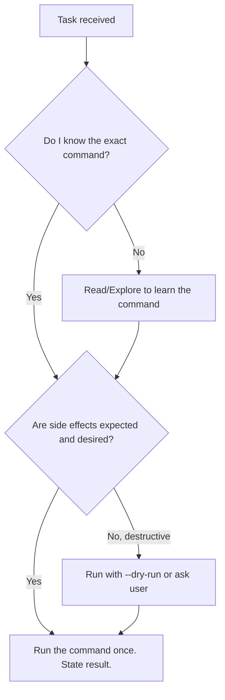

# Deterministic Execution Protocol

## Purpose

Many agent tasks are fully predictable — the command, the arguments, and the expected output are known before execution. The agent must execute these in a single step without exploration, dry-runs, re-reading, or summarization.

This skill exists because agents waste steps on tasks that should take one:

| Task | Wrong (multi-step) | Right (one step) |
|------|-------------------|-----------------|
| Get next ID | Read script → dry-run → run → read counter → list files → summarize | Run the command → state the result |
| Check build | Read Makefile → read config → run build → summarize | Run the build command → state pass/fail |
| List git status | Read .gitignore → run status → run diff → summarize | Run `git status` → state what changed |
| Check file existence | Glob → read → check → state | Glob → state exists/missing |
| Install package | Check package.json → check if installed → install → verify | Run install → state done |

## The Iron Rules

### Rule 1 — One Step for Known Commands

If you know the exact command to run and can predict the output shape, **run it once.** No dry-runs, no exploratory reads, no "let me first check" steps.

**Before executing, ask:**
- Do I know the exact command? → Run it.
- Do I know what the output will look like? → Run it.
- Is there a risk of irreversible side effects? → Only then consider dry-run or confirmation.

### Rule 2 — No Exploratory Reading Before Execution

Do NOT read source code, configuration files, or state files before running a command you already know how to use. Reading is for understanding; execution is for doing.

**Anti-patterns to avoid:**
- Reading a script before running it when you know what it does
- Reading `counters.json` before and after running `next-id.mjs`
- Reading `package.json` before running `npm install <package>`
- Running `--dry-run` before running the real command when side effects are expected and desired
- Listing directory contents before creating a file in a known directory

### Rule 3 — No Summarization of Obvious Results

When the output is self-explanatory, state the result in one line. Do not write paragraphs explaining what happened.

**Examples:**
- `next-id.mjs adr` returns `{"kind": "adr", "ids": ["psc-adr-0006"]}` → Say: "Next ADR ID: psc-adr-0006. File: psc-adr-0006.md"
- `npm install` exits 0 → Say: "Installed."
- `git push origin main` succeeds → Say: "Pushed to origin/main."
- Build passes → Say: "Build passes."

### Rule 4 — No Verification Steps for Predictable Operations

Do not re-read state files, re-list directories, or re-check counters after a deterministic operation. The command's exit code and output are sufficient evidence.

**Anti-patterns to avoid:**
- Reading `counters.json` after `next-id.mjs` increments it
- Running `ls` after `mkdir`
- Running `git status` after `git add` (the add either succeeds or fails)
- Running `cat` on a file you just wrote

### Rule 5 — Batch Independent Operations

When multiple operations are independent, run them in parallel. Do not sequence operations that could run simultaneously.

**Examples:**
- Need to read 3 files? Read all 3 in one tool call block.
- Need to check git status AND run a build? Run both in parallel.
- Need to edit 5 agent files? Edit all 5 in one message.

## Decision Flowchart

## Exceptions

The only valid reasons to multi-step a known-command task:

1. **Destructive operations** — `rm`, `git push --force`, `DROP TABLE`. Always confirm or dry-run destructive operations.
2. **First encounter** — If you have never seen a tool before and need to understand its interface, reading its source or help output is justified. But only once per tool.
3. **Ambiguous requirements** — If the task is unclear, ask for clarification rather than exploring randomly.

## Self-Reflection Clause

After completing a task, if you used more than 2 steps for a known-command operation:
1. **Was the exploration necessary?** — If you read a file you didn't need, or ran a command you already knew the output of, the answer is no.
2. **Could I have batched?** — If you ran 4 sequential reads that could have been parallel, the answer is yes.
3. **Update the knowledge base** — Note the optimal path for this task type so future agents execute it deterministically.