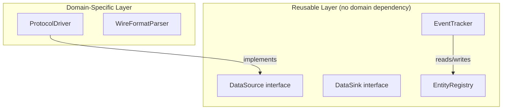
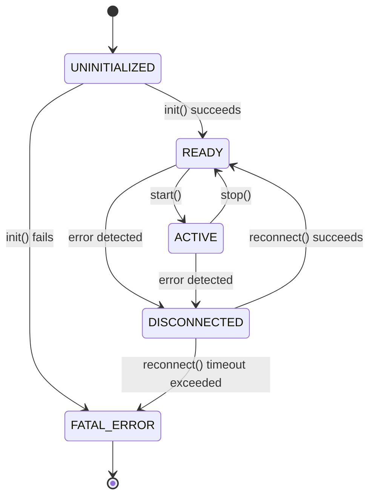

# Software Engineering Principles

## Purpose

Defines language-agnostic software engineering principles for architecture design, code review, and module documentation. This skill provides the structural rules that Software Engineer applies during Phase A (design) and Phase C (verification), and the documentation format that Docs Writer uses for module docs. All principles are language-agnostic — they apply to C++, Rust, Python, Go, TypeScript, or any other language.

## When to Trigger

- Loaded by **Software Engineer** as a role-specific skill during Phase A and Phase C
- Loaded by **Docs Writer** for module documentation format and C4 diagram standards
- Loaded by **Code Architect** during Phase B for implementation compliance
- Triggered when designing new modules, reviewing architecture, or writing module documentation

---

## Clean Architecture

### Core Rule: Dependency Arrows Point Inward

**Module boundaries are enforced.** Inner modules never depend on outer modules. The dependency graph is a directed acyclic graph pointing inward toward pure logic and interfaces.

```
┌─────────────────────────────────────────────────────────────────┐
│  Entry Point (main, CLI, HTTP handler) — wires everything      │
├─────────────────────────────────────────────────────────────────┤
│  Adapters — translate between domain-specific and generic types│
├─────────────────────────────────────────────────────────────────┤
│  Orchestrators — coordinate between pure functions and state   │
├─────────────────────────────────────────────────────────────────┤
│  State — single source of truth for data                       │
├─────────────────────────────────────────────────────────────────┤
│  Pure Logic — no state, no I/O, maximally reusable             │
├─────────────────────────────────────────────────────────────────┤
│  Interfaces — abstraction contracts, no implementation         │
└─────────────────────────────────────────────────────────────────┘
```

### Rules

1. **Domain-specific code is isolated.** Only adapter/driver modules know about domain-specific formats, protocols, or hardware. All other modules operate on generic types.
2. **Reusable modules have no domain dependency.** Business logic, analysis, and processing modules must compile without including any domain-specific headers. They operate on generic types only.
3. **Dependency injection over hard-wiring.** Clocks, registries, sinks, sources, and classifiers are injected, not created inside. No `new` or factory construction of dependencies inside business logic. Use constructor injection, setter injection, or parameter passing.
4. **Adapter layers translate between domains.** Adapter modules are pure translation layers — no business logic, no state. They know about both domain-specific types and generic types, and convert between them.

---

## SOLID Principles

### S — Single Responsibility

Each module has exactly one job. A registry tracks state; a tracker detects transitions; an analyzer classifies; a sink writes output; a source reads input. No module does two of these. If a module's description needs the word "and", split it.

**Check:** Can you describe the module's responsibility in one sentence without "and"?

### O — Open/Closed

New behaviour is added by creating new implementations of existing interfaces — never by modifying existing code. New event types, new data sources, new output formats, new classification algorithms — all added without touching existing modules.

**Check:** If a new requirement arrives, does it require modifying existing code or adding a new file?

### L — Liskov Substitution

Any implementation of an interface can replace any other without breaking the system. Any `DataSource` can replace any other. Any `DataSink` can replace any other. Any `Classifier` can replace any other. Subtypes must honour the contract of their supertype.

**Check:** Can you swap one implementation for another without changing any consuming code?

### I — Interface Segregation

Interfaces are minimal. A source interface has only read methods. A sink interface has only write methods. A registry interface has no event logic. No fat interfaces that force implementors to stub out irrelevant methods.

**Check:** Does every implementor use every method in the interface?

### D — Dependency Inversion

High-level modules depend on abstractions, not concretions. The entry point depends on `DataSink` (interface), not `FileSink` (concrete). The orchestrator depends on `Registry` (interface), not a specific data structure. The analyzer depends on `Classifier` (interface), not a specific algorithm. Clocks, storage, and I/O are always injectable abstractions.

**Check:** Does any business logic module import a concrete implementation directly?

---

## DRY Principles

### Rules

1. **No duplicate state tracking.** One module is the single source of truth for each category of state. Multiple consumers share the same instance.
2. **No duplicate parsing.** Parse once at the boundary. Downstream modules receive parsed, typed data — never re-parse raw formats.
3. **No duplicate output formatting.** Serialization lives in one place (the sink). Consumers say "write this" — never format output in multiple locations.
4. **No duplicate logic.** Pure functions for algorithms, transformations, and calculations live in dedicated modules. They are never inlined elsewhere.

**Check:** If a format, algorithm, or state structure changes, how many files must be edited? The answer should be one.

---

## Test-Driven Development

### Principles

1. **Every module must be testable in isolation.** If a module requires I/O, it depends on an injectable interface (not the real filesystem, network, or hardware). If it requires time, it depends on an injectable clock (not the system clock). If it requires storage, it depends on an injectable storage interface (not a specific database).
2. **Test first, implement second.** Unit tests are written before the implementation. The project's test framework is used consistently.
3. **Fuzz targets exist for all parsers.** Every parser, decoder, and deserializer has a fuzz testing entry point. Parsing untrusted input without fuzz coverage is a security gap.
4. **Pure functions are preferred.** Functions with no side effects and no state are the easiest to test and reuse. Push I/O and state to the edges; keep the core pure.

### Testability Checklist

| Concern | Solution |
|---------|----------|
| Module needs I/O | Depend on injectable I/O interface, use test doubles |
| Module needs time | Depend on injectable Clock interface, use MockClock |
| Module needs storage | Depend on injectable Storage interface, use in-memory implementation |
| Module needs hardware | Depend on injectable Driver interface, use mock driver |
| Module has no dependencies | Pure function — test directly with input/output pairs |

---

## Module Documentation Standard

Every module MUST have a documentation file in the project's module docs directory with the following sections. This standard is language-agnostic — it applies regardless of documentation tooling (Doxygen, JSDoc, Sphinx, Rustdoc, etc.).

### Required Sections

| # | Section | Content |
|---|---------|---------|
| 1 | **Responsibility** | One-sentence description of what this module does and does not do. |
| 2 | **Architecture** | Where it sits in the dependency graph. What it depends on. What depends on it. Mermaid diagram showing its position. |
| 3 | **Interface** | Public API with signatures and contracts. Pre-conditions and post-conditions. |
| 4 | **State Machine** | (If applicable) States, transitions, invariants, and guarantees. Mermaid state diagram. |
| 5 | **Examples** | Usage patterns for common scenarios. Must compile/run and produce the documented output. |
| 6 | **Test Strategy** | How to test this module in isolation. Mock boundaries listed. Pure functions require zero mocks. |
| 7 | **Reusability** | Can this module be used in another project? What are the portability requirements? Which other domains could use it? |

### Module Documentation Table

Every project should maintain a table of all modules and their documentation status:

| Module | Doc File | Has State Machine? | Reusable? |
|--------|----------|--------------------|-----------|
| `<ModuleName>` | `<name>.md` | Yes/No | Yes/No (reason) |

---

## C4 Model Documentation with Mermaid

All architecture diagrams in module docs and ADRs MUST use Mermaid syntax. C4 model provides four levels of granularity.

### C4 Granularity Levels

| Level | Name | Shows | Mermaid Type |
|-------|------|-------|-------------|
| 1 | System Context | External actors and systems | `graph TB` with actor boxes |
| 2 | Container | Executables, libraries, databases | `graph TB` with subgraphs |
| 3 | Component | Modules within a container | `graph TD` with subgraphs per container |
| 4 | Code | Classes and functions | `classDiagram` or `graph TD` for small scopes |

### Level Requirements

- **Level 1 (System Context):** Required for the overall project. Shows the system, its users, external systems, and data flows.
- **Level 2 (Container):** Required for the overall project. Shows executables, libraries, databases, and their relationships.
- **Level 3 (Component):** Required for EVERY module doc. Shows the module's position relative to its direct dependencies and dependents.
- **Level 4 (Code):** Optional. Used for complex classes or function groups within a module.

### Mermaid Diagram Types

| Purpose | Mermaid Syntax | Example Use |
|---------|---------------|-------------|
| Component dependencies | `graph TD` or `graph LR` | Module dependency graphs |
| System context | `graph TB` with styled nodes | External actors and systems |
| State machines | `stateDiagram-v2` | Module state machines, protocol states |
| Class relationships | `classDiagram` | Class hierarchies, interfaces |
| Data flow | `flowchart TD` or `flowchart LR` | Data pipelines, processing stages |

### Subgraph Convention

Use Mermaid subgraphs to group modules by layer:



---

## State Machine Documentation

State machines MUST be documented using Mermaid `stateDiagram-v2` with:

### Required Elements

1. **All states** listed with entry conditions
2. **All transitions** with trigger events
3. **Invariants** that hold in each state (e.g., "connection is open only in CONNECTED or ACTIVE states")
4. **Error transitions** explicitly shown — not just the happy path
5. **State-specific validity** (e.g., "file descriptor >= 0 in CONNECTED, < 0 in UNOPENED")

### Example Format



### Accompanying Table

Every state diagram MUST be accompanied by a table:

| State | Entry Condition | Invariants | Exit Transitions |
|-------|-----------------|------------|------------------|
| UNINITIALIZED | Constructor called | No resources allocated | init() → READY or FATAL_ERROR |
| READY | init() returned success | Resources allocated, not active | start() → ACTIVE, error → DISCONNECTED |
| ACTIVE | start() called | Resources allocated, operation in progress | stop() → READY, error → DISCONNECTED |
| DISCONNECTED | Error detected during READY or ACTIVE | Resources may be stale | reconnect() → READY or FATAL_ERROR |
| FATAL_ERROR | Unrecoverable error | No further operations possible | None (terminal) |

---

## Module Dependency Rules

### The Dependency Direction Rule

**Arrows never point outward.** Inner modules are more reusable and have fewer dependencies. The dependency graph flows:

```
Entry Point → Adapters → Orchestrators → State → Pure Logic → Interfaces
```

### Dependency Validation Checklist

For every module, verify:

| # | Check | Criterion |
|---|-------|-----------|
| 1 | Inward-only dependencies | Module depends only on modules in the same layer or inner layers |
| 2 | No domain leakage | Reusable modules include no domain-specific headers |
| 3 | Interface-only coupling | Modules depend on interfaces, not concrete implementations |
| 4 | No circular dependencies | Dependency graph is a DAG — no cycles |
| 5 | Minimal dependency count | Module depends on the smallest set of interfaces needed for its single responsibility |

### Layer Rules

| Layer | May Depend On | Must NOT Depend On |
|-------|---------------|-------------------|
| Entry Point | Everything (wiring only) | Nothing restricted |
| Adapters | Interfaces, domain-specific modules | Orchestrators, pure logic (translation only) |
| Orchestrators | State, pure logic, interfaces | Entry point, adapters |
| State | Interfaces (for type definitions only) | Everything else |
| Pure Logic | Nothing (or interfaces for type definitions) | Everything else |
| Interfaces | Nothing | Everything |

---

## Self-Reflection Clause

After any architecture violation, design flaw, or documentation gap is discovered:

1. **Why was this violation missed?** — Which review, test, or protocol gap allowed it through?
2. **What procedural safeguard would have caught it?** — What specific check should be added to the verification checklist?
3. **Update the knowledge base** — Add the lesson to this skill (new checklist item, new anti-pattern, new rule) so the same class of violation is caught earlier next time.
